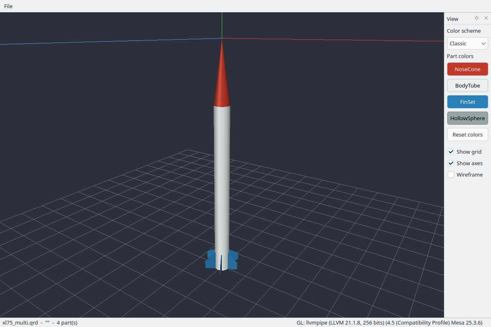
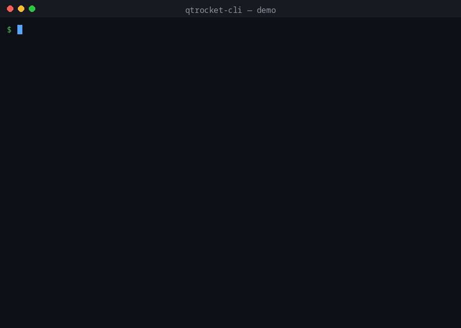
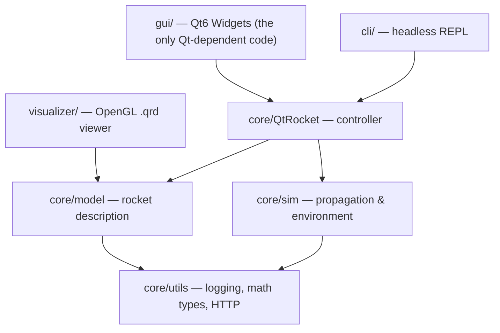

# QtRocket

[](https://github.com/cthunter01/qtrocket/actions/workflows/cmake-multi-platform.yml)

An open-source model-rocket flight simulator: a C++23 simulation core shared by a Qt6 Widgets
GUI, a scriptable headless REPL, and a standalone OpenGL design viewer.



## What it does today

QtRocket simulates 3-DOF point-mass flights of single-stage hobby rockets, with real numerics.
Object-oriented architecture allows for easy implementation and selection of various simulation
parameters at runtime:

- **Integrator** — Fixed-step RK4 or adaptive Runge–Kutta–Fehlberg 4(5) with embedded error
  control, selectable at runtime.
- **Atmosphere** — the full seven-layer US Standard Atmosphere 1976 (density, pressure,
  temperature, speed of sound, viscosity; the NOAA source document is in `docs/`), plus
  constant and vacuum models, selectable at runtime.
- **Gravity** — constant g₀ or Newtonian inverse-square over a spherical geoid.
- **Mass properties** — a composite parts tree (nose cones, body tubes, fin sets) with
  closed-form inertia tensors, parallel-axis composition, and time-varying mass/CG/inertia
  during the motor burn, recomputed from the thrust curve at each step.
- **Motors** — three ingest paths behind one database: RockSim `.rse` files, RASP `.eng`
  files, and a live [thrustcurve.org](https://www.thrustcurve.org) REST client.
- **Designs** — versioned `.qrd` XML persistence with placement expressed as physical intent
  (seat/station links), resolved by a geometry solver that hard-fails self-intersecting
  or gapped designs.

**3-DOF today, with seams for 6-DOF already in place** —
quaternion state carried in `StateData`, a `DESolver<Quaternion>` slot in the propagator for future orientation integration, a
torque interface on the model, and full-stack inertia tensors recorded every step.
Barrowman stability math (per-part CN<sub>α</sub> and center-of-pressure composition) is
implemented and test-verified; surfacing it in the CLI and GUI is the next milestone. The
[roadmap](TODO.md) tracks what's real versus planned.

## The REPL

`qtrocket-cli` can drive the whole engine headlessly, interactively, from a pipe, from a script
file, or via `-c "<command>"`. Exit status is 0 only if every command succeeded.



```console
$ qtrocket-cli demo.cli
# QtRocket CLI - type 'help' for commands, 'quit' to exit.
OK loadmotors: 249 motors from data/Aerotech.rse
OK newdesign: root NoseCone id=2
OK addpart: BodyTube id=3 under 2
OK addpart: FinSet id=4 under 3
OK checkdesign: 3 parts, contiguous, no overlaps
OK setmotor: G80T
OK launch: 2703 steps, t_final=27.020s
  apogee    = 770.498 m @ t=9.060s
  max_speed = 286.154 m/s @ t=1.230s
  downrange = 0.000 m
  landing   = t=27.020s, pos=(0.000, 0.000, -0.233)
CSV <working-dir>/qtrocket_run.csv
OK bye
```

The GUI interfaces the same engine — open/save `.qrd` designs with a live part tree, import or
search motors online, run flights, and inspect altitude/velocity plots — and
`qtrocket-visualizer` renders any `.qrd` in 3D using the same placement solver the simulator
flies, highlighting overlap offenders in red.

## Architecture


```mermaid
graph TD
    GUI["gui/ — Qt6 Widgets (the only Qt-dependent code)"] --> CORE
    CLI["cli/ — headless REPL"] --> CORE
    VIZ["visualizer/ — OpenGL .qrd viewer"] --> MODEL
    CORE["core/QtRocket — controller"] --> MODEL["core/model — rocket description"]
    CORE --> SIM["core/sim — propagation & environment"]
    MODEL --> UTILS["core/utils — logging, math types, HTTP"]
    SIM --> UTILS
```

Each layer depends only on those below it, and the seams are interfaces on purpose:
`Propagatable` bridges model and sim, an abstract `DESolver<T>` makes integrators interchangeable,
`AtmosphericModel`/`GravityModel` are pluggable physics, and the thrustcurve.org client sits
behind an interface so motor search is testable without a network. A 58-page architecture
review of exactly what is implemented, what is dormant, and why lives in
[docs/ArchitectureReviewLatex](docs/ArchitectureReviewLatex/ArchitectureReview.pdf).

## Verification

- **248 automated tests** (GoogleTest, six suites) at a >1:1 test-to-source ratio for the
  core — including physics oracles: apogee must rise monotonically with total impulse across
  a ¼A→M motor ladder flown through the real REPL, drag must reduce apogee versus vacuum for
  both integrators, and RKF45 must track RK4.
- **Six CI configurations run the full suite on every push**: Linux GCC, Linux Clang, Linux
  ASan+UBSan (dependencies instrumented, UBSan findings fatal), macOS, Windows MSVC, and
  FreeBSD 15 booted in a QEMU VM — plus a clang-tidy job with findings-as-errors over every
  hand-written translation unit.
- **Warnings are errors** on all four compilers (`-Wall -Wextra -Wpedantic -Werror`, `/W4 /WX`).
- **Coverage** via LLVM source-based instrumentation (`cmake --build --preset coverage-clang
  --target coverage`): 90% function / 74% line on the Qt-free core at last report.
- A committed numeric baseline pins composite mass/CG/inertia/CP for all 24 design fixtures
  to ULP-level tolerance; the fixtures regenerate from committed CLI scripts.

## Building

Only one system dependency (other than a C++23 capable compiler): Qt6. Everything else (GoogleTest, Eigen, Boost.property_tree,
jsoncpp, curl) is fetched and pinned by CMake using FetchContent. First configure compiles them, so it is slow
once.

```bash
cmake --preset release            # or debug, debug-clang, release-gcc, ...
cmake --build --preset release
ctest --preset release -R 'qtrocket_*'
```

Executables land in `build/gui/qtrocket`, `build/cli/qtrocket-cli`, and
`build/visualizer/qtrocket-visualizer`. Sanitizer builds use `--preset asan-clang`;
`scripts/run-tidy.sh` runs the same clang-tidy sweep CI does.

## Documentation

Three LaTeX whitepapers (source and PDF committed) document the design at depth:

- [User Guide](docs/qtrocket_userguide/UserGuide.pdf) - QtRocket User Guide and Tutorials

- [Architecture Review](docs/ArchitectureReviewLatex/ArchitectureReview.pdf) — a whole-system
  capability and gap review, including a 16-area feature comparison against OpenRocket and a
  ranked deficiency inventory.
- [Design Whitepaper](docs/DesignWhitepaperLatex/DesignWhitepaper.pdf) — the system design
  reference, with a physics primer and the rationale behind the major seams.
- [Part Placement Design](docs/PartPlacementDesignLatex/PartPlacement.pdf) — the station-pair
  placement model: how designs store physical intent rather than baked coordinates, and the
  resolver that turns it into geometry.

## Development practices

Since June 2026, QtRocket has been developed with AI assistance. Prior to that, 
QtRocket began in February 2023 and was designed and built entirely by hand for its first
four years: the layered component architecture and its interface seams, the simulation core, the Qt
GUI, the motor database and ingest pipeline, and the multi-platform CI all predate any AI
involvement.

Since mid-2026 I began using AI assistance within qtrocket to:
 - Learn and become comfortable with AI-assisted development practices and workflows. This is becoming more
   and more common, and whether we as software engineers like it or not, we should know how to use
   it effectively. I'm learning to let go of all the details and focus more on high-level architecture and vision.
 - (Potentially) accelerate work on parts of the application that bogged me down (GUI, CLI/REPL, some documentation, unit tests)

The OpenGL visualizer and CLI/REPL are almost entirely AI-coded since I am unfamiliar with graphics programming and OpenGL, but since it
can use the same Parts tree code in the qtrocket_core library as the rest of the application suite, it seemed like a 
straightforward thing for AI to generate based on existing established architecture. And I can study it to learn more
OpenGL if I like. The REPL was an idea to aid in the testing of the application since it's easily scriptable, and would allow
AI agents to run full-scale integration tests from a commandline rather than a GUI.

A design decision I made in the very beginning of the project -- to separate the UI from the core physics engine -- was originally
done because I couldn't decide on what GUI toolkit to use! I wanted to try wxWidgets and Qt, and didn't want to tie the whole
program to one toolkit. It turned out that, 4 years later, I could use the same architecture to create a CLI/REPL, and make automated
testing much easier! That was not the original idea, but it was a little bit of serendepity.

Importantly, any/all AI development is always specification-first and held to the same gates as everything else in the
tree. All builds must be warning-clean `-Werror`, the full test suite, sanitizers, and clang-tidy,
and the architecture documents are verified against the source citation-by-citation rather
than taken on faith. The design decisions are still human.

## License

[GPL-3.0](LICENSE). Copyright © 2022–2026 Travis Hunter.
