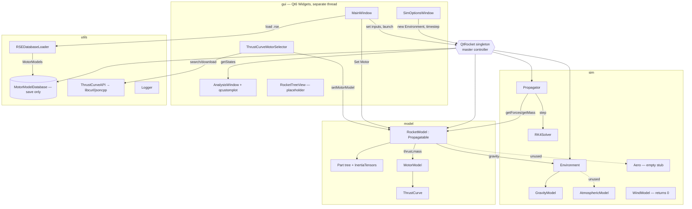

# QtRocket — Consolidated Architectural Analysis

**Date:** 2026-06-05 · **Branch:** `development` (the repo's default/main branch) · **Repo:** `/home/travis/Development/qtrocket`

**Purpose:** Rebuild a mental model of the QtRocket codebase after several years away, and identify where to resume development.

**Provenance:** This document consolidates two independent read-only analyses (`ANALYSIS_RESULTS_2.md` and `ANALYSIS_RESULTS_3.md`). Where the two agreed, the more detailed version was kept. Where they **deviated**, the disagreement was resolved by reading the actual source — see [§7 Reconciliation](#7-reconciliation--where-the-source-analyses-diverged). Every contested claim below was re-verified against the working tree on 2026-06-05.

---

## 0. TL;DR / Executive Summary

QtRocket is an **early-stage C++23 / Qt6 desktop application** that aspires to be an OpenRocket-style model-rocket simulator written in C++. The end-to-end **plumbing works**, but the **physics is essentially a stub**.

**What actually runs today:** a Qt GUI loads a motor (from a local `.rse` file or live from thrustcurve.org), assigns it to a single-part rocket, runs a fixed-step **RK4 point-mass trajectory**, and plots altitude / velocity / thrust with the bundled `qcustomplot` widget.

**What that trajectory actually is** (verified against source): a **vacuum, 3-DOF (translational-only) point mass** driven by exactly two forces — motor thrust along **world +Z** and gravity. There is **no aerodynamic drag, no rotational dynamics, and no wind.** Worse than the source analyses initially implied: because the integrator reads `currentState` (which is zero-initialized) and the GUI's initial velocity/angle are written only to the unused `initialState`, **the rocket launches from rest at the origin and flies straight up the Z-axis** — the launch-angle and initial-velocity inputs, plus the mass and drag-coefficient inputs, are all currently **inert** (see [§3.5](#35-where-the-flow-is-broken--only-partially-wired) and [§7](#7-reconciliation--where-the-source-analyses-diverged)). It is a useful scaffold for validating the integrator + motor model, **not** a flight-accurate simulator.

**The most mature pieces:**
- **Propulsion** — thrust-curve interpolation, a precomputed propellant mass-depletion curve, a working RockSim `.rse` parser (sample DB = 252 Aerotech motors), and a live thrustcurve.org REST client.
- **US Standard Atmosphere 1976** — properly implemented and unit-tested against NOAA tables to 0.1–0.5%… but **not yet consulted by the flight physics** (there is no drag to need air density).

**The biggest gaps vs OpenRocket, in order:**
1. A real **rocket-geometry / component model** (nose cones, body tubes, fins). Today the rocket is one hard-coded 1 kg sphere.
2. **Aerodynamics** — `sim::Aero` is a data-only struct with an empty `.cpp`; no drag, no center of pressure, no stability.
3. **Wiring the atmosphere into the force model** and extending toward **6-DOF**.

**Git history is misleading but harmless:** the recent log is dominated by reverts of "gitea→github push mirroring" test commits and a revert of the "propagator" PR #20. Despite that, the propagator/GUI/sim code **is present and coherent** in the working tree. The last substantive work was a third-party dependency-version bump (`59efd88`, HEAD) — classic "returning after time away" maintenance.

**The breadcrumb marking where you left off:** `sim/RK45Solver.h` — an untracked, non-compiling fragment of an adaptive Runge-Kutta-Fehlberg integrator, truncated mid-statement. You were mid-way through replacing fixed-step RK4 with an error-controlled integrator when development paused.

---

## 1. Inventory & Structure

### 1.1 Directory layout

```
qtrocket/
├── CMakeLists.txt            # Top-level build: fetches all deps, builds qtrocket exe, links 3 sub-libs
├── main.cpp                  # Entry point: makes Logger + QtRocket singletons, calls run()
├── QtRocket.{h,cpp}          # Master singleton/controller ("facade"): owns rocket, propagator, env, motor DB
├── qtrocket.qrc              # Qt resource bundle (one app icon)
├── qtrocket_en_US.ts         # Qt translation stub (US English only, empty)
├── Doxyfile                  # Doxygen config (PROJECT_NAME = "QtRocket")
├── HELPWANTED                # Notes to contributors (dated 2023-04-24)
├── README.md                 # One line ("coming soon"); LICENSE = GPL
│
├── gui/                      # Qt Widgets GUI (~580 LOC + ~43k LOC vendored qcustomplot)
│   │                         #   Compiled directly into the qtrocket exe, NOT a sub-library
│   ├── MainWindow.{h,cpp,ui}            # Primary window; central hub of user actions
│   ├── AnalysisWindow.{h,cpp,ui}        # Plots altitude / velocity / thrust via QCustomPlot
│   ├── SimOptionsWindow.{h,cpp,ui}      # Pick gravity/atmosphere model + timestep
│   ├── ThrustCurveMotorSelector.{h,cpp,ui}  # Live thrustcurve.org motor search/download UI
│   ├── AboutWindow.{h,cpp,ui}           # About dialog
│   ├── RocketTreeView.{h,cpp}           # Empty QTreeView subclass (placeholder for component tree)
│   └── qcustomplot.{h,cpp}              # Vendored 3rd-party plotting widget
│
├── sim/                      # → static library "sim": physics engine
│   ├── Propagator.{h,cpp}               # Drives the RK4 integration loop
│   ├── DESolver.h                       # Abstract ODE-solver interface
│   ├── RK4Solver.h                      # Working RK4 integrator (templated on Vector3/Quaternion)
│   ├── RK45Solver.h                     # *** UNTRACKED, INCOMPLETE — does not compile ***
│   ├── StateData.h                      # State vector (pos, vel, orientation, DCM, Euler)
│   ├── Environment.h                    # Owns/selects gravity + atmosphere models
│   ├── AtmosphericModel.h               # Atmosphere interface
│   ├── ConstantAtmosphere.h             # Constant ISA-sea-level atmosphere
│   ├── USStandardAtmosphere.{h,cpp}     # US Standard Atmosphere 1976 (MATURE, tested)
│   ├── GravityModel.h                   # Gravity interface
│   ├── ConstantGravityModel.h           # Constant g = (0,0,-9.8)
│   ├── SphericalGravityModel.{h,cpp}    # Newtonian point-mass gravity (ECEF, GM/r²)
│   ├── GeoidModel.h / SphericalGeoidModel.{h,cpp}  # Mean WGS84 earth radius (unused)
│   ├── Aero.h / Aero.cpp                # *** STUB: header is a bare data struct; .cpp is EMPTY ***
│   ├── WindModel.{h,cpp}                # *** STUB: returns zero wind ***
│   └── tests/USStandardAtmosphereTests.cpp  # GoogleTest, validates vs NOAA tables
│
├── model/                   # → static library "model": rocket + motor data model
│   ├── RocketModel.{h,cpp}              # The rocket; implements Propagatable; computes forces
│   ├── Propagatable.{h,cpp}             # Interface for anything the Propagator integrates (.cpp EMPTY)
│   ├── Part.{h,cpp}                     # Component-tree node w/ mass + inertia-tensor composition
│   ├── InertiaTensors.h                 # Helpers: solid/hollow sphere, tube/cylinder inertia tensors
│   ├── MotorModel.{h,cpp}               # Hobby motor: metadata enums + mass curve + thrust lookup
│   ├── ThrustCurve.{h,cpp}              # Time→thrust sample table with linear interpolation
│   ├── MotorModelDatabase.{h,cpp}       # *** DEAD STUB — duplicate of utils version, unused ***
│   └── tests/PartTests.cpp              # GoogleTest (basic Part construction + addChildPart)
│
├── utils/                   # → static library "utils": cross-cutting helpers / foundation
│   ├── Logger.{h,cpp}                   # Singleton file+stdout logger w/ levels
│   ├── math/MathTypes.h                 # Eigen typedefs: Vector3/6, Matrix3/4, Quaternion
│   ├── math/Constants.h                 # Physical constants (g0, GM, gas constants, WGS84 radius)
│   ├── math/UtilityMathFunctions.h      # floatingPointEqual() (ULP compare)
│   ├── Bin.{h,cpp}                      # Range/bucket lookup map (used by atmosphere lapse-rate lookup)
│   ├── CurlConnection.{h,cpp}           # Thin libcurl GET wrapper
│   ├── ThrustCurveAPI.{h,cpp}           # thrustcurve.org REST client (metadata/search/download)
│   ├── RSEDatabaseLoader.{h,cpp}        # Parses RockSim .rse engine files → MotorModels
│   ├── MotorModelDatabase.{h,cpp}       # THE active motor database (std::map keyed by common name) + save
│   ├── ThreadPool.{h,cpp}               # Generic thread pool (BUILT BUT UNUSED)
│   └── TSQueue.h                        # Thread-safe queue (used only by ThreadPool)
│
├── data/Aerotech.rse        # Sample RockSim engine database (~9000 lines; 252 Aerotech motors)
├── docs/                    # qtrocketUML.xmi (Umbrello UML), NOAA atmosphere PDF, empty doxygen/ dir
├── resources/               # Icons + screenshots
└── .github/workflows/cmake-multi-platform.yml   # CI: Ubuntu (gcc-13) + Windows (MSVC cl); clang excluded
```

### 1.2 Build system & dependencies (CMake)

- **CMake ≥ 3.16**, **C++23** (`set(CMAKE_CXX_STANDARD 23)`), `CMAKE_EXPORT_COMPILE_COMMANDS ON`. The code uses `std::format`, structured bindings, `[[fallthrough]]`, etc.
- Builds **three internal static libraries** — `utils`, `sim`, `model` — via `add_subdirectory`. The **GUI and top-level sources are compiled directly into the `qtrocket` executable**, not into a library. The exe links `Qt6::Widgets Qt6::PrintSupport utils sim model` (`CMakeLists.txt:144-161`).
- **Dependency direction:** `qtrocket(exe)` → {`utils`, `sim`, `model`}; `sim` → `utils`; `model` → `utils`; `utils` → {libcurl, Boost::property_tree, jsoncpp_static, Eigen} linked **PUBLIC** so headers propagate.
  - ⚠ **Fragility worth tightening:** `sim`/`model` link `utils` as **PRIVATE**, yet their public headers include Eigen via `MathTypes.h`. This compiles only because `utils` exposes Eigen publicly and the include dirs leak upward. A future refactor that changes `utils`'s linkage will break `sim`/`model` includes.
- **All third-party deps are fetched at configure time via `FetchContent`** (only Qt comes from the system via `find_package`). First configure is slow because curl/boost/eigen/gtest all compile from source.

  | Dependency | Version (GIT_TAG) | Used for |
  |---|---|---|
  | GoogleTest | v1.17.0 | unit tests |
  | jsoncpp | 1.9.6 (static) | parse thrustcurve.org JSON |
  | libcurl | curl-8_18_0 (static, HTTP_ONLY, SSL) | HTTP GET to thrustcurve.org |
  | Eigen | 5.0.1 | all linear algebra (`Vector3`, `Matrix3`, `Quaternion`) |
  | Boost | 1.90.0 (`property_tree` only) | parse `.rse` XML + write motor-DB XML |
  | Qt | Qt6 (CI uses 6.6.2; Widgets, PrintSupport, LinguistTools) | GUI |

- `fmtlib` was **removed** in favor of `std::format` (commit `e5c068d`; its `FetchContent` block is commented out at `CMakeLists.txt:22-26`; `Bin.cpp` already uses `<format>`).
- Qt AUTOUIC/AUTOMOC/AUTORCC are on; `.ui` files compile to `ui_*.h`. Tests register via CTest (`enable_testing()` + `gtest_discover_tests`); CI runs `ctest -R 'qtrocket_*'` (suites `qtrocket_sim_tests`, `qtrocket_model_tests`).
- **How to build (intended):**
  ```bash
  cmake -B build -S . -DCMAKE_BUILD_TYPE=Release
  cmake --build build
  ctest --test-dir build -R 'qtrocket_*'   # runs qtrocket_sim_tests + qtrocket_model_tests
  ./build/qtrocket
  ```
  ⚠ Because the pinned dependency tags (curl/eigen/boost/jsoncpp/gtest) are *much* newer than the 2023-era application code, **a first build after returning is the natural place for surprises** — start there.

### 1.3 Actual file state / untracked & dead files

- **`sim/RK45Solver.h` (UNTRACKED, NEW):** an abandoned adaptive Runge-Kutta-Fehlberg solver. **It does not compile** — it ends mid-statement at line 36:
  ```cpp
  constexpr std::array<double, 5> K1 = {0, 0, }   // <-- truncated; function body never closes
  ```
  It is **not referenced** by any CMakeLists or source, so it does not break the build. This is the literal "where I left off" breadcrumb.
- **`sim/Aero.cpp` — EMPTY (0 lines)** and **`model/Propagatable.cpp` — EMPTY (0 lines).** Both are compiled (listed in their CMakeLists) as empty translation units. `Aero.h` declares only data members, no methods.
- **`model/MotorModelDatabase.{h,cpp}` — DEAD STUB.** A near-duplicate of `utils/MotorModelDatabase`: empty constructor, two search methods **declared but never defined** (would fail to link if called). Nothing references it; the **live** DB is `utils::MotorModelDatabase`, held by `QtRocket`. This is a naming hazard (two classes named `MotorModelDatabase` in different namespaces).
- **Uncommitted tracked change:** `CMakeLists.txt` adds only `set(CMAKE_EXPORT_COMPILE_COMMANDS ON)` vs HEAD — harmless, enables `compile_commands.json`.
- `.cache/` (untracked) is a clangd/IDE artifact.
- **Git history is noisy but the tree is coherent** — see [§6 git-history clues](#git-history-clues).

### 1.4 Key entry points to re-orient quickly

- **Run a sim (control flow):** [`gui/MainWindow.cpp:109`](gui/MainWindow.cpp#L109) `onButton_calculateTrajectory_clicked` → [`QtRocket.cpp:113`](QtRocket.cpp#L113) `launchRocket` → [`sim/Propagator.cpp:52`](sim/Propagator.cpp#L52) `runUntilTerminate`.
- **The actual physics:** [`sim/Propagator.cpp:29`](sim/Propagator.cpp#L29) (ODE lambda) + [`model/RocketModel.cpp:38`](model/RocketModel.cpp#L38) (`getForces`) — **this is where drag goes.**
- **The integrator:** [`sim/RK4Solver.h`](sim/RK4Solver.h) (`step`).
- **Most mature physics:** [`sim/USStandardAtmosphere.cpp`](sim/USStandardAtmosphere.cpp) (+ tests in `sim/tests/`).
- **Motor pipeline:** [`utils/RSEDatabaseLoader.cpp`](utils/RSEDatabaseLoader.cpp), [`utils/ThrustCurveAPI.cpp`](utils/ThrustCurveAPI.cpp), [`model/MotorModel.cpp`](model/MotorModel.cpp), [`model/ThrustCurve.cpp`](model/ThrustCurve.cpp).
- **"Where I left off" marker:** [`sim/RK45Solver.h`](sim/RK45Solver.h) (untracked, incomplete).

---

## 2. Components

**Maturity legend:** ✅ **[WORKING]** usable (often tested) · 🟡 **[PARTIAL]** real logic but incomplete/unwired · 🟥 **[STUB]** placeholder/empty · ⬛ **[DEAD]** present but unused/non-functional.

### 2.1 Application controller — `QtRocket` 🟡/✅
Singleton master controller (hand-rolled with a mutex, `QtRocket.cpp:53` `getInstance()`), constructed before the GUI. It owns:
- `rocket` — a `std::pair<shared_ptr<RocketModel>, shared_ptr<Propagator>>` typedef'd `Rocket` (`QtRocket.h:81`): the rocket and its propagator kept in lockstep. `addRocket()` rebuilds the propagator when a new rocket is set (`QtRocket.h:52`).
- `environment` — `shared_ptr<sim::Environment>`.
- `motorDatabase` — `shared_ptr<utils::MotorModelDatabase>`.

`run()` (`QtRocket.cpp:99`) spawns a **separate `std::thread`** (`guiWorker`) that creates the `QApplication` + `MainWindow` and `join()`s it — so the GUI runs on a worker thread while `main`'s thread blocks on the join (unusual but functional; worth an audit). `launchRocket()` (`QtRocket.cpp:113`) is the **simulation entry point**: clears states, resets propagator time to 0, calls `rocket->launch()` (starts the motor clock), then `propagator->runUntilTerminate()`.

**Dead/loose ends:**
- `runSim()` is **declared but never defined** (`QtRocket.h:41`) — dead declaration.
- `launchSitePosition{0,0,0}` (labeled ECEF) is declared but effectively unused (`QtRocket.h:89`).
- A stray `std::vector<StateData> states` member (`QtRocket.h:92`) is `reserve(1024)`'d in the ctor but **never used for results** — the GUI reads results from `rocket.first->getStates()` (`QtRocket.h:61`), not from `QtRocket::states`.

### 2.2 Integrator / ODE solver — RK4 ✅, RK45 🟥
- `sim/DESolver.h` ✅ — abstract solver interface: `setTimeStep`, `step(state, rate) → pair`.
- `sim/RK4Solver.h` ✅ — a **generic fixed-step classic RK4** templated on `Vector3`/`Quaternion` (`static_assert`-restricted). Solves a coupled (state, rate) system; correctly implements the k1..k4 weighting. *(Minor latent dead-code: a `dt == quiet_NaN()` guard can never be true — NaN compares unequal to everything — but `setTimeStep` is always called, so it is harmless.)*
- `sim/RK45Solver.h` 🟥 — **incomplete, untracked, uncompilable** adaptive solver (see [§1.3](#13-actual-file-state--untracked--dead-files)).

### 2.3 Propagator — 🟡 (translation only)
`sim/Propagator.{h,cpp}` drives the simulation. In its constructor it builds a lambda of the linear ODEs (`Propagator.cpp:29-40`):
```cpp
dPosition = rate;                                        // ẋ = v
dVelocity = object->getForces(currentTime)               // v̇ = F/m  (Newton's 2nd law)
          / object->getMass(currentTime);
```
and hands it to a `RK4Solver<Vector3>`. `runUntilTerminate()` (`Propagator.cpp:52-89`) loops: read `object->getCurrentState()` pos/vel → `step()` → write `nextState` back via `setCurrentState` → append `(currentTime, nextState)` → check `terminateCondition(currentTime)` → `currentTime += timeStep`.

**Verified gaps / observations:**
- **Strictly 3-DOF translational.** A `RK4Solver<Quaternion>` orientation integrator is **commented out** (`Propagator.h:59`). `getTorques()`/`getInertiaTensor()` exist on the model but are **never called** by the Propagator.
- **⚠ Forces are evaluated at the object's stored `currentState`/`currentTime`, not at the RK4 trial states.** The ODE lambda calls `object->getForces(currentTime)`, and `RocketModel::getForces` reads the `currentState` member (`RocketModel.cpp:46-48`). Across all four RK4 stages the force is therefore **constant**. For today's force model (thrust = f(t), gravity = constant·mass) this is benign, but **the moment a velocity- or altitude-dependent force like drag is added, RK4 silently degrades toward Euler accuracy** unless the candidate stage state is threaded into `getForces`. *Fix this as part of the drag work, not after.*
- **⚠ Timestep changes don't reach the integrator (confirmed bug).** `QtRocket::setTimeStep` (`QtRocket.h:45`) → `Propagator::setTimeStep` (`Propagator.h:53`) updates only the Propagator's `timeStep` member. The `RK4Solver`'s own `dt` is set **once, in the Propagator constructor** (`Propagator.cpp:43`). So after construction, changing the timestep via Sim Options updates the loop's `currentTime += timeStep` bookkeeping (the plotted time axis) but **not** the actual integration step — the integrator keeps using 0.01 s. The two then disagree.
- **Minor time-labeling offset.** The loop appends `nextState` (the post-step state) labeled with the *pre-increment* `currentTime`, and the terminate check runs *after* the append (so the first below-ground sample is recorded before breaking). The true `t=0` initial state is never recorded. Worth cleaning up when validating results.
- Default `timeStep` = 0.01 s (`Propagator.h:65`).

### 2.4 State representation — `StateData` 🟡 (over-provisioned)
`sim/StateData.h` is a **6-DOF-capable** container: `position`, `velocity` (`Vector3`, world frame) plus `orientation`, `orientationRate` (`Quaternion`), `dcm` (`Matrix3`), and `eulerAngles` (yaw-pitch-roll, 3-2-1). **Only `position` and `velocity` are read/written today**; the orientation fields are carried but never integrated. All members have **in-class zero-initializers** (`position{0,0,0}`, `velocity{0,0,0}`, …) — so a default-constructed `StateData` is genuinely all-zeros, not garbage (this matters for [§3.5](#35-where-the-flow-is-broken--only-partially-wired)). Hand-written copy/move assignment operators are provided.

### 2.5 Environment, gravity, atmosphere, geoid
- `sim/Environment.h` ✅ (as a selector) — maps human-readable names → model instances and exposes the current gravity/atmosphere model. Defaults: **"Constant Gravity" + "Constant Atmosphere"** (`Environment.h:32-36`). `Environment` is non-copyable/non-movable (deleted copy/move).
  - ⚠ **Confirmed combo-box bug:** `getAvailableGravityModels()`/`getAvailableAtmosphereModels()` (`Environment.h:43-57`) construct the result vector pre-sized to `map.size()` and then `std::back_inserter` onto it — so the returned vector is the N empty default strings **followed by** the N real names (2N entries, the first N blank). The Sim Options combo boxes therefore show leading blank entries.
- **Gravity** (`GravityModel` interface: `getAccel(position) → Vector3`):
  - `ConstantGravityModel` ✅ → constant `(0,0,-9.8)` (note: 9.8, **not** the 9.80665 `g0` constant). **This is the model the default sim uses**, and it implies a flat-earth, +Z-up frame.
  - `SphericalGravityModel` 🟡 → true Newtonian `-GM·r̂/r²`, computed in km internally for precision. **Correct only for geocentric/ECEF positions** (origin at Earth's center). The running app launches at the **local origin (0,0,0)**, so selecting Spherical Gravity would point "gravity" at the launch site (and divide by ≈0 at liftoff). The two gravity models assume **different coordinate origins** — an unresolved frame mismatch.
- **Atmosphere** (`AtmosphericModel` interface: density/pressure/temperature/speed-of-sound/dynamic-viscosity, all `f(altitude)`):
  - `ConstantAtmosphere` ✅ → ISA sea-level constants.
  - `USStandardAtmosphere` ✅ **(tested)** — the **1976 US Standard Atmosphere** across the 7 standard layers (0–71 km) via lapse-rate/barometric formulas, backed by `utils::Bin` lookup tables, with speed of sound and Sutherland-law viscosity. Validated by `sim/tests/USStandardAtmosphereTests.cpp` against the NOAA report to 0.1–0.5% (source PDF checked in at `docs/`). **The single most complete and trustworthy piece of the simulation** — but **never consulted by the flight physics** (no drag → no need for ρ).
- **Geoid** — `GeoidModel` + `SphericalGeoidModel` 🟡 returns mean WGS84 radius; **unused** anywhere in the running code (infrastructure for a future round-earth frame).

### 2.6 Rocket / domain model
- `model::Propagatable` 🟡 (interface, `Propagatable.h`) — the contract the Propagator integrates: pure-virtual `getForces`, `getTorques`, `getMass`, `getInertiaTensor`, `terminateCondition`; concrete state management (`initialState`/`currentState`/`nextState` + a `states` history vector with append/clear). Carries one unused `sim::Aero aeroData` member. `Propagatable.cpp` is **empty**.
- `model::RocketModel : Propagatable` 🟡 (minimal) — the heart of the per-step force model:
  - Default rocket is a **single hard-coded part**: a 1 kg solid-sphere "NoseCone" at (0,0,1) (`RocketModel.cpp:11`). No real geometry.
  - `getForces(t)` (`RocketModel.cpp:38-55`): `{0,0, mm.getThrust(t)}` (thrust; the comment says "the rocket's Z-axis", but with no orientation tracked this is identical to **world +Z**) **+** gravity `gravityModel->getAccel(currentState.position) * getMass(t)`. Then a `// Calculate aero forces` comment followed by **nothing** — **drag is not modeled.**
  - `getMass(t)` = `mm.getMass(t)` (motor) + `topPart.getCompositeMass(t)` (structure).
  - `getInertiaTensor(t)` delegates to `topPart` (computed but unused — no rotational integration).
  - `getTorques(t)` ≡ `(0,0,0)`.
  - `terminateCondition` = `currentState.position[2] < 0` (rocket returns to/below launch altitude).
  - ⚠ `setMass()`, `setDragCoefficient()`, `getDragCoefficient()` are **no-op/constant stubs** (`RocketModel.h:101-103`: `getDragCoefficient` returns a hard-coded `1.0`, the setters have empty bodies). The GUI calls the setters with user input; **they do nothing.**
- `model::Part` 🟡/✅ (tested, underused) — a genuine composite/tree node: name, mass, inertia tensor, center of mass, and `childParts` (shared_ptr + relative position). `addChildPart()` correctly applies the **parallel-axis theorem** to accumulate a composite inertia tensor; `recomputeInertiaTensor()` walks children recursively; the copy ctor deep-copies the subtree. Solid groundwork — but **mass/inertia only: no geometry, no aerodynamics, no part *types*** (no NoseCone/BodyTube/Fin classes). `getMass(double)`/`getCompositeMass(double)` currently **ignore** their time argument (parts don't vary mass with time yet).
- `model::InertiaTensors` ✅ — static factories for solid sphere, hollow sphere, and tube/cylinder inertia tensors.
- `model::Stage` was **intentionally removed** earlier (commit `46eca11`; only a commented `#include` remains at `RocketModel.h:22`) to simplify single-stage prototyping.

### 2.7 Propulsion — ✅ the most complete subsystem
- `model::ThrustCurve` ✅ — stores `(time, thrust)` samples, computes `maxTime`, returns **piecewise-linearly interpolated** thrust with an ignition-time offset and 0 outside the burn window.
- `model::MotorModel` ✅ — a rich motor record: a large `MetaData` struct (manufacturer, cert org, type, impulse class, diameters, weights, delays, total impulse, …, each with enum↔string helpers) plus the thrust curve. On metadata load it **precomputes a 128-point mass-depletion curve** by integrating thrust to deplete propellant mass (`MotorModel.cpp:102`), and computes Isp from total impulse / (g0 · propellant weight). `getThrust(t)`/`getMass(t)` honor ignition time and burnout. Well-developed, usable physics.
- **Two ways to obtain motors:**
  1. `utils::RSEDatabaseLoader` ✅ — parses **RockSim `.rse`** XML (`engine-database/engine-list/engine`) via `boost::property_tree` into `MotorModel`s (converting grams→kg), and **pushes them into the global motor DB** as a side effect of construction. The bundled `data/Aerotech.rse` contains **252 motors**.
  2. `utils::ThrustCurveAPI` 🟡 (works, rough) — a **thrustcurve.org REST client**: `getMetadata`, `searchMotors(criteria)`, `getMotorData(id)`/`getThrustCurve(id)` (downloads RASP samples), JSON-parsed via jsoncpp over `utils::CurlConnection`. Has leftover `debug("1".."6")` trace logging, a **manufacturer-enum swap bug** (Klima↔Quest crossed in `MotorModel::MotorManufacturer::toEnum`, `MotorModel.h:346-349`), and partial mappings (only "AeroTech" is mapped in `searchMotors`).
- `utils::MotorModelDatabase` 🟡 (**the real one**) — `std::map<commonName → MotorModel>` with add/get and **XML save** via Boost.PropertyTree (`saveMotorDatabase`, produces a `QtRocketMotorDatabase` XML, written to `qtrocket_motors.qmd` by the Tools menu). `getMotorModel` returns `std::optional`. ⚠ `loadMotorDatabase` is **declared but empty** (`utils/MotorModelDatabase.cpp:129-132`) — save has no matching load.
- `model::MotorModelDatabase` ⬛ — the **dead duplicate** (see [§1.3](#13-actual-file-state--untracked--dead-files)).

### 2.8 GUI — 🟡 functional but ad-hoc
Qt6 Widgets, spawned on a worker thread (`QtRocket.cpp:24-51`).
- `MainWindow` 🟡 (the central hub) — buttons **Load RSE**, **Set Motor**, **Get TC Motor Data**, **Calculate Trajectory** (disabled until a motor is set), plus menu actions (Quit, Simulation Options, Save Motor Database, About).
  - **Calculate Trajectory** (`MainWindow.cpp:109`) reads **four `QLineEdit`s found by object name** — `initialVelocity`, `mass`, `initialAngle`, `dragCoeff` — decomposes speed/angle into Vx/Vz in the X–Z plane, builds an initial `StateData`, calls `rocket->setMass(...)`/`setDragCoefficient(...)` **(no-ops!)**, calls `qtRocket->setInitialState(...)` then `launchRocket()`, and pops an `AnalysisWindow`.
- `SimOptionsWindow` 🟡 — pick gravity/atmosphere model + timestep; on accept it **builds a brand-new `Environment`**, sets the chosen models + timestep, and replaces QtRocket's environment (so defaults reset each accept). Affected by the combo-box blank-entry bug ([§2.5](#25-environment-gravity-atmosphere-geoid)).
- `ThrustCurveMotorSelector` ✅ (workflow) — get metadata → populate combos → search → pick motor → download thrust curve → `setMotorModel` on the rocket → plot it. ⚠ **Does NOT enable the Calculate Trajectory button** (see [§7](#7-reconciliation--where-the-source-analyses-diverged)).
- `AnalysisWindow` ✅ — plots altitude-vs-time, Z-velocity-vs-time, and the motor thrust curve via `qcustomplot`, reading `QtRocket::getStates()`.
- `RocketTreeView` 🟥 — empty `QTreeView` subclass; the `rocketTreeView` widget exists in `MainWindow.ui` but has **no model attached** — the intended "exploded component tree" is unimplemented.
- `AboutWindow` ✅ — trivial modal. `qcustomplot` ✅ — vendored third-party plotting widget.

### 2.9 Utilities
- `utils::Logger` ✅ — singleton, writes to `log.txt` + stdout with fall-through level filtering. ⚠ The run level is set to `PERF_` (`main.cpp:15`), the most verbose, and the motor code logs **per-timestep at INFO**, so logs get large during a sim.
- `utils::Bin` ✅ — the binned/range-bucket lookup table backing the atmosphere layers.
- `utils::CurlConnection` ✅ — minimal libcurl GET (gzip; **SSL peer verification disabled** — fine for a hobby tool, not production).
- `utils::ThreadPool` + `TSQueue` 🟡 — a complete generic worker pool, **instantiated nowhere** (perhaps anticipating batch/Monte-Carlo runs).
- `utils/math/` ✅ — `MathTypes.h` (Eigen aliases; a commented-out experiment to make `Vector3` convertible to `std::vector`), `Constants.h` (g0, air molar mass, γ, Sutherland's S, Earth GM/radius), `UtilityMathFunctions.h` (ULP float compare).

---

## 3. Data Flow

### 3.1 Component diagram



### 3.2 Startup

```
main()
 ├─ Logger::getInstance()           (singleton, PERF_ level)
 └─ QtRocket::getInstance()         (singleton)
      ├─ Environment  (default: Constant Gravity + Constant Atmosphere)
      ├─ RocketModel  (default: single 1 kg solid-sphere "NoseCone" part)
      ├─ Propagator(rocket)         (builds the linear RK4 integrator over F = ma)
      └─ utils::MotorModelDatabase  (empty map)
   QtRocket::run()
      └─ std::thread guiWorker → QApplication → MainWindow(QtRocket*) → exec()
```

### 3.3 Setting up a simulation (today's actual happy path)

```
USER picks a motor:
  (A) MainWindow "Load RSE" → QFileDialog → RSEDatabaseLoader(file)
         → parse .rse XML → vector<MotorModel> → pushed into the global motor DB
         → fills engineSelectorComboBox
      MainWindow "Set Motor" → RSEDatabaseLoader::getMotorModelByName(name)
         → RocketModel::setMotorModel(mm)
         → ENABLES "Calculate Trajectory"          ← only this path enables it
   OR
  (B) MainWindow "Get TC Motor Data" → ThrustCurveMotorSelector
         → ThrustCurveAPI (libcurl → thrustcurve.org, jsoncpp) → search / download RASP curve
         → RocketModel::setMotorModel(mm)
         → does NOT enable "Calculate Trajectory"   ← asymmetry / bug (see §7)

USER (optionally) opens Simulation Options:
  SimOptionsWindow → builds a NEW Environment, sets gravity/atmosphere/timestep
                   → QtRocket::setEnvironment() + QtRocket::setTimeStep()  (timestep doesn't reach RK4 — §2.3)

USER enters initialVelocity / mass / initialAngle / dragCoeff in MainWindow line edits.
```

### 3.4 Running the simulation & viewing results

```
MainWindow::onButton_calculateTrajectory_clicked()
  ├─ read line edits (initialVelocity, mass, initialAngle, dragCoeff)
  ├─ vX = v·cos(angle°/57.2958), vZ = v·sin(angle°/57.2958)
  ├─ build StateData{ pos=(0,0,0), vel=(vX,0,vZ) }
  ├─ rocket->setMass(mass)            ← NO-OP (stub)
  ├─ rocket->setDragCoefficient(d)    ← NO-OP (stub)
  ├─ QtRocket::setInitialState(state) ← writes RocketModel::initialState ONLY
  └─ QtRocket::launchRocket()
        ├─ rocket->clearStates()
        ├─ propagator->setCurrentTime(0)
        ├─ rocket->launch()  → motor.startMotor(0)        (sets ignition time)
        └─ propagator->runUntilTerminate()
              loop (Δt = integrator's own 0.01 s):
                 read object->getCurrentState()  ← currentState, default-constructed = ZEROS
                 F = thrust·ẑ + gravity·m         (NO DRAG)
                 a = F / (motor mass curve + part mass)
                 (pos, vel) = RK4.step(pos, vel)  [ẋ=v, v̇=a]
                 setCurrentState(nextState); appendState(currentTime, nextState)
                 if pos.z < 0 → break;  currentTime += timeStep
  └─ open AnalysisWindow (plots altitude / velocity / thrust from rocket->getStates())
```

> **⚠ The initial state is silently discarded (verified).** `setInitialState()` writes `RocketModel::initialState`, but `runUntilTerminate()` reads `object->getCurrentState()` — and `currentState` is a default-constructed, **all-zeros** `StateData` that is **never seeded from `initialState`** (nothing in `launchRocket()` or the loop copies one to the other). So the rocket effectively launches **from rest at the origin**, and because the only forces are thrust (+Z) and gravity (−Z), the entire trajectory is a **1-D vertical line up the Z-axis**. The GUI's initial-velocity and launch-angle inputs have **no effect whatsoever** today. (Evidence: `MainWindow.cpp:127-135`, `QtRocket.h:67`, `QtRocket.cpp:113-124`, `Propagator.cpp:63-64`, `StateData.h:78-79`.)

### 3.5 Where the flow is broken / only partially wired

1. **Initial state discarded** — `currentState` is never seeded from `initialState`; launch angle/velocity do nothing (verified, [§3.4](#34-running-the-simulation--viewing-results)). *Highest-value single fix.*
2. **GUI mass & Cd are no-ops** — `RocketModel::setMass`/`setDragCoefficient` have empty bodies (`RocketModel.h:101-103`); the mass actually used is `motorMass + 1 kg sphere`, and `getDragCoefficient()` is a constant `1.0` that nothing reads.
3. **No aerodynamics in the force model** — `getForces` sums only thrust (+Z) and gravity; the whole drag/lift/CP path is absent → apogee is unphysically optimistic (vacuum trajectory).
4. **Atmosphere disconnected** — even with US Standard 1976 selected, nothing in the integration reads density/pressure/Mach (there's no drag to need it).
5. **Rotational dynamics disconnected** — `getTorques`/`getInertiaTensor` exist and `StateData` has orientation fields, but the Propagator integrates translation only.
6. **thrustcurve.org motor path doesn't enable Calculate Trajectory** — only the RSE "Set Motor" path does (verified, [§7](#7-reconciliation--where-the-source-analyses-diverged)).
7. **Combo-box population bug** ([§2.5](#25-environment-gravity-atmosphere-geoid)) — blank entries in the Sim Options dialog.
8. **Gravity-model / coordinate-origin mismatch** — Constant (local up, origin at launch) vs Spherical (geocentric ECEF) assume different origins; only Constant is consistent with the running launch frame.
9. **Timestep change doesn't reach the integrator** ([§2.3](#23-propagator--🟡-translation-only)) — the RK4 step stays at 0.01 s regardless of Sim Options.
10. **`utils::MotorModelDatabase::loadMotorDatabase` is empty** — the motor-DB save has no matching load.

---

## 4. Physics & Math Model (as implemented)

| Aspect | Current state |
|---|---|
| **Degrees of freedom** | **3-DOF point mass (translational only).** Integrated: position + velocity (`Vector3`). Orientation fields exist in `StateData` but are never integrated. |
| **Equations of motion** | `ẋ = v`, `v̇ = F(t)/m(t)` (Newton's 2nd law), integrated as a coupled (state, rate) system. |
| **Forces modeled** | (1) **Thrust** — magnitude from the motor `ThrustCurve`, direction hard-fixed to **world +Z**. (2) **Gravity** — `g·m` from the active gravity model. |
| **Forces NOT modeled** | Aerodynamic **drag**, lift, normal force, base drag, **wind**, Coriolis, launch-rod constraint, thrust misalignment. |
| **Torques / rotation** | **None.** `getTorques` ≡ 0; orientation never integrated; CP/CG stability not modeled. |
| **Mass model** | **Time-varying** via the motor (precomputed 128-point propellant mass curve + Isp) **+** a constant structural mass. Structure = one hard-coded 1 kg sphere; the GUI mass input is ignored. |
| **Integration** | Hand-rolled **classic fixed-step RK4** (Δt = 0.01 s, set once at construction). Adaptive RK45 started but broken/unused. Forces are **not** re-evaluated at RK trial states ([§2.3](#23-propagator--🟡-translation-only)). |
| **Termination** | `position.z < 0` (returns to/below launch altitude). No apogee / recovery / landing event system. |
| **Gravity** | Constant `(0,0,-9.8)` [default] **or** Newtonian `GM/r²` (geocentric; frame-incompatible with the launch frame). |
| **Atmosphere** | `ConstantAtmosphere` **or** validated `USStandardAtmosphere` (ISA-1976) — but **not consumed** by the force model. |
| **Geoid** | Spherical mean-WGS84-radius model exists; unused. |
| **Coordinate frame** | Flat-ground, launch-pad origin, **+Z up** (the only self-consistent path, with Constant gravity). No Earth-rotation, launch rail, or geodetic conversion. No explicit body frame (thrust applied in world Z). |
| **Units** | SI internally (m, m/s, kg, N, s, K, Pa). Motor masses are g/mm in source files and **converted to kg** on load. Launch angle entered in **degrees**, converted via `/57.2958`. |
| **Numerical notes** | Spherical gravity rescales to km internally for precision. Linear interpolation for thrust and mass curves. |

**Net:** the physics is a *vacuum, 1-D-vertical, from-rest point mass with a realistic time-varying-mass motor*. The aerodynamic and rotational machinery that makes a rocket simulator a *rocket simulator* (drag, stability, weathercocking, parachute descent) is not yet present. It is a sound scaffold for validating the integrator + motor model, and a clean place to start adding real forces.

---

## 5. Comparison to OpenRocket

| OpenRocket subsystem | QtRocket status | Notes / biggest gaps |
|---|---|---|
| **Rocket geometry / component tree** (NoseCone, BodyTube, Fins, Transitions, InnerTubes, mass objects, parachutes) | 🟥 **STUB (~10%)** | `Part` gives a generic mass+inertia tree with parallel-axis composition, but **no real component types, dimensions, shapes, fins, or geometry**. Default rocket = one 1 kg sphere. `RocketTreeView` exists but is empty. **The biggest missing pillar.** |
| **Aerodynamics** (Barrowman CP, Cd build-up, AoA, Mach/Reynolds, fin flutter) | 🟥 **STUB (~2%)** | `Aero` is a fieldset with no methods; `.cpp` empty. **No drag, no CP, no Barrowman, no stability margin.** The single largest *physics* gap. |
| **Motor / propulsion** (.eng/.rse parsing, thrust curves, motor DB, burn/mass model) | 🟡 **PARTIAL (~60%) — closest to parity** | Strong: `.rse` parsing, live thrustcurve.org search + RASP download, `MotorModel` metadata, thrust + integrated mass curves, motor DB with XML **save**. Missing: `.eng` (RASP) parsing, DB **load**, dedup, motor clusters/mounts, ejection/delay handling. |
| **Simulation engine** (6-DOF, adaptive RK, events, launch rail, recovery/parachute, wind, staging) | 🟡 **PARTIAL (~25%)** | 3-DOF translational fixed-step RK4 with time-varying mass works end-to-end. Missing: drag, 6-DOF rotation, **recovery/parachute descent**, launch rail, flight events (apogee/ejection/landing), wind (model returns 0), staging, adaptive stepping. |
| **Atmosphere / environment** | 🟡 **PARTIAL (~50%)** | `USStandardAtmosphere` well-implemented and validated; multiple gravity models; geoid. But the environment isn't consumed by the force model yet, and the Spherical models are frame-mismatched. |
| **Optimization / Monte Carlo** | ⬛ **MISSING (0%)** | Absent (expected at this stage). `ThreadPool` exists, perhaps anticipating batch runs. |
| **UI** (component editor, 2D/3D rocket view, motor config, plots, flight config) | 🟡 **PARTIAL (~20%)** | Qt Widgets app with motor selectors, a sim-options dialog, and result plots (QCustomPlot). **No rocket drawing/editing, no component editor, no flight-config management.** Tree view is a placeholder. |
| **File formats** (`.ork` open/save, `.eng`, `.rse`, `.rkt`) | 🟡 **PARTIAL (~15%)** | Reads `.rse` (motors). **No `.ork`-equivalent design save/load at all** (a rocket design cannot be persisted). A custom XML motor-DB **save** exists (load unimplemented). No `.eng`. |
| **Designs / presets database** (body tubes, nose cones, materials, parachutes) | ⬛ **MISSING (0%)** | None. |

**The three biggest gaps, ranked:** (1) a real **rocket-component / geometry model**; (2) **aerodynamics** (CP + drag) feeding the force model; (3) **wiring the atmosphere into the simulation** and extending to **6-DOF**.

---

## 6. State Assessment (works / partial / stub / missing)

### ✅ Works today (and largely tested)
- Build system + CI (Ubuntu gcc-13 + Windows MSVC); `FetchContent` for all deps.
- Launch the GUI; load a motor from `data/Aerotech.rse` (or any `.rse`); or search & download a motor live from thrustcurve.org.
- Assign a motor, click **Calculate Trajectory**, and get a **3-DOF vacuum trajectory** computed by RK4 with a realistic time-varying-mass motor; plot altitude / velocity / thrust.
- **US Standard Atmosphere 1976** — correct ISA values, unit-tested to NOAA tables.
- Motor model (thrust + mass-depletion + burnout), `.rse` parsing, motor DB XML save.
- `Part` inertia-tensor compositing (parallel-axis) + `InertiaTensors` helpers (unit-tested).
- RK4 solver; the translational Propagator loop. Logger, Bin, CurlConnection, thread-safe queue.

### 🟡 Half-finished / wired-but-wrong (highest-value fixes)
- **Initial conditions discarded** — `currentState` never seeded from `initialState` → launch angle/velocity have no effect.
- **`setMass`/`setDragCoefficient` are no-ops** → the GUI's mass and drag inputs do nothing.
- **Drag not implemented** → empty `// Calculate aero forces`; apogee is unphysical.
- **thrustcurve.org motor path doesn't enable Calculate Trajectory** (only the RSE path does).
- **`Environment::getAvailable*Models()`** returns lists with leading blank entries.
- **Timestep change doesn't reach the RK4 integrator** ([§2.3](#23-propagator--🟡-translation-only)).
- **`utils::MotorModelDatabase::loadMotorDatabase` is empty** (save works, load doesn't).
- **`SimOptionsWindow` rebuilds a fresh `Environment`** on each accept (defaults reset).
- `ThrustCurveAPI` — debug spam, Klima/Quest enum swap, only "AeroTech" mapped; SSL verification off.
- `SphericalGravityModel`/`SphericalGeoidModel` — implemented but unused / frame-mismatched.
- `StateData` orientation fields, `getTorques`/`getInertiaTensor` — present, not integrated.

### 🟥 Pure stubs / empty / ⬛ dead
- `sim/Aero.{h,cpp}` (empty `.cpp`, no behavior), `sim/WindModel` (returns 0), `gui/RocketTreeView` (no model), `model/Propagatable.cpp` (empty), the commented-out orientation integrator, `GeoidModel`/`SphericalGeoidModel` (unused), `ThreadPool`/`TSQueue` (unused).
- ⬛ `model::MotorModelDatabase` (dead duplicate), `QtRocket::runSim()` (declared, never defined), `QtRocket::states` (unused stray), `qtrocket_en_US.ts` (empty translation stub).
- `sim/RK45Solver.h` — **untracked and non-compiling**; the literal "where I left off" marker.

### ⬛ Missing entirely
Aerodynamics/drag, CP & stability (Barrowman), 6-DOF rotational dynamics, recovery/parachute descent, staging, launch rail, wind effects, rocket **geometry & component types**, a **design file format** (save/load a rocket), a component-tree UI / rocket drawing, optimization, materials/preset databases, `.eng` (RASP) parsing.

### Git-history clues
- `59efd88` (**HEAD**): bumped third-party library versions (curl/eigen/boost/jsoncpp/gtest) — last work was **dependency maintenance**, consistent with "returning after time away."
- `e6bf1fe`: **reverted** the "propagator" merge (PR #20); a run of reverts above it (`d2ac301`, `152907b`, `cc9ba15`, `9432848`) cleaned up **gitea→github push-mirroring** test commits — repo-plumbing noise, not feature work. Note: that revert **re-introduced** the application sources, so the current tree *does* contain the full GUI/sim/model code.
- Earlier substantive commits show the real trajectory: `5a332ec` (big refactor, Rocket → RocketModel; Propagator ownership moved to QtRocket), `46eca11` (removed `model::Stage` to "prototype single-stage while working out the physics engine"), `9b807d5`/`63a5b89` (atmosphere + CTest), `e5c068d` (drop fmtlib for `std::format`).
- **Translation:** the author intentionally simplified to a single-stage, translational prototype to get the physics loop working end-to-end, and was mid-way through improving the integrator (RK45) and the data model when development paused.

---

## 7. Reconciliation — where the source analyses diverged

The two source analyses agreed on the overwhelming majority of findings. Where they **disagreed or left something unverified, the code was read to settle it.** Results:

| # | Question | Analysis 2 | Analysis 3 | **Verified truth (evidence)** |
|---|---|---|---|---|
| 1 | Do the GUI's **initial velocity & launch angle** affect the trajectory? | Implied **yes** — §4 says "the initial angle puts some velocity in X… X drifts linearly," assuming the initial velocity is applied. | **No** — `currentState` is never seeded from `initialState`. | **Analysis 3 is correct.** `MainWindow` writes `initialState` only (`MainWindow.cpp:134`, `QtRocket.h:67`); `launchRocket` never copies it to `currentState` (`QtRocket.cpp:113-124`); the loop reads `currentState`, which is zero-initialized (`Propagator.cpp:63-64`, `StateData.h:78-79`). The rocket launches **from rest at the origin** and flies **straight up** — there is no X motion at all, so Analysis 2's "X drifts" caveat is also wrong. |
| 2 | Does picking a motor from **thrustcurve.org** enable the **Calculate Trajectory** button? | **Yes** (§3.2 treats both motor paths as enabling it; cites `MainWindow.cpp:196`). | **No** — only the RSE path enables it. | **Analysis 3 is correct.** Only `MainWindow::onButton_setMotor_clicked` enables the button (`MainWindow.cpp:196`). `ThrustCurveMotorSelector::onButton_setMotor_clicked` sets the motor and plots it but never touches the button (`ThrustCurveMotorSelector.cpp:95-112`) — it has no handle to MainWindow's UI. |
| 3 | Does changing the **timestep** in Sim Options reach the RK4 integrator? | Flagged as a **suspected bug** ("worth verifying"). | Not mentioned. | **Analysis 2 is correct — it is a real bug.** `Propagator::setTimeStep` updates only a member (`Propagator.h:53`); the `RK4Solver`'s `dt` is set once in the ctor (`Propagator.cpp:43`). The integration step stays at 0.01 s; only the loop's time-axis bookkeeping changes. |
| 4 | Is `QtRocket::runSim()` defined? | **No** — "declared but never defined." | (Not raised.) | **Analysis 2 is correct.** `void runSim();` at `QtRocket.h:41` has no definition anywhere — dead declaration. |
| 5 | Misc unique-but-correct details | `runSim` dead decl; timestep bug; off-by-one append bookkeeping; `PERF_` logging spam; Klima/Quest swap line; commits `9432848`/`63a5b89`. | Stray `QtRocket::states` & `launchSitePosition`; RK4 NaN-guard dead check; CMake PUBLIC/PRIVATE fragility; `getMass(double)` ignores `t`; the "key entry points" appendix. | **Both correct** — all such items were spot-checked and merged into §1–§2 above. |

**Bonus finding surfaced during verification (in neither source analysis):** the Propagator evaluates forces at the object's stored `currentState`/`currentTime`, **not** at the RK4 trial states (`Propagator.cpp:29-40` + `RocketModel.cpp:46-48`). Harmless today, but it means **RK4 will silently behave like Euler the moment a velocity/altitude-dependent drag force is added** — so the drag work ([§8 P1](#8-where-to-resume-prioritized)) must also thread the candidate stage state into `getForces`.

**Bottom line on trust:** Analysis 3 was more accurate on the *runtime wiring* (it traced `currentState` vs `initialState` and the two motor paths to ground truth). Analysis 2 was more accurate on a couple of *static* details (the timestep-propagation bug, the dead `runSim` declaration) and carried denser `path:line` citations. This consolidated document takes the verified answer in every case.

---

## 8. Where to Resume (prioritized)

**Recommended next milestone: "Make a single-stage flight physically believable."** Concretely — a launched rocket should respect its GUI inputs, coast up against gravity *and drag*, reach a realistic apogee, and (stretch) descend under a parachute. The ladder below builds to that and then beyond toward OpenRocket parity. Effort estimates are rough.

### P0 — Unblock, de-risk, stop lying to the user (hours → ~1 day)
*These are mostly the verified wiring bugs from [§3.5](#35-where-the-flow-is-broken--only-partially-wired) and [§7](#7-reconciliation--where-the-source-analyses-diverged). Do them first; each is small and removes a trap.*
1. **First, just build and run it.** `cmake -B build -S . && cmake --build build && ./build/qtrocket`; load `data/Aerotech.rse`, set a motor, Calculate Trajectory, view the altitude plot; run `ctest` to confirm the atmosphere tests pass. The newer pinned dependency versions are the likeliest source of first-build friction.
2. **Seed `currentState` from `initialState`** at the start of `launchRocket()`/`runUntilTerminate()`, so launch angle & initial velocity actually matter. *(Highest-value single fix — it turns three dead GUI inputs live.)*
3. **Make `RocketModel::setMass`/`setDragCoefficient` real** (add backing members; use them in `getMass`/drag), or remove the GUI fields — pick one and be consistent.
4. **Fix `Environment::getAvailable*Models()`** (build an empty vector + `reserve`, or use indices) to kill the blank combo-box entries.
5. **Enable "Calculate Trajectory" from the thrustcurve.org path too** — unify a single "a motor is set" signal across both motor-selection paths.
6. **Fix timestep propagation** — have `Propagator::setTimeStep` push `dt` into the `RK4Solver` (and re-push before each run), so Sim Options actually changes the integration step.
7. **Decide the fate of `sim/RK45Solver.h`** — finish it (see P4) or delete the untracked, non-compiling file so it can't break a future build.
8. **Remove the dead `model/MotorModelDatabase.{h,cpp}`** (and its `model/CMakeLists.txt` entry) to kill the duplicate-class hazard. Also clean up `QtRocket::runSim()` (dead decl), the stray `QtRocket::states`, and the unused `launchSitePosition` while you're in there.

### P1 — Make the physics honest: drag + the atmosphere (the keystone, days)
9. **Implement aerodynamic drag** in `RocketModel::getForces`: `F_drag = -½·ρ(altitude)·|v|·v·Cd·A`, pulling `ρ` from `QtRocket::getEnvironment()->getAtmosphericModel()->getDensity(position.z)`. Start with a single user-supplied `Cd` and reference area `A`. This is the highest-impact realism change **and** the thing that finally *uses* the already-tested atmosphere model. **While doing this, fix the RK4 force-evaluation** ([§7 bonus finding](#7-reconciliation--where-the-source-analyses-diverged)) so forces are evaluated at each trial state — otherwise the new drag term makes RK4 behave like Euler. Add a terminal-velocity unit test.
10. **Apply thrust along the velocity/body direction** (after rail exit), falling back to +Z at near-zero speed, instead of fixed world +Z. Even this simple change is a big step toward a realistic gravity-turn ascent.
11. **Add a recovery / parachute descent phase** — after burnout/apogee, switch to a parachute drag model (constant Cd·A), trigger on vertical-velocity sign change, and only terminate at ground impact. Plot the full up-and-down altitude profile. *(This is the moment the simulator starts producing numbers a rocketeer would recognize.)*

### P2 — A real (if minimal) component model + reference area (1–2 weeks)
12. **Introduce concrete component types** on top of `model::Part` (NoseCone, BodyTube, FinSet) carrying real dimensions, deriving mass, CG, and **reference/frontal area** from geometry (reusing `InertiaTensors` and the existing parallel-axis composition). Replace the hard-coded sphere with an assembled design.
13. **Wire `gui/RocketTreeView`** to a `QAbstractItemModel` backed by the `Part` tree, with add/remove/edit of components — an editable exploded view. This is where OpenRocket parity begins.

### P3 — Stability & center of pressure (Barrowman) (1–2 weeks)
14. **Aerodynamic build-up:** compute **Barrowman CP** and a Cd estimate from component geometry in the (currently empty) `Aero` class, replacing the hand-entered Cd; surface **CG / CP / static margin** in the UI. This is the first feature that makes QtRocket a *design* tool, not just a trajectory integrator.

### P4 — 6-DOF, events & integrator fidelity (later)
15. **Re-enable rotational dynamics** — instantiate the commented-out `RK4Solver<Quaternion>` orientation integrator, implement `getTorques` from aero moments (CP–CG) + thrust offset, integrate orientation alongside translation, and update `StateData` orientation/Euler → angle of attack, weathercocking, stability. Keep 3-DOF behind a flag.
16. **Replace the bare `z<0` terminate with an event system** — detect apogee (vertical-velocity sign change), motor burnout, recovery deployment, and ground impact; record event times and mark them on the `AnalysisWindow` plots.
17. **Reconcile coordinate frames** — decide flat-ground (ENU/local) vs geocentric (ECEF). The Spherical gravity/geoid path needs a geodetic launch-site → ECEF transform; until then, gate the Spherical models out of the GUI. Document the chosen frame.
18. **Wind** — flesh out `WindModel` (constant + altitude profile) and feed relative airspeed `(v − v_wind)` into the drag from P1.
19. **Finish the adaptive RK45** behind the `DESolver` interface (with step-size control + an error-tolerance test) and make it selectable, keeping RK4 as the default.

### P5 — Persistence & polish
20. **Design save/load** — an `.ork`-style project file serializing the component tree + sim options (Boost.PropertyTree is already a dependency); add File → Save/Open in `MainWindow`.
21. **Implement `MotorModelDatabase::loadMotorDatabase`** (mirror the existing save; add a round-trip test) and a **RASP `.eng`** parser alongside `RSEDatabaseLoader`.
22. **Audit logging & threading** — demote per-step logs / add a log-level flag (drop the default `PERF_`); confirm the GUI-on-worker-thread model is Qt-safe and consider running long sims on the existing `ThreadPool` to keep the UI responsive.

---

## 9. Suggested Claude Prompts to Continue Development

Copy-paste-ready, specific, and scoped — each assumes this repo as context. Ordered to roughly match the [§8 roadmap](#8-where-to-resume-prioritized). Items marked **[verified bug]** were confirmed against the source in this analysis.

### Quick fixes / correctness (P0)
1. **[verified bug]** "In `QtRocket::launchRocket` / `sim/Propagator::runUntilTerminate`, the integration starts from `object->getCurrentState()`, which is zero-initialized — the initial state set via `setInitialState` (written to `RocketModel::initialState`) is never used. Seed `currentState` from `initialState` at launch so the GUI's initial velocity and launch angle affect the trajectory. Add a model test verifying that a 45° launch produces a symmetric, non-vertical range."
2. **[verified bug]** "`RocketModel::setMass` and `setDragCoefficient` (`model/RocketModel.h:101-103`) are empty no-ops and `getDragCoefficient` returns a constant 1.0, but `gui/MainWindow.cpp` calls the setters with user input. Add real backing members (structural mass, Cd), use them in `getMass`/`getForces`, and confirm the MainWindow inputs now change the simulation output."
3. **[verified bug]** "`sim/Environment.h::getAvailableGravityModels`/`getAvailableAtmosphereModels` size-construct the result vector to `map.size()` and then `back_inserter` onto it, producing leading empty strings in the Sim Options combo boxes. Fix both (and add a small unit test) so they return exactly the model names."
4. **[verified bug]** "Picking a motor in `gui/ThrustCurveMotorSelector` sets it on the rocket but does not enable MainWindow's 'Calculate Trajectory' button (only the RSE 'Set Motor' path does). Unify a single 'motor is set' signal so both motor-selection paths enable the button."
5. **[verified bug]** "`sim::Propagator::setTimeStep` updates only a member; the `RK4Solver`'s `dt` is set once in the constructor, so changing the timestep in Sim Options never reaches the integrator. Make `setTimeStep` push the new `dt` into the solver (and re-push before each run). Add a test that two different timesteps actually change the sampling."
6. "`sim/RK45Solver.h` is untracked and does not compile (truncated at line 36). Either remove it, or finish implementing an adaptive Runge-Kutta-Fehlberg `solve_RK45` consistent with the `DESolver`/`RK4Solver` interface, with an error-tolerance test against a known ODE. Recommend which."
7. "Remove the dead duplicate `model/MotorModelDatabase.{h,cpp}` (undefined methods, unused; the live one is `utils::MotorModelDatabase`); update `model/CMakeLists.txt`. Also remove the dead `QtRocket::runSim()` declaration, the unused `QtRocket::states` vector, and the unused `launchSitePosition`. Verify the build still links."
8. "Audit `utils/ThrustCurveAPI.cpp`: remove the leftover `debug(\"1\")..debug(\"6\")` traces; fix the Klima↔Quest swap in `MotorModel::MotorManufacturer::toEnum` (`MotorModel.h:346-349`); and complete the manufacturer mapping in `searchMotors` (only 'AeroTech' is mapped). Add tests against captured JSON fixtures so no live network is needed."

### Core physics (P1)
9. "Implement aerodynamic drag in `model/RocketModel::getForces`: `F_drag = -0.5 * rho * |v| * v * Cd * A`, with `rho` from `QtRocket::getInstance()->getEnvironment()->getAtmosphericModel()->getDensity(position.z)`. Add Cd and reference-area members with GUI inputs. **Also refactor `sim/Propagator` so `getForces` is evaluated at each RK4 trial state** (thread the candidate position/velocity through the ODE lambda into the force functor) — today it reads the fixed `currentState`, which would make RK4 degrade to Euler once drag is added. Add a GTest checking computed terminal velocity for a known Cd/A/mass."
10. "Apply motor thrust along the rocket's direction of motion (velocity unit vector) after rail exit instead of fixed world +Z in `model/RocketModel::getForces`, falling back to +Z at near-zero speed. Explain the coordinate-frame implications."
11. "Add a recovery/parachute descent phase: after apogee (or burnout), switch the drag model to a parachute (constant Cd·A), trigger on vertical-velocity sign change, and only terminate the run at ground impact. Plot the full up-and-down altitude profile in `AnalysisWindow`."

### Geometry, component tree & stability (P2–P3)
12. "Design and implement concrete rocket component types extending `model::Part` — NoseCone, BodyTube, FinSet — each carrying real dimensions and deriving mass, CG, and reference area from geometry, reusing the existing parallel-axis composite-inertia logic. Assemble a default rocket from these instead of the hard-coded sphere."
13. "Wire `gui/RocketTreeView` to a `QAbstractItemModel` backed by the `model::Part` component tree, so MainWindow shows an editable exploded view; support adding/removing/editing child parts and recompute mass/inertia on change."
14. "Flesh out `sim/Aero` into a real class that computes total Cd and Barrowman center of pressure from the current rocket's geometry. Expose `getCd(Mach, Re)` and `getCP()`, wire them into `RocketModel::getForces`/`getTorques`, and surface CG/CP/static-margin in the GUI."

### 6-DOF, events, frames & integrator (P4)
15. "Re-enable rotational dynamics in `sim/Propagator`: instantiate the commented-out `RK4Solver<Quaternion>` orientation integrator, implement `RocketModel::getTorques` from aerodynamic moments (CP–CG) and thrust offset, integrate orientation alongside translation, and update `StateData` orientation/Euler fields. Add angle-of-attack-driven restoring moments. Keep 3-DOF behind a flag."
16. "Replace the `z<0` terminate condition with an event system in `sim::Propagator`: detect apogee (vertical-velocity sign change), motor burnout, recovery deployment, and ground impact, recording each event time; mark them on the `AnalysisWindow` plots."
17. "Reconcile the coordinate frames: the running sim uses a flat-ground +Z-up frame with `ConstantGravityModel`, but `SphericalGravityModel`/`SphericalGeoidModel` assume geocentric ECEF. Either (a) gate the Spherical models out of the GUI until supported, or (b) implement a geodetic launch-site → ECEF transform. Recommend (a) first; document the chosen frame."
18. "Add a wind field to `sim::WindModel` (constant + altitude profile) and incorporate relative airflow `(v − v_wind)` into the drag calculation."

### Motors, file I/O & persistence (P5)
19. "Add a RASP `.eng` motor-file parser to `utils` (analogous to `RSEDatabaseLoader` for `.rse`), producing `model::MotorModel`s and registering them in `utils::MotorModelDatabase`; add a GUI import hook, a sample file, and a unit test."
20. "Implement `utils::MotorModelDatabase::loadMotorDatabase` to read back the XML written by `saveMotorDatabase` (Boost.PropertyTree), round-tripping all `MetaData` fields and thrust curves; add a save→load→compare GTest."
21. "Design a project save/load format for QtRocket (an `.ork`-style file) serializing the full rocket design (component tree) + simulation options via Boost.PropertyTree; add File → Save/Open wiring in `MainWindow`."

### GUI / UX
22. "The 'Calculate Trajectory' handler in `MainWindow` looks up four line edits by object name (`findChild<QLineEdit*>`). Add proper, validated input fields for mass, Cd, reference area, and launch angle, and pass them cleanly into the `RocketModel`/initial `StateData`."
23. "Make `AnalysisWindow` also plot downrange distance, Mach number, and acceleration, and add a CSV export of the saved `StateData` time series."

### Testing / infrastructure
24. "Add GTest coverage for the simulation core: a vacuum-trajectory test (closed-form parabola for constant gravity, no drag), thrust/mass-curve interpolation tests for `MotorModel`/`ThrustCurve`, and an `.rse` parsing test using `data/Aerotech.rse`. Wire them into the existing CTest `qtrocket_*` setup."
25. "Add an end-to-end headless simulation test: load `data/Aerotech.rse`, pick a known motor, run the propagator, and assert apogee/burn-time are within tolerance of expected values."
26. "Audit logging and threading: the run level is `PERF_` (`main.cpp:15`) and the motor model logs every timestep at INFO. Add a config/CLI log-level flag and demote per-step logs. Separately, review the GUI-on-worker-`std::thread` model in `QtRocket::run` for Qt safety, and propose running long sims on the existing `utils::ThreadPool` to keep the UI responsive."

---

*Consolidated from two independent read-only analyses of the `development` branch working tree, with every contested claim re-verified against the source on 2026-06-05. Where runtime behavior depends on paths not exercised here, the relevant code is cited for the reader to confirm.*
