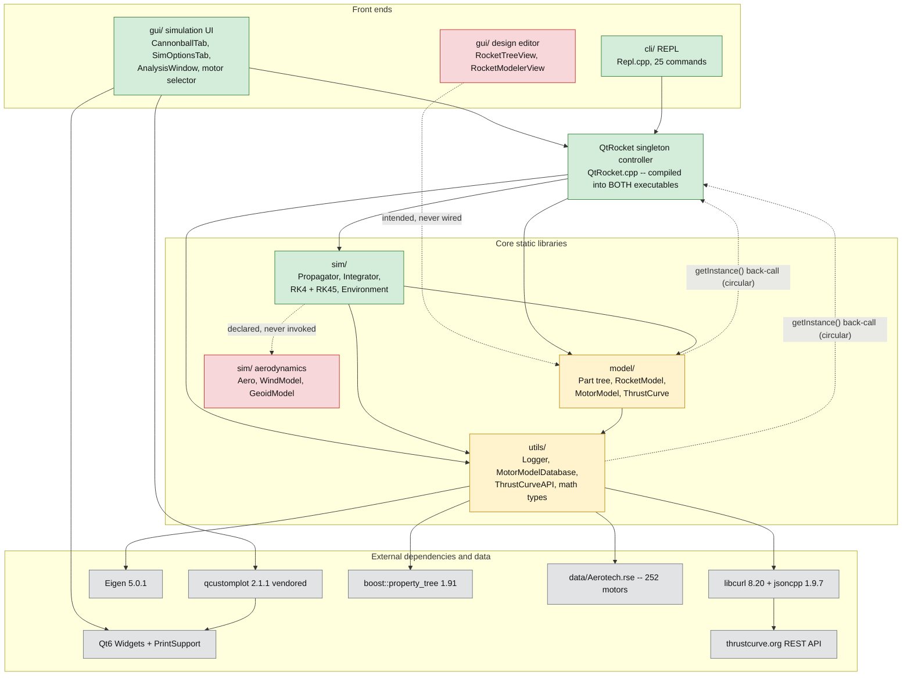
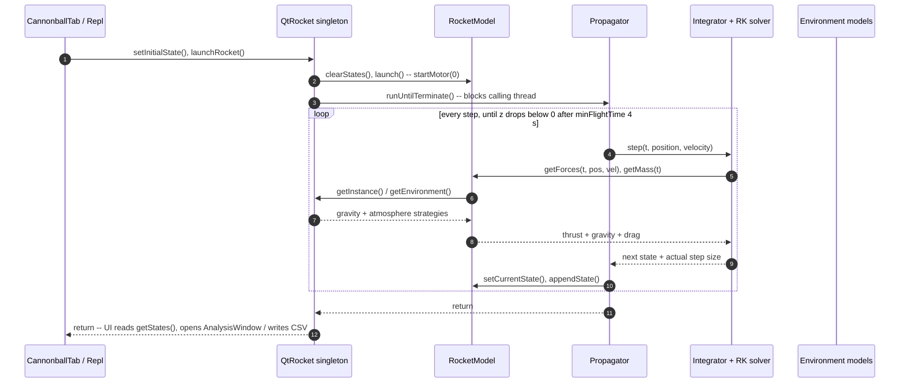

# QtRocket Architecture Audit

| | |
|---|---|
| **Audited at** | commit `b6e1321` (branch `development`), working tree of 2026-06-09 |
| **Scope** | Read-only audit. Every claim cites `path:line` (or `path:start-end`) pinned to the commit above. No code was changed. |
| **Project** | QtRocket — a C++23 / Qt6 model-rocket design & flight-simulation app (OpenRocket-like intent). |

**Status legend** (used on every section heading, scorecard row, and gap entry):

| Mark | Meaning |
|------|---------|
| ✅ | Working — implemented and exercised by a test or a live UI/CLI path |
| 🟡 | Partial — implemented but unwired, stubbed, incomplete, or dead code |
| ❌ | Missing — does not exist; listed because the architecture implies it |

---

## 1. Project Status Snapshot

### 1.1 History at a glance

181 commits spanning 2023-02-01 → 2026-06-09 (`git log --oneline | wc -l`; `git log --format=%ad --date=short`), in three distinct phases:

| Phase | Period | What landed |
|---|---|---|
| Initial build-out | 2023-02 → 2023-05 | Qt GUI skeleton, RK4 solver, atmosphere/gravity models, Logger, RSE motor loader, thrustcurve.org client |
| Sporadic upkeep | 2023-05 → 2024-08, then quiet | Modular refactoring, early tests, occasional WIP commits |
| Reactivation | 2026-06-05 → 2026-06-09 | RK45 adaptive integrator, aerodynamic drag + physics integration tests, CLI REPL, Part composition/clone fixes, HollowSphere part, motor-DB persistence |

The "shelved at ~15%" memory is accurate for the GUI editor; the June 2026 burst substantially hardened the **core** (model + sim + tests + CLI) without touching the editor gap.

### 1.2 Completeness scorecard

| Subsystem | Status | State in one line | Evidence |
|---|---|---|---|
| Component model (`model/`) | 🟡 | Part tree, motors, thrust curves are solid and well-tested; only one concrete part type; tree editing unreachable from any UI | `model/Part.h:41-240`; `model/tests/PartTests.cpp:53-418` |
| Simulation engine (`sim/`) | ✅ | 3-DOF thrust+gravity+drag with RK4/RK45 and pluggable environment models; runs synchronously | `sim/Propagator.cpp:56-102` |
| Aerodynamics | ❌ | One hardcoded drag line; Aero/Wind/Geoid classes are stubs or orphans; no stability analysis | `model/RocketModel.cpp:74`; `sim/Aero.cpp` (entire file: 0 lines) |
| Motor data & file I/O (`utils/`, `data/`) | 🟡 | RSE import, thrustcurve.org search, and `.qmd` save/load all work; dead ThreadPool code; Logger init race | `utils/MotorModelDatabase.cpp:55-299` |
| Rocket-design persistence | ❌ | No save/load of a rocket design exists anywhere; File-menu actions are disabled shells | `gui/MainWindow.ui:117-170`; §4.1 |
| GUI — simulation workflow | ✅ | Cannonball tab → launch → plots works end to end (but blocks the GUI thread) | `gui/CannonballTab.cpp:94-125` |
| GUI — design editor | ❌ | RocketTreeView / RocketModelerView are 6-line stubs; no tree model; no property editing | `gui/RocketTreeView.cpp`, `gui/RocketModelerView.cpp` (entire files: 6 lines each) |
| CLI (`cli/`) | ✅ | 25-branch REPL covering configure → launch → CSV export; same core as the GUI | `cli/Repl.cpp:114-654` |

### 1.3 How to read this document

- Citations are repo-root-relative, backticked, `path:line` or `path:start-end`. Whole-file claims (emptiness, stubness) cite the bare path plus a line count. Absence claims cite the search that found nothing, plus any positive artifact (a disabled `.ui` action, a commented-out include).
- Section 4 traces the two core flows; every break is an inline `> ⛔ BREAK` blockquote, and all of them are consolidated in the §5 Gap Register.
- Code comments reference a `TODO.md` (e.g. `model/RocketModel.cpp:14`, `model/RocketModel.h:123`). That file was deleted in the working tree when this audit was taken (`git status`: ` D TODO.md`); it has since been **restored and rewritten** (2026-06-09) — the legacy `P1/P2/P4` references now resolve against the previous list preserved in `TODO.md` Appendix A.

---

## 2. High-Level Architecture

### 2.1 Subsystem dependency map



Node colors follow the §1 legend (green = working, amber = partial, red = missing, grey = external). **Solid arrows** are real compile-time/runtime dependencies. **Dashed arrows** are the three pathologies: the design-editor widgets that were meant to consume the model but were never wired, the aero classes that are declared but never invoked, and the two `QtRocket::getInstance()` back-calls that make the dependency graph circular (§2.3).

### 2.2 Subsystem responsibilities

- **`model/` — the rocket itself.** A composite tree of `Part` objects carrying mass/CM/inertia, plus `MotorModel`/`ThrustCurve` for propulsion, all aggregated by `RocketModel`, which implements the `Propagatable` interface the sim consumes (`model/Propagatable.h:19-54`). Depends on `utils` (math types, logger) — and, pathologically, back on the `QtRocket` singleton for environment lookups (`model/RocketModel.cpp:56,67`).
- **`sim/` — the numerics.** `Propagator` drives a pluggable `DESolver` (RK4/RK45) over the state, with `Environment` supplying interchangeable gravity and atmosphere strategies. Depends on `model` (the `Propagatable` it steps) and `utils`. Linked as static lib `sim` (`sim/CMakeLists.txt:1,27-28`).
- **`sim/` aerodynamics (nominal).** `Aero`, `WindModel`, `GeoidModel` exist as files but are stubs/orphans; the only aero force in the program is a drag one-liner inside `model/RocketModel.cpp:74` (§3.3).
- **`utils/` + `data/` — shared infrastructure and motor data.** Logger, Eigen-based math typedefs, the motor database with its three ingest paths (bundled `.rse`, thrustcurve.org REST, saved `.qmd` XML). Linked as static lib `utils` carrying all third-party deps (`utils/CMakeLists.txt:1,26-30`).
- **`QtRocket` — the controller.** A singleton owning the (RocketModel, Propagator) pair, the Environment, and the MotorModelDatabase (`QtRocket.h:71-75`); front ends drive everything through it (`QtRocket.h:34-58`). Not in any library — see §2.3.
- **`gui/` — Qt6 Widgets front end.** Entry `main.cpp:11-28` → `gui::run` (`gui/GuiRunner.cpp:30-51`) → `MainWindow`, which hosts exactly two functional tabs (Cannonball, Sim Options — `gui/MainWindow.cpp:30-36`) plus the two stub editor widgets. The only Qt-dependent code in the repo.
- **`cli/` — headless REPL.** `cli/CliMain.cpp:13-28` builds the same `QtRocket` core with no Qt at all and drives it line-by-line (`cli/Repl.cpp:101-112`). Its existence proves the core is front-end-agnostic.

### 2.3 The QtRocket singleton and the circular dependency

`QtRocket` is a mutex-guarded lazy singleton (statics `QtRocket.cpp:13-15`; `getInstance` `:18-25`; double-checked `init()` `:27-36`). Its constructor wires the whole object graph: Environment, RocketModel, Propagator, MotorModelDatabase (`QtRocket.cpp:38-53`).

The architectural smell: code *underneath* the controller reaches back up into it —

- `model/RocketModel.cpp:56,67` call `QtRocket::getInstance()->getEnvironment()` to fetch gravity/atmosphere during force evaluation;
- `utils/MotorModelDatabase.cpp:33,48` call `QtRocket::getInstance()->getLogger()`.

So `utils`/`model` (libraries) reference symbols defined in `QtRocket.cpp` (application layer). The build resolves this by **compiling `QtRocket.cpp` directly into each executable that needs it** instead of putting it in a library — explained verbatim in the build file (`CMakeLists.txt:171-174`): the GUI exe lists it as a source (`CMakeLists.txt:93`), the CLI exe does (`CMakeLists.txt:175-180`), and the integration tests do (`tests/CMakeLists.txt:5-9`). `model_tests`/`sim_tests` link without it only because they never pull in the objects that reference it. Any new executable touching `RocketModel` or `MotorModelDatabase` must repeat this pattern — or the back-calls must be inverted (dependency injection) to break the cycle. The compile database confirms the pattern at build level: `QtRocket.cpp` appears as exactly **three** translation units in `build/compile_commands.json`, one per consumer executable.

---

## 3. Subsystem Deep Dives

### 3.1 Component Model (`model/`) 🟡

| File | Role |
|---|---|
| `model/Part.h` / `model/Part.cpp` | Composite tree node: own + composite mass/CM/inertia, lazy recompute |
| `model/parts/HollowSphere.h` / `.cpp` | The **only** concrete part type (closed-form hollow-sphere geometry) |
| `model/parts/Parts.h` | Umbrella header for concrete parts (`model/parts/Parts.h:4-8`) |
| `model/RocketModel.h` / `.cpp` | `Propagatable` implementation; owns the part tree root + motor |
| `model/Propagatable.h` (+ `model/Propagatable.cpp` — empty, 1 blank line, still compiled) | The model↔sim bridge interface |
| `model/MotorModel.h` / `.cpp` | Motor metadata + time-varying mass/thrust |
| `model/ThrustCurve.h` / `.cpp` | Sampled thrust curve with linear interpolation (`model/ThrustCurve.cpp:53-89`) |

**Core data structures.** A `Part` owns its children together with their CM-to-CM offsets:

```cpp
std::vector<std::tuple<std::shared_ptr<Part>, Vector3>> childParts;   // model/Part.h:239
```

plus a non-owning `Part* parent` for upward dirty propagation (`model/Part.h:199`), a per-process-unique `Id` (`std::uint64_t`, `model/Part.h:50,205`), and **two** inertia tensors: its own *per-unit-mass* geometric tensor (m²) and the *mass-weighted composite* tensor (kg·m²) of the whole subtree about the composite CM (`model/Part.h:218-219`; convention documented at `model/Part.h:29-35`). `RocketModel` holds the tree root `topPart` (`model/RocketModel.h:141`), a copied-in `MotorModel mm` (`:133`), and scalar drag inputs `dragCoefficient{1.0}` / `referenceArea{1.134e-3}` — a 38 mm tube (`model/RocketModel.h:144,148`). `Propagatable` carries the state plus the recorded `(t, StateData)` trajectory (`model/Propagatable.h:49-53`).

**Patterns in use.**

- **Composite** — `addChildPart` transfers ownership, rejects null/already-parented/cycle-forming children with logged no-ops, re-parents, then just marks the path dirty (`model/Part.cpp:81-114`).
- **Prototype (type-preserving clone)** — value copy/move is deleted (`model/Part.h:74-75`); duplication goes through `clone()` → virtual `cloneShallow()` → protected copy-ctor that assigns a **fresh id** (`model/Part.cpp:116-133`, `model/Part.cpp:53`, `model/Part.h:189,193`; `HollowSphere` override `model/parts/HollowSphere.h:62-65`).
- **Dirty-flag lazy recomputation** — setters flag this node and every ancestor (`model/Part.h:213-214`); composite getters recompute on read (`model/Part.h:86-93,108-131`). The recompute is two passes: accumulate composite mass/CM, then shift every tensor to the composite CM via the parallel-axis theorem (`model/Part.cpp:135-177`; helper `parallelAxisTerm` `model/Part.cpp:18`; the load-bearing sum `model/Part.cpp:165-170`).
- **Time-parameterized mass** — `MotorModel::getMass(t)` interpolates a precomputed 128-sample burn curve (`model/MotorModel.cpp:27-72`, curve built at `model/MotorModel.cpp:102-130`), so total rocket mass `motor + composite structure` is consistent at every integrator stage (`model/RocketModel.cpp:21-31`).

**Status notes.** The tree machinery is genuinely done and the best-tested code in the repo (19 tests — `model/tests/PartTests.cpp:53-418`, including clone re-parenting and dirty-propagation via a test-only friend, `model/Part.h:46`). What keeps the subsystem 🟡: the default rocket is a **hardcoded** aluminum hollow sphere (ri=40 mm, ro=50 mm, ρ=2700 kg/m³ ≈ 0.69 kg, `model/RocketModel.cpp:10-18`); `setMass()` writes only the top part's *own* mass and is documented as not round-tripping once children attach (`model/RocketModel.h:120-127`); multi-stage support is a commented-out include (`model/RocketModel.h:21-22`); and nothing outside unit tests can reach `addChildPart` (§4.1).

### 3.2 Simulation Engine (`sim/`) ✅

| File | Role |
|---|---|
| `sim/Propagator.h` / `.cpp` | Owns the loop: step → record → check termination |
| `sim/Integrator.h` | Name→solver strategy map over `DESolver<Vector3>` |
| `sim/DESolver.h` | Template solver interface + `StepResult{state, rate, stepSize}` (`sim/DESolver.h:27,35-65`) |
| `sim/RK4Solver.h` | Fixed-step RK4 (`sim/RK4Solver.h:52-81`) |
| `sim/RK45Solver.h` | Adaptive Runge-Kutta-Fehlberg with error control (`sim/RK45Solver.h:81-160`) |
| `sim/Environment.h` | Gravity + atmosphere strategy registries |
| `sim/StateData.h` | The state record (6-DOF fields, 3-DOF actually used) |

**The ODE.** Propagator's constructor builds the state-space callback — `dPosition = velocity; dVelocity = getForces(t, pos, vel) / getMass(t)` — and hands it to the integrator (`sim/Propagator.cpp:31-42`). Solvers evaluate it at each stage's *node time* so time-varying thrust is sampled correctly (`sim/Propagator.cpp:28-30`; RK4 stages `sim/RK4Solver.h:65-75`; RK45 stages at `t + Cn*h`, `sim/RK45Solver.h:81-160`).

**The loop** (`sim/Propagator.cpp:56-102`): re-assert dt (`:60`), then step → write `nextState.position/velocity` → `appendState` → terminate when `terminateCondition` holds **and** `t > minFlightTime = 4.0 s` (guard against the trajectory dipping below z=0 numerically at liftoff; `sim/Propagator.cpp:87-90`, `sim/Propagator.h:30`, condition `z < 0` at `model/RocketModel.cpp:38-45`) → advance by the step the solver *actually took* (`sim/Propagator.cpp:92-93`). Wall-clock time of the run is logged at DEBUG (`sim/Propagator.cpp:95-100`).

**Strategy pattern, three times.**
- Integrators: `Integrator` maps `"Runge-Kutta 4th Order"` / `"Runge-Kutta-Fehlberg"` to solvers built on demand (`sim/Integrator.h:55-71`, map `:87`, default RK4 set in its constructor `:35-37`).
- Gravity: `"Constant Gravity"` → `(0, 0, -9.8)` (`sim/ConstantGravityModel.h:17-19`) or `"Spherical Gravity"` → GM/r² evaluated in km for conditioning (`sim/SphericalGravityModel.cpp:28-47`). Note the constant model's `-9.8` disagrees with `g0 = 9.80665` defined in `utils/math/Constants.h:10`.
- Atmosphere: `"Constant Atmosphere"` (sea-level constants, `sim/ConstantAtmosphere.h:15-21`), `"US Standard 1976"` (7-layer `utils::Bin` lookup tables, `sim/USStandardAtmosphere.cpp:21-79`, accessors `:78-79`; self-flagged *"overly simplistic and wrong implementation"* with a `@todo`, `sim/USStandardAtmosphere.h:19-21`), `"Vacuum"` (all zeros — reduces the model to thrust+gravity for baseline tests, `sim/VacuumAtmosphere.h:22-30`). Registered in `sim/Environment.h:76-93`; defaults set in its constructor (`sim/Environment.h:33-37`).

**Robustness work from the 2026 reactivation.** `Propagator::setTimeStep` is the single chokepoint that rejects `dt <= 0`/NaN (would otherwise loop forever) and pushes dt into the solver so the integration step and the time axis can't silently diverge (`sim/Propagator.h:56-80`). RK45 throws on step-size underflow (`sim/RK45Solver.h:89`), shrinks on `err > tol` (`:130-135`), grows capped at 5× (`:146-148`), and clamps the next guess to `hMax` — without which exactly-integrated dynamics grow h unboundedly (`sim/RK45Solver.h:150-155`; regression test `sim/tests/RK45SolverTests.cpp:75`).

**What's quietly missing (the 🟡 edges of a ✅ subsystem).** `StateData` carries `orientation`/`orientationRate` quaternions, a DCM, and Euler angles (`sim/StateData.h:78-91`) — but only position/velocity are ever integrated; the orientation integrator is a commented-out member with a design note (`sim/Propagator.h:93-97`), the loop never writes the rotational fields (`sim/Propagator.cpp:78-81`), and the quaternions are zero-initialized `{0,0,0,0}` — not even an identity rotation (`sim/StateData.h:82-83`). Correspondingly `getTorques()` returns zeros and nothing calls it (`model/RocketModel.cpp:80-84`). The whole run executes synchronously on the caller's thread — there is no worker thread anywhere (§4.2).

### 3.3 Aerodynamics ❌

This is the audit's bluntest finding: **the subsystem OpenRocket is built around does not exist here.** The complete aerodynamic force model of the program is one line:

```cpp
const Vector3 drag = -0.5 * rho * speed * dragCoefficient * referenceArea * velocity;   // model/RocketModel.cpp:74
```

with ρ from the active atmosphere at clamped altitude (`model/RocketModel.cpp:67-72`) and a user-supplied Cd/area. Thrust is likewise hardwired to world +Z, "always through the center of mass" (`model/RocketModel.cpp:50-51`).

The supporting cast is scaffolding only:
- `sim/Aero.h:17-40` declares cp, Cx/Cy/Cz, Cl/Cm/Cn, Cd fields — and not a single method; `sim/Aero.cpp` (entire file: 0 lines). The `aeroData` member sits unread in the interface (`model/Propagatable.h:47`; only reference outside its own files per `grep -rn "aeroData|sim::Aero" --include=*.cpp --include=*.h .`).
- `sim/WindModel.cpp:16-19` unconditionally returns `(0,0,0)`; zero callers (`grep -rn getWindSpeed` matches only the class's own files).
- `GeoidModel`/`SphericalGeoidModel` have zero usages outside their own files (`grep -rn GeoidModel`).

No angle of attack, no lift or side force, no moments, no CP computation, no CG-vs-CP stability margin. Consequence: every simulated rocket is a guided point mass — §4.2's flow is honest physics only for a cannonball-like model.

### 3.4 Motor Data & File I/O (`utils/`, `data/`) 🟡

**Motor database.** `MotorModelDatabase` stores motors in a `std::map<std::string, model::MotorModel>` keyed by common name (`utils/MotorModelDatabase.h:158-159`). Ingestion is deliberately private (`utils/MotorModelDatabase.h:146-149`); motors enter via three working paths:

1. **RSE import** — `importRSEFile` (`utils/MotorModelDatabase.h:98`, impl `utils/MotorModelDatabase.cpp:55`) delegates to `RSEDatabaseLoader`, which parses RockSim XML via `boost::property_tree::read_xml` and walks `engine-database.engine-list` (`utils/RSEDatabaseLoader.cpp:24-27`). Bundled data: `data/Aerotech.rse` (252 `<engine` entries; `grep -c '<engine ' data/Aerotech.rse`).
2. **thrustcurve.org REST** — `searchOnline`/`getOnlineSearchFacets` (`utils/MotorModelDatabase.h:125-134`) drive `ThrustCurveAPI` against `https://www.thrustcurve.org/` (`utils/ThrustCurveAPI.cpp:18`): `api/v1/search.json` (`:218-219`), `api/v1/download.json` for samples (`:32`), `api/v1/metadata.json` (`:138-139`), parsed with jsoncpp. HTTP is a thin libcurl wrapper (`utils/CurlConnection.cpp:28-29,40-44`) — note it sets `CURLOPT_SSL_VERIFYPEER` to `false` (`utils/CurlConnection.cpp:43`), i.e. TLS certificates are not verified.
3. **`.qmd` save/load round-trip** — `saveMotorDatabase`/`loadMotorDatabase` write/read a `<QtRocketMotorDatabase version="0.1">` XML document via property_tree (`utils/MotorModelDatabase.cpp:167-229` with `write_xml` at `:228`; `:231-299` with `read_xml` at `:237`). Reached from the GUI (Tools menu `gui/MainWindow.cpp:75-100`; Cannonball tab buttons `gui/CannonballTab.cpp:176-232`) and the CLI (`savedb`/`loaddb`, `cli/Repl.cpp:183-226`). Round-trip is tested (`tests/MotorDatabasePersistenceTests.cpp:77`).

**The headline absence: rocket-*design* persistence.** Nothing serializes a rocket (parts, masses, geometry, sim setup). Evidence: the File menu's New/Open/Save/Save As/Close actions exist but ship disabled (`enabled=false` at `gui/MainWindow.ui:117,129,141,153,170`) with no slots behind them (`gui/MainWindow.h:38-44` declares only Quit/About/SaveMotorDatabase handlers); the once-planned boost serialization is a commented-out include marked "CURRENTLY UNUSED" (`model/MotorModel.h:10-13`); and `grep -rniE "saveRocket|loadRocket|\.ork\b|boost::archive|QAbstractItemModel" --include=*.cpp --include=*.h --include=*.ui .` returns no matches.

**Logger.** Singleton writing every message to both stdout and a hardcoded `log.txt` in the CWD (`utils/Logger.cpp:28`), levels `ERROR_`→`PERF_` (`utils/Logger.h:25-29`). Logging itself is mutex-guarded (`utils/Logger.cpp:38,89`) but **first-call construction is not** — `getInstance` does an unguarded `instance = new Logger()` (`utils/Logger.cpp:17-24`), unlike `QtRocket`'s locked init (`QtRocket.cpp:27-36`). Harmless today (single-threaded), a landmine if threading arrives.

**Dead code.** `ThreadPool` (hardware-concurrency workers, `utils/ThreadPool.cpp:14-26`) and its `TSQueue` are never instantiated anywhere: `grep -rnE "ThreadPool|TSQueue" --include=*.cpp --include=*.h .` matches only their own files. Math types are thin Eigen aliases — `Vector3`/`Matrix3`/`Quaternion` etc. (`utils/math/MathTypes.h:11-22`).

### 3.5 GUI Layer (`gui/`) 🟡

Entry chain: `main.cpp:11-28` → `gui::run` creates `QApplication` and shows `MainWindow` (`gui/GuiRunner.cpp:30-51`). `MainWindow` adds exactly two tabs and three menu connections (`gui/MainWindow.cpp:27-58`).

**Working widgets ✅**

| Widget | What it does | Evidence |
|---|---|---|
| `CannonballTab` | Point-mass inputs (velocity, angle-from-vertical w/ 0–90° validator, mass, Cd, area), motor selection, launch button gated on `isMotorSet()` | `gui/CannonballTab.cpp:27-92` |
| `SimOptionsTab` | Live-applies timestep, atmosphere, gravity, integrator to the core the moment they change (no Apply button); pushes its defaults at construction | `gui/SimOptionsTab.cpp:57-77,89-107` |
| `ThrustCurveMotorSelector` | thrustcurve.org metadata fetch, search, and set-motor | `gui/ThrustCurveMotorSelector.cpp:48-95` |
| `AnalysisWindow` | Three plots off the recorded states: altitude (z), z-velocity, motor thrust curve — via vendored qcustomplot 2.1.1 (`gui/qcustomplot.h:23`) | `gui/AnalysisWindow.cpp:36-125` |

Quirks worth knowing: `AnalysisWindow` sets itself `Qt::NonModal` then `hide()`/`show()` in its constructor (`gui/AnalysisWindow.cpp:13-15`), yet CannonballTab displays it with blocking `exec()` after calling `setModal(false)` (`gui/CannonballTab.cpp:122-124`) — `exec()` blocks regardless. Plots cover only the Z components; no downrange, speed, or 3-D view.

**Stub widgets ❌**

| Widget | Declared | Reality |
|---|---|---|
| `RocketTreeView` | placed in the main splitter (`gui/MainWindow.ui:49-56`, promoted class `:188-192`) | entire `.cpp` is a 6-line empty constructor (`gui/RocketTreeView.cpp`); never referenced in `gui/MainWindow.cpp:22-59`; no `setModel()` call and **no `QAbstractItemModel` subclass exists in the repo** (grep in §3.4) |
| `RocketModelerView` | bottom pane of the splitter (`gui/MainWindow.ui:66`, promoted `:193-197`) | entire `.cpp` is a 6-line empty constructor (`gui/RocketModelerView.cpp`); no `paintEvent`, renders a blank widget |
| File actions | New/Open/Save/Save As/Close in the File menu (`gui/MainWindow.ui:82-88`) | all disabled (`:117,129,141,153,170`), no slots (`gui/MainWindow.h:38-44`) |

### 3.6 CLI (`cli/`) ✅

`qtrocket-cli` is a Qt-free REPL over the same core. `cli/CliMain.cpp:13-28` silences the logger to ERROR (stdout stays machine-readable), grabs the `QtRocket` singleton, and loops `Repl::run` over stdin (`cli/Repl.cpp:101-112`). `Repl::execute` is a 25-branch `if/else if` dispatch (`cli/Repl.cpp:114-654`; `grep -c 'cmd == ' cli/Repl.cpp` = 25, with `quit`/`exit` sharing a branch): motor DB management (`loadmotors`, `savedb`, `loaddb`, `tcfacets`, `tcsearch`, `listmotors`, `setmotor`), staged flight configuration kept in plain members that mirror the core's defaults (`cli/Repl.h:52-61`), environment/integrator selection, `status`, and `launch`.

`launch` (`cli/Repl.cpp:527-605`) decomposes the angle exactly like the GUI (shared constant `DEG_PER_RAD`, `cli/Repl.cpp:31,537-539`), runs the identical `setInitialState` → `launchRocket` path (`:544-545`), then derives apogee / max-speed / downrange / landing from the state series (`:554-575`) and writes the full trajectory to `qtrocket_run.csv` (`:577-591`, CSV writer `:78-90`). The CLI's significance to this audit: it demonstrates the controller+model+sim stack runs headless, so the editor gap is purely a GUI-layer problem. The compile database proves the Qt-freeness directly — the `cli/` translation units carry no Qt defines or include paths at all (`build/compile_commands.json`).

### 3.7 Build & Test Topology

C++23 (`CMakeLists.txt:5`), Qt AUTOMOC/AUTOUIC/AUTORCC globally on (`CMakeLists.txt:70-72`). Targets:

| Target | Kind | Notes |
|---|---|---|
| `qtrocket` | GUI exe | sources incl. `QtRocket.cpp` (`CMakeLists.txt:93,125-129`); links Qt6 + `utils`/`sim`/`model` (`:164-169`) |
| `qtrocket-cli` | CLI exe | `cli/*` + `QtRocket.cpp` (`CMakeLists.txt:175-184`) |
| `utils` | static lib | carries libcurl, Boost::property_tree, jsoncpp, Eigen (`utils/CMakeLists.txt:26-30`) |
| `sim` | static lib | links `utils` (`sim/CMakeLists.txt:27-28`) |
| `model` | static lib | links `utils` (`model/CMakeLists.txt:17-18`) |
| `model_tests`, `sim_tests`, `integration_tests` | gtest exes | registered with ctest as `qtrocket_*`; CI runs `ctest -R 'qtrocket_*'` (`.github/workflows/cmake-multi-platform.yml:86`) |

All third-party deps except Qt6 arrive via FetchContent and build from source on first configure (§6.1) — so the first build is slow by design.

**Compile-database corroboration (build of 2026-06-10).** `build/compile_commands.json` holds 551 entries: **49 project TUs vs 502 dependency TUs** (curl 419, boost 65, jsoncpp 9, gtest 4) — the slow first build, quantified. Three hygiene facts fall out of it: **(a) no warning flags at all** — zero of the 49 project TUs carry any `-W*` option, and no `CMAKE_CXX_FLAGS`/`add_compile_options` exists in any project CMakeLists (grep: no matches); **(b)** curl's own test harness is compiled (`_deps/curl-build/tests/*` TUs) because curl defaults `option(BUILD_TESTING "Build tests" ON)` **itself** (`_deps/curl-src/CMakeLists.txt:1925`, gated by `Perl_FOUND`) — not, as an earlier revision of this paragraph claimed, because of the parent's `enable_testing()`, which never sets `BUILD_TESTING`; **(c)** the global AUTOMOC (`CMakeLists.txt:70-72`) emits a `mocs_compilation.cpp` for every target, including the Qt-free libraries. Toolchain observed in the DB: `clang++` via ccache, `-std=gnu++23`, system Qt **6.10.3** — while CI builds with gcc-13/MSVC (`.github/workflows/cmake-multi-platform.yml:30-37`), a local/CI compiler divergence worth knowing about.

**Test coverage.** `model_tests`: 19 tests on Part/HollowSphere composition — closed-form inertia, parallel-axis correctness at depth, clone semantics, dirty propagation (`model/tests/PartTests.cpp:53-418`). `sim_tests`: US-Standard-Atmosphere density/pressure/temperature and 7 RK45 properties incl. the hMax regression (`sim/tests/USStandardAtmosphereTests.cpp:5-64`, `sim/tests/RK45SolverTests.cpp:43-195`). `integration_tests`: end-to-end physics on a real Aerotech G80T loaded from the bundled RSE via a compile-time data path (`tests/CMakeLists.txt:13`, fixture `tests/PhysicsIntegrationTests.cpp:56-59`) — timestep invariance in vacuum, RK45-vs-RK4 agreement, downrange from tilted launch, drag-reduces-apogee, terminal-velocity force balance (`tests/PhysicsIntegrationTests.cpp:120-278`); plus motor-DB enum and save/load round-trips (`tests/MotorDatabasePersistenceTests.cpp:25-77`). **Gap:** nothing exercises the GUI, and nothing can exercise design editing because it doesn't exist.

---

## 4. Data-Flow Traces

### 4.1 Editing a rocket design — the broken flow ❌

What "editing a design" would mean, step by step, against what exists:

1. **Create / open a design** —
   > ⛔ BREAK: File→New/Open/Save/Save As/Close are disabled shells: `enabled=false` (`gui/MainWindow.ui:117,129,141,153,170`), no slots (`gui/MainWindow.h:38-44`), no serialization anywhere (§3.4 grep).
2. **See the part tree** — the model side is ready: `RocketModel.topPart` is a real `Part` tree (`model/RocketModel.h:141`).
   > ⛔ BREAK: `RocketTreeView` is created by `setupUi` and then never touched — no `setModel()`, no signals (`gui/RocketTreeView.cpp`, entire file: 6 lines; `gui/MainWindow.cpp:22-59`). The adapter it needs — a `QAbstractItemModel` over `Part` — does not exist (repo-wide grep, §3.4).
3. **Add / remove / re-arrange parts** — the model API is implemented, guarded, and unit-tested: `addChildPart` (`model/Part.cpp:81-114`), `clone` (`model/Part.cpp:123-133`), `findById` (`model/Part.cpp:179-193`).
   > ⛔ BREAK: zero callers outside tests — `grep -rn addChildPart gui/ cli/` finds nothing. No dialog, button, or context menu reaches the tree.
4. **Edit part properties** — what actually reaches the model today is exactly three scalars + the motor: CannonballTab writes mass/Cd/area on each launch click (`gui/CannonballTab.cpp:114-117` → `model/RocketModel.h:110,117,127`), and `setMass` touches only the top part's own mass (documented caveat, `model/RocketModel.h:120-126`).
5. **Pick a motor** — ✅ fully working, two paths converging on `RocketModel::setMotorModel` (`model/RocketModel.cpp:97-101`): Cannonball tab combo (`gui/CannonballTab.cpp:234-246`) and thrustcurve.org selector (`gui/ThrustCurveMotorSelector.cpp:85-95`), both gating the launch button via `isMotorSet()` (`gui/CannonballTab.cpp:87-92`).
6. **Visualize the rocket** —
   > ⛔ BREAK: `RocketModelerView` draws nothing — empty constructor, no `paintEvent` (`gui/RocketModelerView.cpp`, entire file: 6 lines).

Net: **the editable surface of a "design" today is {mass, Cd, reference area, motor} on a hardcoded one-part rocket.** Everything deeper exists only as model-layer API.

### 4.2 Running a simulation — GUI path ✅ (with one 🟡)



The numbered trace, with citations per hop:

1. Click **Calculate Trajectory** (enabled only with a motor set, `gui/CannonballTab.cpp:87-92`) → slot `gui/CannonballTab.cpp:94`.
2. Read the five inputs (`:97-105`); decompose angle-from-vertical into vx/vz (`:109-110`); build `StateData{pos=(0,0,0), vel=(vx,0,vz)}` (`:111-113`).
3. Push scalars into the model (`:114-117`), initial state into the controller (`:119` → `QtRocket.h:58` → `model/Propagatable.h:37`).
4. `QtRocket::launchRocket()` (`QtRocket.cpp:55-66`): clear old states (`:58`), reset clock (`:59`), `RocketModel::launch()` — current state := initial, motor ignition at t=0 (`model/RocketModel.cpp:91-95`) — then `runUntilTerminate()` (`:65`).
5. The propagation loop (`sim/Propagator.cpp:56-102`) steps the active solver via the `Integrator` facade (`sim/Integrator.h:83`).
6. Every RK stage calls the ODE callback `{v, F/m}` (`sim/Propagator.cpp:31-42`) at that stage's node time (RK4 `sim/RK4Solver.h:65-75`; RK45 `sim/RK45Solver.h:81-160`).
7. `getForces` assembles thrust(+Z) + gravity + drag, re-entering the singleton for the active environment strategies (`model/RocketModel.cpp:47-78`, back-calls `:56,67`); `getMass(t)` adds burning motor mass to composite structure mass (`model/RocketModel.cpp:21-31`).
8. Accepted states append to the trajectory (`sim/Propagator.cpp:83-86`); loop exits when z < 0 after the 4 s guard (`:87-90`, `model/RocketModel.cpp:38-45`, `sim/Propagator.h:30`); only position/velocity are written — orientation fields stay zero (`sim/Propagator.cpp:78-81`).
9. Control returns to the slot, which opens `AnalysisWindow` — `setModal(false)` then **blocking `exec()`** (`gui/CannonballTab.cpp:122-124`); its plot buttons read `QtRocket::getStates()` (`gui/AnalysisWindow.cpp:39,66`, accessor `QtRocket.h:52`).

> ⛔ 🟡 **Threading callout:** the entire flight integrates synchronously inside the button slot on the GUI thread — no worker, no signals, no progress (call chain above; the only thread machinery in the repo is the dead `ThreadPool`, §3.4). A long flight freezes the UI for its duration.

### 4.3 Running a simulation — CLI path ✅ (delta only)

`launch` in the REPL (`cli/Repl.cpp:527-605`) refuses to run without a motor (`:529-533`), builds the same initial state from its staged settings (`:537-543`), then enters the identical core at step 4 above (`:544-545`). Differences are all post-processing: summary stats computed from the series (`:554-575`), full trajectory CSV to `qtrocket_run.csv` (`:577-591`), and `states`/`save` commands for re-export (`:606-645`). Same blocking behavior — irrelevant in a synchronous REPL.

---

## 5. Gap Register

Every 🟡/❌/⛔ from sections 2–4, consolidated. This is an audit inventory, deliberately not a prioritized roadmap.

| # | Gap | Mark | Where it bites | Evidence |
|---|---|---|---|---|
| 1 | No aerodynamics: no AoA, lift, moments, CP, or stability margin — drag is one hardcoded line | ❌ | §3.3 | `model/RocketModel.cpp:74`; `sim/Aero.cpp` (0 lines) |
| 2 | No rocket-design save/load (the File menu is a façade) | ❌ | §3.4, §4.1.1 | `gui/MainWindow.ui:117-170`; `model/MotorModel.h:10-13`; grep |
| 3 | No `QAbstractItemModel` adapter for the Part tree | ❌ | §4.1.2 | repo-wide grep (no matches) |
| 4 | `RocketTreeView` placed in the UI but never wired | 🟡 | §3.5, §4.1.2 | `gui/RocketTreeView.cpp` (6 lines); `gui/MainWindow.cpp:22-59` |
| 5 | `RocketModelerView` renders nothing | 🟡 | §3.5, §4.1.6 | `gui/RocketModelerView.cpp` (6 lines) |
| 6 | `Part::addChildPart`/`clone` unreachable from any front end | 🟡 | §4.1.3 | `model/Part.cpp:81-114`; grep `gui/ cli/` |
| 7 | 3-DOF only: orientation never integrated; quaternions zero-initialized (not identity) | 🟡 | §3.2, §4.2.8 | `sim/Propagator.h:93-97`; `sim/Propagator.cpp:78-81`; `sim/StateData.h:82-83` |
| 8 | `getTorques()` returns zeros and has no caller | 🟡 | §3.2 | `model/RocketModel.cpp:80-84` |
| 9 | `WindModel` and `GeoidModel` orphaned (zero callers; wind returns zeros) | 🟡 | §3.3 | `sim/WindModel.cpp:16-19`; greps |
| 10 | Simulation blocks the GUI thread (no worker, no progress UI) | 🟡 | §4.2 | `gui/CannonballTab.cpp:120-124`; `QtRocket.cpp:55-66` |
| 11 | Circular dependency: `model`/`utils` back-call the `QtRocket` singleton; `QtRocket.cpp` recompiled into every consumer exe | 🟡 | §2.3 | `CMakeLists.txt:171-174`; `model/RocketModel.cpp:56,67`; `utils/MotorModelDatabase.cpp:33,48` |
| 12 | Logger singleton construction is not thread-safe (unlike QtRocket's) | 🟡 | §3.4 | `utils/Logger.cpp:17-24` vs `QtRocket.cpp:27-36` |
| 13 | Dead code: `ThreadPool`/`TSQueue` never instantiated | 🟡 | §3.4 | repo grep (matches only their own files) |
| 14 | Hardcoded one-part default rocket; GUI `setMass` not composite-aware once children exist | 🟡 | §3.1 | `model/RocketModel.cpp:10-18`; `model/RocketModel.h:120-127` |
| 15 | `USStandardAtmosphere` self-flagged "overly simplistic and wrong"; constant gravity −9.8 disagrees with `g0 = 9.80665` | 🟡 | §3.2 | `sim/USStandardAtmosphere.h:19-21`; `sim/ConstantGravityModel.h:19` vs `utils/math/Constants.h:10` |
| 16 | TLS certificate verification disabled for thrustcurve.org requests | 🟡 | §3.4 | `utils/CurlConnection.cpp:43` |
| 17 | Build hygiene: no compiler warnings enabled anywhere; dependency test suites (curl) get compiled — **both addressed in the working tree 2026-06-10** (`-Wall -Wextra -Wpedantic`/`/W4`; `set(BUILD_TESTING OFF)`; `-Werror` deferred, warning sweep pending) | 🟡 | §3.7 | `build/compile_commands.json` (0 of 49 project TUs carry `-W*`; `_deps/curl-build/tests/*` TUs); no flag config in any CMakeLists (grep) — all at the pinned commit |

---

## 6. Appendix

### 6.1 External dependency inventory

| Dependency | Version | Acquired via | Used by / for | Evidence |
|---|---|---|---|---|
| Qt6 (Widgets, PrintSupport, LinguistTools) | system — 6.10.3 on the audited machine | `find_package` | all of `gui/` | `CMakeLists.txt:81-82,164-169`; `build/compile_commands.json` |
| Eigen | 5.0.1 | FetchContent | all math types (`Vector3`, `Matrix3`, `Quaternion`) | `CMakeLists.txt:55-58`; `utils/math/MathTypes.h:4-22` |
| Boost (property_tree requested; 6 libs compile transitively — 65 TUs, 48 of them Serialization) | 1.91.0 | FetchContent | RSE + `.qmd` XML parse/write | `CMakeLists.txt:62-66`; `utils/RSEDatabaseLoader.cpp:24`; `build/compile_commands.json` |
| libcurl | 8.20.0 | FetchContent | thrustcurve.org HTTP | `CMakeLists.txt:41-52`; `utils/CurlConnection.cpp:28-29` |
| jsoncpp | 1.9.7 | FetchContent | thrustcurve.org JSON | `CMakeLists.txt:29-38` |
| GoogleTest | 1.17.0 | FetchContent | all three test suites | `CMakeLists.txt:14-20` |
| qcustomplot | 2.1.1 | vendored in-tree | AnalysisWindow plots | `gui/qcustomplot.h:23` |
| Aerotech motor data | 252 engines | bundled file | default motor database | `data/Aerotech.rse`; `tests/CMakeLists.txt:13` |

### 6.2 Maintaining this document

Line numbers are pinned to commit `b6e1321`; corroborated against `build/compile_commands.json` on 2026-06-10 at HEAD `d89305c` (`git diff --name-only b6e1321 d89305c` touches only docs — no source files, so every pin remains valid). **Exception:** `CMakeLists.txt` changed in the working tree later on 2026-06-10 (warnings, `BUILD_TESTING OFF`, `enable_testing()` moved; plus new `CMakePresets.json` pinning Ninja+Debug) — this document's `CMakeLists.txt:N` citations apply at the pin, not the working tree. After meaningful changes, re-verify citations by extracting them (`grep -oE '[A-Za-z0-9_./-]+\.(h|cpp|txt|ui|rse|md|yml):[0-9]+(-[0-9]+)?' docs/ARCHITECTURE_AUDIT.md | sort -u`) and dumping each cited range (`sed -n 'START,ENDp' <file>`) to confirm the named symbol still lives there. Update §1.2 / §5 marks as gaps close; the legend and citation conventions are defined in §1.3.

---

## 7. State of the Code (gap & quality pass)

This section is the candid assessment layer on top of §§3–5: maturity per area, every dangling symbol and dead end found by a dedicated sweep, and pattern/API critiques. Same commit (`b6e1321`); everything below is established by **reading** the code — nothing was executed, so dynamic claims are labeled "by inspection". Items here that go beyond the §5 register (notably F1 and F2) came out of this pass.

### 7.1 Maturity ratings

Vocabulary: **solid** (do not rewrite — extend), **partial** (works, with real holes), **skeleton** (files exist, function doesn't), **missing** (nothing to build on).

| Area | Rating | Why |
|---|---|---|
| Part tree & mass properties | **solid** | Correct parallel-axis composition, lazy recompute, type-preserving clone, 19 tests (`model/tests/PartTests.cpp:53-418`) — but its composite-tensor output currently has zero consumers (§7.2) |
| Motor model & thrust curves | **solid** | Time-aware mass/thrust, three ingest paths, persistence round-trip tested (`tests/MotorDatabasePersistenceTests.cpp:77`); delays are dead cargo (§7.5) |
| Motor database & file I/O | **solid** | `utils/MotorModelDatabase.cpp:55-299`; clean ingestion discipline (`utils/MotorModelDatabase.h:146-149`) |
| ODE solvers (RK4 / RK45) | **solid** | Well-commented, node-time-correct, regression-tested (`sim/tests/RK45SolverTests.cpp:43-195`); accuracy knobs unreachable from the app (§7.5) |
| Propagator & state recording | **partial** | 3-DOF only, synchronous, and the termination gate records subterranean states for short flights (F9) |
| Environment models | **partial** | Constant gravity/atmosphere fine; US76 self-flagged wrong (`sim/USStandardAtmosphere.h:19-21`); Spherical Gravity broken twice by inspection (F1) |
| Aerodynamics | **missing** | The supporting files are skeleton (`sim/Aero.cpp`: 0 lines); the physics is one drag line (§3.3) |
| Rocket-design persistence | **missing** | §3.4 — no serialization of designs exists in any form |
| GUI — simulation workflow | **partial** | Works end to end but blocks the GUI thread, has a dead button (§7.2), and plots only Z components |
| GUI — design editor | **skeleton** | Two 6-line widget stubs, no tree model, no property panel (§4.1) |
| CLI | **solid** | Complete configure→launch→export loop, validates inputs, machine-readable output (`cli/Repl.cpp:114-654`) |
| Concurrency infrastructure | **skeleton** | `ThreadPool`/`TSQueue` dead since 2023 (§3.4); Logger init race (`utils/Logger.cpp:17-24`); nothing multithreaded actually exists |

### 7.2 Dangling interfaces and dead symbols

**Implemented, never called** (callers established by repo-wide grep, `build/` excluded):

| Symbol | Where | Note |
|---|---|---|
| `RocketModel::getCompositeInertiaTensor` | `model/Propagatable.h:29`; `model/RocketModel.cpp:33-36` | Zero callers — the entire tensor-composition machinery (the best-tested code in the repo) is currently **write-only** |
| `RocketModel::getTorques` | `model/RocketModel.cpp:80-84` | Returns zeros; never invoked (no orientation integrator) |
| `Part::findById` | `model/Part.cpp:179-193` | Tests only (`model/tests/PartTests.cpp:379-382,442`) — built for a front end that doesn't exist yet |
| `Part::getChildMasses` | `model/Part.h:210`; `model/Part.cpp:70-79` | Private and uncalled even within `Part.cpp` (recompute reads `compositeMass` directly) |
| `StateData::getPosStdVector` / `getVelStdVector` | `sim/StateData.h:55-62` | Zero callers |
| `Propagator::retainStates` **and** `setSaveStats` | `sim/Propagator.h:50-53,88` | Two public names for the same bool — both with zero callers |
| `ThrustCurve::setThrustCurveVector` | `model/ThrustCurve.h:47-49`; `model/ThrustCurve.cpp:34-45` | Zero callers; its own doc says *"TODO: Get rid of this"* |
| `ThrustCurveAPI::getMotorData` | `utils/ThrustCurveAPI.h:77`; `utils/ThrustCurveAPI.cpp:82` | Zero callers (overlaps `getThrustCurve`) |
| `RK45Solver::setErrorTolerance` / `setMaxStepSize` | `sim/RK45Solver.h:76-79` | Called only by solver unit tests; `Integrator` forwards only `setTimeStep`/`step` (`sim/Integrator.h:78-83`), so they are unreachable from the application |
| `Logger::perf` / `Logger::log(std::ostream&, …)` | `utils/Logger.h:46,48` | Zero callers |
| `AtmosphericModel::getSpeedOfSound` / `getDynamicViscosity` | `sim/AtmosphericModel.h:17-18` | Implemented in all three models, called by **nothing — including tests** (`sim/tests/USStandardAtmosphereTests.cpp:5-64` covers only density/pressure/temperature) |
| `WindModel::getWindSpeed` / `GeoidModel::getGroundLevel` | `sim/WindModel.cpp:16-19`; `sim/SphericalGeoidModel.cpp:18-21` | Zeros / a constant; zero callers (§3.3) |

**Never instantiated anywhere:** `ThreadPool`, `TSQueue` (§3.4), `WindModel`, `SphericalGeoidModel`. `Aero` *is* instantiated — as the `aeroData` member every `Propagatable` carries (`model/Propagatable.h:47`) — but no line ever reads or writes it.

**Phantom declarations:** `class Rocket;` is forward-declared in `sim/Propagator.h:24` and exists nowhere in the repo (grep for `class Rocket` finds only that line). Cosmetic cousin: `sim/Integrator.h`'s closing guard comment says `SIM_ENVIRONMENT_H` while the guard is `SIM_INTEGRATOR_H` (`sim/Integrator.h:1-2,98`) — copy-paste residue.

**UI elements wired to nothing:** `plotAtmosphereBtn` is declared in `gui/AnalysisWindow.ui:52` and referenced by **no** connect and **no** slot (`gui/AnalysisWindow.cpp:17-27` connects three buttons; `gui/AnalysisWindow.h:41-43` declares three slots) — a visible button that silently does nothing. Beyond it: the disabled File actions and the two stub views (§3.5, §4.1). Every other widget/slot pairs up cleanly (6/6 CannonballTab, 4/4 SimOptionsTab, 3/3 motor selector, 1/1 AboutWindow — connect inventory vs. `.ui` widget inventory).

### 7.3 TODO inventory, commented-out code, stub bodies

**TODO census: 17 markers, zero FIXME/HACK** (sweep: `grep -rniE "todo|fixme|hack|wip"` over `*.cpp|*.h|*.ui`, excluding `build/` and vendored `gui/qcustomplot.h`, which carries 8 of its own):

| File | Lines | Substance |
|---|---|---|
| `model/RocketModel.h` / `.cpp` | `h:123`; `cpp:14,27` | Composite-aware GUI mass story; GUI-driven geometry — all reference **TODO.md P2** |
| `model/MotorModel.h` | `370,392` | Make MetaData private ("public just for testing"); `infoUrl` annotated `TODO: ???` |
| `model/ThrustCurve.h` | `47` | "Get rid of this. This is for temporary testing" (`setThrustCurveVector`) |
| `sim/StateData.h` | `65` | "Put these behind an interface" (public members) |
| `sim/RK4Solver.h` | `39` | Make the solver more generic |
| `sim/USStandardAtmosphere.h` | `21` | "Fix this implementation. See the 1976 NOAA paper" |
| `utils/Logger.h` | `18` | "@todo write docs" |
| `utils/Bin.h` / `.cpp` | `h:22`; `cpp:15,39` | STL-ify/templatize Bin; `<format>` availability in Clang; efficiency |
| `utils/ThrustCurveAPI.cpp` | `256,257` | "fill in certOrg" / "fill in delays" for online motors |
| `gui/GuiRunner.cpp` | `34` | US-English-only translation note |
| `tests/PhysicsIntegrationTests.cpp` | `35` | References **TODO.md P1** |

Four of these point into `TODO.md`, which was deleted in the working tree when the audit was taken (§1.3); the ledger has since been restored and rewritten (its legacy sections — the targets of those references — are preserved in `TODO.md` Appendix A).

**Commented-out code blocks (8):** multi-stage include (`model/RocketModel.h:21-22`); boost-archive serialization (`model/MotorModel.h:10-13`); the 6-DOF orientation integrator member (`sim/Propagator.h:93-97`); StateData accessors plus its `// private:` (`sim/StateData.h:65-75`); `getCurrentMotorModel()` by-const-ref accessor (`model/RocketModel.h:100`); `//maxTime += ignitionTime` (`model/ThrustCurve.cpp:50`); `//private:` over MotorModel's metadata (`model/MotorModel.h:371`); `//#include <format>` (`utils/Bin.cpp:17`).

**Stub/placeholder bodies:** `sim/Aero.cpp` (empty file); `model/Propagatable.cpp` (entire file: 1 blank line — compiled as an empty TU); `WindModel::getWindSpeed` → `(0,0,0)`; `RocketModel::getTorques` → zeros; `SphericalGeoidModel::getGroundLevel` → a constant; the two 6-line GUI view constructors. (`VacuumAtmosphere`'s zeros are deliberate design, not a stub — `sim/VacuumAtmosphere.h:22-30`.)

### 7.4 Patterns and APIs — candid critique

- **F1 — `SphericalGravityModel` is wrong twice, by inspection.** (a) The denominator is `std::sqrt(r³)` = r^1.5, not the r³ an inverse-square `factor·r_vec` form requires (`sim/SphericalGravityModel.cpp:39-44`) — at geocentric Earth-surface radius that yields ≈5×10⁶ m/s², some five orders of magnitude too strong. (b) Both front ends launch from `(0,0,0)` (`gui/CannonballTab.cpp:112`; `cli/Repl.cpp:542`), where r = 0: division by zero → NaN forces → `terminateCondition` (a `NaN < 0` compare) is false forever → `runUntilTerminate`'s `while(true)` never exits (`sim/Propagator.cpp:69-94`, `model/RocketModel.cpp:41`). **Net: selecting "Spherical Gravity" (offered by both UIs — `sim/Environment.h:69-73`) and launching hangs the app on the GUI thread.** No test covers this model (`grep -rn Spherical tests/ sim/tests/`: no matches). The orphaned `GeoidModel` (§7.2) was plainly meant to supply the missing Earth-radius frame offset.
- **F2 — `Integrator`'s unknown-name landmine.** The else-branch of `setIntegratorModel` sets the active model to `"None"` mapped to a **null** solver (`sim/Integrator.h:67-70`); the next `setTimeStep`/`step` dereferences it (`:78-83`), and `"None"` thereafter appears in `getAvailableIntegratorModels()` (`:46-53`). Unreachable from today's UIs (combo boxes constrain; the CLI validates, `cli/Repl.cpp:497`), but one in-code typo away from a crash — an invalid name should be a logged no-op like everywhere else in this codebase.
- **F3 — Registries require throwaway instances.** Listing valid model names requires constructing a full `Environment` (which builds all five physics models) or an `Integrator` (which builds an RK4 with a null ODE): `gui/SimOptionsTab.cpp:33,43`; `cli/Repl.cpp:481,497`. Static vocabulary is modeled as instance state — and SimOptionsTab consequently reads its lists from a *different* `Environment` than the one it mutates.
- **F4 — The circular dependency is half gratuitous.** `MotorModelDatabase` back-calls `QtRocket` solely to fetch the Logger (`utils/MotorModelDatabase.cpp:33,48`), which is itself a globally accessible singleton used directly everywhere else (e.g. `model/Part.cpp:85`). That edge — half the reason `QtRocket.cpp` must be compiled into every executable (§2.3) — buys nothing. The load-bearing edge is `RocketModel`'s environment lookup (`model/RocketModel.cpp:56,67`); injecting `Environment` (constructor or `getForces` parameter) removes both.
- **F5 — The motor is not a `Part`, and the mass story splits.** `Part::getMass(t)` is time-parameterized precisely so a motor could be a part (`model/Part.h:95-102`), but `MotorModel` lives beside the tree instead: `RocketModel` sums motor + structure manually (`model/RocketModel.cpp:21-31`) while `getCompositeInertiaTensor` delegates to `topPart` alone (`:33-36`). So the motor has mass but **no inertia contribution and no location** — the planned 6-DOF inherits a wrong tensor from day one, and a rocket CG (prerequisite for any CP-vs-CG stability margin) is not computable.
- **F6 — Duplicate and asymmetric APIs.** `retainStates` vs `setSaveStats` (§7.2); `getMotorModel()` returns the whole `MotorModel` **by value**, curves included (`model/RocketModel.h:86`) — `AnalysisWindow` then copies the motor *and* the curve again on every plot click (`gui/AnalysisWindow.cpp:94-96`) — while the by-const-ref accessor sits commented out one declaration below (`model/RocketModel.h:100`). Ignition-time bookkeeping is split across `MotorModel` *and* `ThrustCurve` (`model/ThrustCurve.h:56`), with ThrustCurve's own offset half-disabled (`model/ThrustCurve.cpp:50`) and `MotorModel` compensating externally (`model/MotorModel.cpp:77`).
- **F7 — `Propagatable` is a grab-bag.** One type is simultaneously the physics interface (pure virtuals), concrete state storage, the trajectory recorder, and home to the never-touched `aeroData` (`model/Propagatable.h:25-53`). Implementors can't opt out of history storage; the sim can't step anything lightweight.
- **F8 — `StateData` undermines its own conventions.** All-public members with the encapsulation TODO and commented getters (`sim/StateData.h:65-75`); quaternions zero-initialized to `{0,0,0,0}` — not a valid rotation — and annotated "(vector, scalar)" (`:82-83`) although the underlying `Eigen::Quaterniond` (`utils/math/MathTypes.h:16`) takes `(w, x, y, z)`; whichever order was intended, the literal is meaningless under both.
- **F9 — The termination gate records subterranean states.** Exit requires `t > 4 s` **and** `z < 0` (`sim/Propagator.cpp:87-90`; `sim/Propagator.h:30`), so a flight that lands before 4 s keeps integrating underground and those states flow into plots and CSVs. The guard also lives as a namespace-scope constant in a widely-included header.
- **F10 — Small frictions that compound.** The REPL mirrors applied settings in its own members and `status` prints the mirror, not the core (`cli/Repl.cpp:508-526`); the motor selector re-appends facet entries on every "Get Metadata" click — no `clear()` first (`gui/ThrustCurveMotorSelector.cpp:53-61`; contrast `gui/CannonballTab.cpp:158`); a default `ThrustCurve` carries a phantom `(0, 0)` sample (`model/ThrustCurve.cpp:25-29`).

### 7.5 What the front ends and the backend don't agree on

**Exposed, but unsupported or hazardous behind the surface:**
- "Spherical Gravity" — selectable in both front ends; by inspection it hangs the app from the default launch site and its force law is wrong anyway (F1).
- `plotAtmosphereBtn` — a clickable button with no implementation (§7.2).
- The File menu — five visible (disabled) actions advertising file workflows that don't exist (§4.1).

**Supported by the backend, exposed by nothing:**
- RK45 accuracy controls — tolerance (default `1.0e-6`, `sim/RK45Solver.h:52`) and step cap (default 10× the seed, `sim/RK45Solver.h:72,172`) are real, tested knobs that no front end (and not even `Integrator`) can reach.
- State-retention toggle (`retainStates`/`setSaveStats`) — unbounded trajectory memory growth is not controllable.
- The entire Part-tree API — `addChildPart`/`clone`/`findById` (§4.1).
- Motor ejection delays — parsed from RSE (`utils/RSEDatabaseLoader.cpp:58-68`), stored (`model/MotorModel.h:388`), serialized to `.qmd`, and consumed by **nothing**: the sim has no ejection/recovery phase of any kind (termination is ground impact, §3.2), and thrustcurve.org imports don't even populate the field (`utils/ThrustCurveAPI.cpp:257`).
- `ThrustCurveAPI::getMotorData` — a second, finished download path with no caller (§7.2).

**GUI vs CLI parity:**
- The CLI reports apogee, max speed, downrange, and landing position (`cli/Repl.cpp:554-600`); the GUI can plot only z-altitude and z-velocity (`gui/AnalysisWindow.cpp:49,77`) even though x is integrated — the data exists, the GUI just can't show it.
- Settings-application timing differs by surface: SimOptionsTab applies on change, CannonballTab on launch click, the CLI immediately per command — three different mental models for "when does my edit take effect".

**Net read:** the 3-DOF point-mass spine — parts, motors, solvers, propagation, motor persistence, CLI — is genuinely solid and worth building on. Everything that would make this a rocket *designer* (aero/stability, 6-DOF, the editor, design files) is skeleton or missing, exactly as §§4–5 trace. The two sharpest by-inspection hazards (F1, F2) are small, isolated fixes; F4/F5 are the structural decisions worth settling before the editor work starts, because the tree model, CG computation, and design serialization all sit on top of them.
