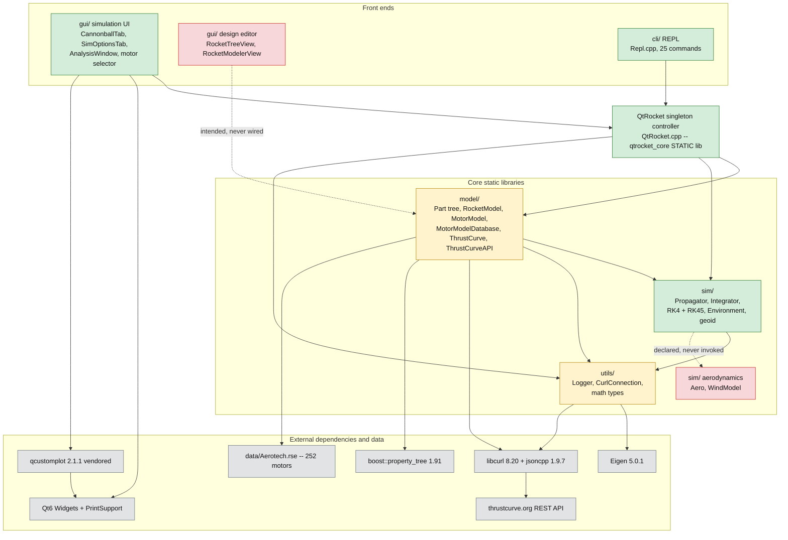
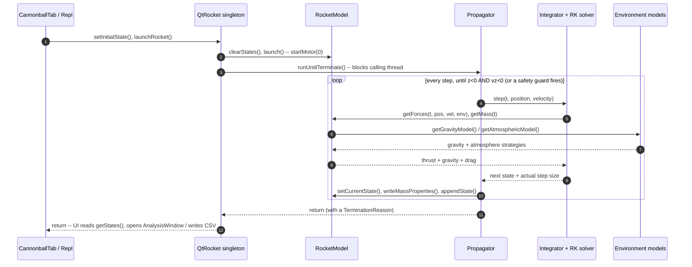

# QtRocket Architecture Audit

| | |
|---|---|
| **Originally audited at** | commit `b6e1321` (branch `development`), working tree of 2026-06-09 |
| **Revised at** | commit `09e23b4` (branch `MotorPart`), 2026-06-18 — all citations re-pinned to this commit. The June 10–18 hardening burst closed a third of the original gaps (F1/F2/F4/F5/F9 fixed; build-hygiene done; motor-in-tree landed) and moved much of the source tree (`utils/`→`model/` for the motor stack; `model/Part`→`model/parts/`). See §6.2 for the change log. |
| **Scope** | Read-only audit. Every claim cites `path:line` (or `path:start-end`) pinned to the revision commit above. No code was changed. |
| **Project** | QtRocket — a C++23 / Qt6 model-rocket design & flight-simulation app (OpenRocket-like intent). |

**Status legend** (used on every section heading, scorecard row, and gap entry):

| Mark | Meaning |
|------|---------|
| ✅ | Working — implemented and exercised by a test or a live UI/CLI path |
| 🟡 | Partial — implemented but unwired, stubbed, incomplete, or dead code |
| ❌ | Missing — does not exist; listed because the architecture implies it |

---

## 1. Project Status Snapshot

### 1.1 History at a glance

204 commits spanning 2023-02-01 → 2026-06-18 (`git log --oneline | wc -l`; `git log --format=%ad --date=short`), in four distinct phases:

| Phase | Period | What landed |
|---|---|---|
| Initial build-out | 2023-02 → 2023-05 | Qt GUI skeleton, RK4 solver, atmosphere/gravity models, Logger, RSE motor loader, thrustcurve.org client |
| Sporadic upkeep | 2023-05 → 2024-08, then quiet | Modular refactoring, early tests, occasional WIP commits |
| Reactivation | 2026-06-05 → 2026-06-09 | RK45 adaptive integrator, aerodynamic drag + physics integration tests, CLI REPL, Part composition/clone fixes, HollowSphere part, motor-DB persistence |
| Hardening + restructure | 2026-06-10 → 2026-06-18 | Hang-proof Propagator (termination reasons, NaN/no-liftoff guards), SphericalGravity fix + geoid wiring (F1), Integrator no-op guard (F2), broke the QtRocket back-calls / `qtrocket_core` static lib (F4), motor-in-part-tree (F5, `model/parts/Motor`), F9 subterranean-state fix, warnings + `-Werror`, dead-code removal; moved the motor stack `utils/`→`model/` and `Part`→`model::part` |

The "shelved at ~15%" memory is accurate for the GUI editor; the June 2026 bursts substantially hardened the **core** (model + sim + tests + CLI) without touching the editor gap.

### 1.2 Completeness scorecard

| Subsystem | Status | State in one line | Evidence |
|---|---|---|---|
| Component model (`model/`) | 🟡 | Part tree, motors, thrust curves are solid and well-tested; two concrete part types (`HollowSphere`, `Motor`); tree editing unreachable from any UI | `model/parts/Part.h:44-248`; `model/tests/PartTests.cpp` |
| Simulation engine (`sim/`) | ✅ | 3-DOF thrust+gravity+drag with RK4/RK45 and pluggable environment models; runs synchronously; now hang-proof | `sim/Propagator.cpp:62-166` |
| Aerodynamics | ❌ | One hardcoded drag line; `Aero`/`WindModel` classes are stubs or orphans; no stability analysis (the geoid is now wired into Spherical Gravity, §3.3) | `model/RocketModel.cpp:77`; `sim/Aero.cpp` (entire file: 9 lines — ctor/dtor only) |
| Motor data & file I/O (`model/`, `data/`) | 🟡 | RSE import, thrustcurve.org search, and `.qmd` save/load all work; (motor stack moved here from `utils/`) | `model/MotorModelDatabase.cpp:53-297` |
| Rocket-design persistence | ❌ | No save/load of a rocket design exists anywhere; File-menu actions are disabled shells | `gui/MainWindow.ui:117-170`; §4.1 |
| GUI — simulation workflow | ✅ | Cannonball tab → launch → plots works end to end (but blocks the GUI thread) | `gui/CannonballTab.cpp:94-124` |
| GUI — design editor | ❌ | RocketTreeView / RocketModelerView are 6-line stubs; no tree model; no property editing | `gui/RocketTreeView.cpp`, `gui/RocketModelerView.cpp` (entire files: 6 lines each) |
| CLI (`cli/`) | ✅ | 25-branch REPL covering configure → launch → CSV export; same core as the GUI | `cli/Repl.cpp:133` |

### 1.3 How to read this document

- Citations are repo-root-relative, backticked, `path:line` or `path:start-end`. Whole-file claims (emptiness, stubness) cite the bare path plus a line count. Absence claims cite the search that found nothing, plus any positive artifact (a disabled `.ui` action, a commented-out include).
- **Path moves (this revision):** the motor stack moved `utils/` → `model/` (`MotorModel`, `MotorModelDatabase`, `ThrustCurveAPI`, `RSEDatabaseLoader`, `ThrustCurve`), and `model/Part.{h,cpp}` moved to `model/parts/Part.{h,cpp}` with the class now in the `model::part` namespace. `utils/` now holds only `Logger`, `CurlConnection`, `Bin`, and the math typedefs. Citations below use the current paths.
- Section 4 traces the two core flows; every break is an inline `> ⛔ BREAK` blockquote, and all of them are consolidated in the §5 Gap Register.
- Code comments reference a `TODO.md` (e.g. `model/RocketModel.cpp:14,25`). That file was deleted in the working tree when the original audit was taken (`git status`: ` D TODO.md`); it has since been **restored and rewritten** (2026-06-09) — the legacy `P1/P2/P4` references now resolve against the previous list preserved in `TODO.md` Appendix A.

---

## 2. High-Level Architecture

### 2.1 Subsystem dependency map



Node colors follow the §1 legend (green = working, amber = partial, red = missing, grey = external). **Solid arrows** are real compile-time/runtime dependencies. **Dashed arrows** are the two remaining pathologies: the design-editor widgets that were meant to consume the model but were never wired, and the aero classes that are declared but never invoked. (The two `QtRocket::getInstance()` back-calls that made the graph circular in the original audit were removed by the F4 fix — §2.3 — so those dashed arrows are gone; `QtRocket.cpp` now lives in the `qtrocket_core` static lib.)

### 2.2 Subsystem responsibilities

- **`model/` — the rocket itself.** A composite tree of `Part` objects carrying mass/CM/inertia (`model::part`, in `model/parts/`), plus `MotorModel`/`ThrustCurve` for propulsion and the `MotorModelDatabase` with its three ingest paths (all moved here from `utils/`), aggregated by `RocketModel`, which implements the `Propagatable` interface the sim consumes (`model/Propagatable.h:23-73`). Depends on `utils` and `sim`; the `Environment` it needs for gravity/atmosphere is **injected** into `getForces()` by the Propagator (`model/RocketModel.cpp:50`), not fetched from the `QtRocket` singleton (the former back-call is gone — §2.3).
- **`sim/` — the numerics.** `Propagator` drives a pluggable `DESolver` (RK4/RK45) over the state, with `Environment` supplying interchangeable gravity and atmosphere strategies (and now owning a geoid model). Linked as static lib `sim` (`sim/CMakeLists.txt:1,27-28`), which links `utils`; `model` in turn links `sim` (it steps a `model::Propagatable`).
- **`sim/` aerodynamics (nominal).** `Aero` and `WindModel` exist as files but are stubs/orphans; the only aero force in the program is a drag one-liner inside `model/RocketModel.cpp:77` (§3.3). (The geoid is no longer an orphan — `SphericalGeoidModel` is now wired into Spherical Gravity, §3.3.)
- **`utils/` + `data/` — shared infrastructure.** Logger, Eigen-based math typedefs, the `Bin` lookup helper, and the libcurl HTTP wrapper (`CurlConnection`). Linked as static lib `utils` carrying libcurl + Eigen (`utils/CMakeLists.txt:1,13-14`). (The motor database and its ingest paths now live in `model/`.)
- **`QtRocket` — the controller.** A singleton owning the (RocketModel, Propagator) pair, the Environment, and the MotorModelDatabase (`QtRocket.h:79-83`); front ends drive everything through it (`QtRocket.h:34-68`). Compiled once into the `qtrocket_core` static lib (`CMakeLists.txt:187-194`) — see §2.3.
- **`gui/` — Qt6 Widgets front end.** Entry `main.cpp:11-28` → `gui::run` (`gui/GuiRunner.cpp`) → `MainWindow`, which hosts exactly two functional tabs (Cannonball, Sim Options — `gui/MainWindow.cpp:31,36`) plus the two stub editor widgets. The only Qt-dependent code in the repo.
- **`cli/` — headless REPL.** `cli/CliMain.cpp:13-28` builds the same `QtRocket` core with no Qt at all and drives it line-by-line (`cli/Repl.cpp:120`). Its existence proves the core is front-end-agnostic.

### 2.3 The QtRocket singleton (the circular dependency, now resolved)

`QtRocket` is a mutex-guarded lazy singleton (statics `QtRocket.cpp:14-16`; `getInstance` `:19-26`; double-checked `init()` `:28-37`). Its constructor wires the whole object graph: Environment, RocketModel, Propagator, MotorModelDatabase (`QtRocket.cpp:39-52`).

**The original audit found a circular dependency here — code *underneath* the controller reached back up into it. The June 2026 F4 fix removed both back-calls, so this is now resolved:**

- `RocketModel::getForces` used to call `QtRocket::getInstance()->getEnvironment()` to fetch gravity/atmosphere during force evaluation. It now takes the `Environment` as a parameter (`model/RocketModel.cpp:50`), which the Propagator — itself constructor-injected with a `shared_ptr<Environment>` (`sim/Propagator.h:46,116`) — passes into the ODE callback on every step (`sim/Propagator.cpp:45`). A propagator's environment can therefore never silently go stale.
- `MotorModelDatabase` used to fetch the logger through the singleton; it now calls `utils::Logger::getInstance()` directly (`model/MotorModelDatabase.cpp:36,40,74,81`), the globally-accessible singleton everything else already uses.

A repo-wide grep for `QtRocket::getInstance` over `model/`, `sim/`, and `utils/` now returns **zero** hits, so those libraries no longer reference symbols defined in `QtRocket.cpp` and the dependency graph is acyclic. The payoff: `QtRocket.cpp` is compiled exactly **once** into a real static library, `qtrocket_core` (`CMakeLists.txt:187-194`: `add_library(qtrocket_core STATIC QtRocket.cpp QtRocket.h)`, linking `PUBLIC model sim utils`), which the GUI (`CMakeLists.txt:206-209`), the CLI (`:213-219`), and the integration tests (`tests/CMakeLists.txt:13-14`) all link — instead of recompiling the source into each executable as three separate translation units. Any new executable touching `RocketModel`/`MotorModelDatabase` just links `qtrocket_core`.

---

## 3. Subsystem Deep Dives

### 3.1 Component Model (`model/`) 🟡

| File | Role |
|---|---|
| `model/parts/Part.h` / `.cpp` | Composite tree node: own + composite mass/CM/inertia, lazy recompute (class `model::part::Part`) |
| `model/parts/HollowSphere.h` / `.cpp` | A concrete part type (closed-form hollow-sphere geometry) |
| `model/parts/Motor.h` / `.cpp` | Leaf `Part` wrapping a `MotorModel` so motor mass(t)/CG/inertia enter the composite tree (the F5 fix) |
| `model/parts/Parts.h` | Umbrella header for concrete parts (`model/parts/Parts.h:8-9`) |
| `model/RocketModel.h` / `.cpp` | `Propagatable` implementation; owns the part-tree root `topPart`; the motor is a `Motor` child of it, tracked by a borrowed `motorPart` handle |
| `model/Propagatable.h` (+ `model/Propagatable.cpp` — just the out-of-line constructor, 9 lines) | The model↔sim bridge interface |
| `model/MotorModel.h` / `.cpp` | Motor metadata + time-varying mass/thrust |
| `model/ThrustCurve.h` / `.cpp` | Sampled thrust curve with linear interpolation (`model/ThrustCurve.cpp:47-75`) |

**Core data structures.** A `Part` owns its children together with their CM-to-CM offsets:

```cpp
std::vector<std::tuple<std::shared_ptr<Part>, Vector3>> childParts;   // model/parts/Part.h:247
```

plus a non-owning `Part* parent` for upward dirty propagation (`model/parts/Part.h:194`), a per-process-unique `Id` (`std::uint64_t`, `model/parts/Part.h:53,200`), and **two** inertia tensors: its own *per-unit-mass* geometric tensor (m²) and the *mass-weighted composite* tensor (kg·m²) of the whole subtree about the composite CM (`model/parts/Part.h:220-221`; convention documented at `model/parts/Part.h:30-38`). `RocketModel` holds the tree root `topPart` (a `shared_ptr<model::part::Part>`, `model/RocketModel.h:154`), a borrowed `part::Motor* motorPart` whose owning `shared_ptr` lives in `topPart`'s `childParts` (`model/RocketModel.h:145`), and scalar drag inputs `dragCoefficient{1.0}` / `referenceArea{1.134e-3}` — a 38 mm tube (`model/RocketModel.h:157,161`). `Propagatable` carries the state plus the recorded `(t, StateData)` trajectory (`model/Propagatable.h:48,70`).

**Patterns in use.**

- **Composite** — `addChildPart` transfers ownership, rejects null/already-parented/cycle-forming children with logged no-ops, re-parents, then just marks the path dirty (`model/parts/Part.cpp:71-104`).
- **Prototype (type-preserving clone)** — value copy/move is deleted (`model/parts/Part.h:77-78`); duplication goes through `clone()` → virtual `cloneShallow()` → protected copy-ctor that assigns a **fresh id** (`model/parts/Part.cpp:106-123`, `:54`, `model/parts/Part.h:184,188`; `HollowSphere` override `model/parts/HollowSphere.h:62-65`, `Motor` override `model/parts/Motor.h:60-63`).
- **Dirty-flag lazy recomputation** — setters flag this node and every ancestor (`model/parts/Part.h:81,85,215-216`); composite getters recompute on read (`model/parts/Part.h:116,125,137`). The recompute is the one time-aware walk `computeCompositeAt` (`model/parts/Part.cpp:168-203`): pass 1 accumulates composite mass/CM, pass 2 shifts every tensor to the composite CM via the parallel-axis theorem (helper `parallelAxisTerm` `model/parts/Part.cpp:19`; the load-bearing sum `:195,199`). The CM/inertia are cached behind a **mass-delta gate** (`ensureCompositeCache`, `:137-154`), so they recompute every step while a child's mass varies (a burning motor) and **freeze** once mass is constant.
- **Time-parameterized mass** — `MotorModel::getMass(t)` interpolates a precomputed 128-sample burn curve (`model/MotorModel.cpp:27-72`, curve built at `:104-130`); total rocket mass is `topPart->getCompositeMass(t)`, which already includes the `Motor` child's time-varying mass, so there is no separate motor term to add (`model/RocketModel.cpp:21-27`).

**Status notes.** The tree machinery is genuinely done and among the best-tested code in the repo (16 Part/HollowSphere composition tests — `model/tests/PartTests.cpp`, including clone re-parenting and dirty-propagation via a test-only friend `PartCompositionAccess`, `model/parts/Part.h:49`; the new `Motor` part adds 11 more in `model/tests/MotorTests.cpp`). What keeps the subsystem 🟡: the default rocket is a **hardcoded** aluminum hollow sphere body (ri=40 mm, ro=50 mm, ρ=2700 kg/m³ ≈ 0.69 kg, `model/RocketModel.cpp:10-18`); multi-stage support is a commented-out include (`model/RocketModel.h:21-22`); and nothing in a *front end* can reach `addChildPart` (§4.1) — though `RocketModel::setMotorModel` now calls it internally to place the motor in the tree (`model/RocketModel.cpp:100-112`). *(The motor-in-tree fix resolved the old `setMass`/composite split: `setMass()` now writes only the airframe's own dry mass while `getMass(t)` reports the composite, an honest split with no double-count — `model/RocketModel.h:126-135`.)*

### 3.2 Simulation Engine (`sim/`) ✅

| File | Role |
|---|---|
| `sim/Propagator.h` / `.cpp` | Owns the loop: step → record → check termination |
| `sim/Integrator.h` | Name→solver strategy map over `DESolver<Vector3>` |
| `sim/DESolver.h` | Template solver interface + `StepResult{state, rate, stepSize}` (`sim/DESolver.h:27,35-65`) |
| `sim/RK4Solver.h` | Fixed-step RK4 (`sim/RK4Solver.h:52-81`) |
| `sim/RK45Solver.h` | Adaptive Runge-Kutta-Fehlberg with error control (`sim/RK45Solver.h:81-160`) |
| `sim/Environment.h` | Gravity + atmosphere strategy registries; owns the geoid model (`sim/Environment.h:122`) |
| `sim/StateData.h` | The state record (6-DOF + mass/CG/inertia fields, 3-DOF actually integrated) |
| `sim/TrajectoryStatistics.h` | Running per-flight summary (apogee, time to apogee, max speed, flight time); feeds the no-liftoff guard |

**The ODE.** Propagator's constructor builds the state-space callback — `dPosition = velocity; dVelocity = getForces(t, pos, vel, *environment) / getMass(t)` — and hands it to the integrator (`sim/Propagator.cpp:37-48`); the constructor-injected `Environment` is passed in by reference, so gravity/atmosphere are read from it (not a singleton). Solvers evaluate the callback at each stage's *node time* so time-varying thrust is sampled correctly (RK4 stages `sim/RK4Solver.h:65-75`; RK45 stages at `t + Cn*h`, `sim/RK45Solver.h:81-160`).

**The loop** (`sim/Propagator.cpp:62-166`): reset the termination verdict + statistics (`:69-70`), re-assert dt (`:66`), then, inside a `try/catch` (so an integrator throw — RK45 step underflow — aborts cleanly as `IntegratorError` rather than escaping, `:152-157`): step → **reject a non-finite state before it is recorded** (`allFinite`, `:99-105`) → update `TrajectoryStatistics` every step (`:110`) → optionally `writeMassProperties`/`appendState` (`:111-117`) → check four guards, each setting a `TerminationReason` (`sim/Propagator.h:37-44`): nominal `terminateCondition` (`:119-124`), no-liftoff after `noLiftoffTime = 3.0 s` below `noLiftoffAltitude = 1.0 m` (`:129-136`, constants `sim/Propagator.h:27-28`), and the `maxSimTime` (default 7200 s) / `maxIterations` backstops (`:140-146`, `sim/Propagator.h:29,125`) → advance by the step the solver *actually took* (`:149`). The nominal condition is now `z < 0 && vz < 0` — descending below the launch site (`model/RocketModel.cpp:44-48`); the old `t > minFlightTime = 4.0 s` guard is **deleted** (F9). Wall-clock time of the run is logged at DEBUG (`:159-164`).

**Strategy pattern, three times.**
- Integrators: `Integrator` maps `"Runge-Kutta 4th Order"` / `"Runge-Kutta-Fehlberg"` to solvers built on demand (`sim/Integrator.h:56-74`, map `:90`, default RK4 set in its constructor `:38`). An unknown model name is now a logged no-op that keeps the current solver (`:68-73`, the F2 fix).
- Gravity: `"Constant Gravity"` → `(0, 0, -g0)` = `(0, 0, -9.80665)` (`sim/ConstantGravityModel.h:18-21`) or `"Spherical Gravity"` → `a = -GM·r/|r|³` in plain SI meters (the earlier km-conditioning is gone), mapping the local launch frame to a geocentric distance via the launch-site ground radius cached from the geoid (`sim/SphericalGravityModel.cpp:30-43`, ctor caches `groundLevel` at `:16-23`). `g0 = 9.80665` is defined in `utils/math/Constants.h:10`; the constant model now agrees with it (the old `-9.8` mismatch is fixed).
- Atmosphere: `"Constant Atmosphere"` (sea-level constants, `sim/ConstantAtmosphere.h:15-21`), `"US Standard 1976"` (7-layer `utils::Bin` lookup tables, `sim/USStandardAtmosphere.cpp`; self-flagged *"overly simplistic and wrong implementation"* with a `@todo`, `sim/USStandardAtmosphere.h:19-21`), `"Vacuum"` (all zeros — reduces the model to thrust+gravity for baseline tests, `sim/VacuumAtmosphere.h:22-30`). Registered in `sim/Environment.h:64-95`; defaults set in its constructor (`sim/Environment.h:37-38`).

**Robustness work from the 2026 hardening.** `Propagator::setTimeStep` is the single chokepoint that rejects `dt <= 0`/NaN (would otherwise loop forever) and pushes dt into the solver so the integration step and the time axis can't silently diverge (`sim/Propagator.h:70-94`); `setMaxSimTime` (`:97`) is the sibling guard backing the loop's backstop. RK45 throws on step-size underflow (`sim/RK45Solver.h:88-89`), shrinks on `err > tol` (`:130-135`), grows capped at 5× (`:146-148`), and clamps the next guess to `hMax` — without which exactly-integrated dynamics grow h unboundedly (`sim/RK45Solver.h:150-155`; regression test `sim/tests/RK45SolverTests.cpp:75`).

**What's quietly missing (the 🟡 edges of a ✅ subsystem).** `StateData` carries `orientation`/`orientationRate` quaternions, a DCM, and Euler angles (`sim/StateData.h:49-59`) — but only position/velocity are ever integrated; the orientation integrator is a commented-out member with a design note (`sim/Propagator.h:109-113`), the loop never writes the rotational fields, and the quaternions are zero-initialized `{0,0,0,0}` — not even an identity rotation (`sim/StateData.h:50-51`). Correspondingly `getTorques()` returns zeros and nothing calls it (`model/RocketModel.cpp:83-87`). `StateData` *did* gain `mass`/`cg`/`inertia` fields recorded every step via `Propagatable::writeMassProperties` (`sim/StateData.h:61-66`, written at `sim/Propagator.cpp:115`), so composite CG(t)/I(t) are now observable and trajectory-testable — but still not integrated. The whole run executes synchronously on the caller's thread — there is no worker thread anywhere (§4.2).

### 3.3 Aerodynamics ❌

This is the audit's bluntest finding: **the subsystem OpenRocket is built around does not exist here.** The complete aerodynamic force model of the program is one line:

```cpp
const Vector3 drag = -0.5 * rho * speed * dragCoefficient * referenceArea * velocity;   // model/RocketModel.cpp:77
```

with ρ from the active atmosphere at clamped altitude (`model/RocketModel.cpp:74-75`) and a user-supplied Cd/area. Thrust is likewise hardwired to world +Z, "always through the center of mass" — though it now reads the motor from the part tree, `motorPart->getMotorModel().getThrust(t)` (`model/RocketModel.cpp:53-54`), rather than a hardcoded motor.

The supporting cast is scaffolding only:
- `sim/Aero.h` declares an `Aero` class whose coefficient fields (cp, Cx/Cy/Cz, Cl/Cm/Cn, Cd) are now **commented out** (`sim/Aero.h:24-37`), leaving only an empty ctor/dtor — and not a single method; `sim/Aero.cpp` (entire file: 9 lines, those empty bodies). The `aeroData` member sits unread in the interface (`model/Propagatable.h:64`; the only reference outside its own files per `grep -rn "aeroData|sim::Aero" --include=*.cpp --include=*.h .`).
- `sim/WindModel.cpp` unconditionally returns `(0,0,0)`; zero callers (`grep -rn getWindSpeed` matches only the class's own files).

*(The geoid is no longer scaffolding: `SphericalGeoidModel` is now instantiated by `Environment` (`sim/Environment.h:122`) and consumed by `SphericalGravityModel` to convert local-frame altitude to a geocentric distance (`sim/Environment.h:74`; ctor `sim/SphericalGravityModel.cpp:16-23`), with dedicated tests — `sim/tests/SphericalGeoidAndGravityTests.cpp`. See §3.2 and §7.4 F1.)*

No angle of attack, no lift or side force, no moments, no CP computation, no CG-vs-CP stability margin. Consequence: every simulated rocket is a guided point mass — §4.2's flow is honest physics only for a cannonball-like model.

### 3.4 Motor Data & File I/O (`model/`, `utils/`, `data/`) 🟡

*(The motor stack moved `utils/` → `model/` since the original audit: `MotorModelDatabase`, `ThrustCurveAPI`, `RSEDatabaseLoader`, `ThrustCurve`, `MotorModel`.)*

**Motor database.** `MotorModelDatabase` stores motors in a `std::map<std::string, model::MotorModel>` keyed by common name (`model/MotorModelDatabase.h:159`). Ingestion is deliberately private (`model/MotorModelDatabase.h:144-149`); motors enter via three working paths:

1. **RSE import** — `importRSEFile` (`model/MotorModelDatabase.h:98`, impl `model/MotorModelDatabase.cpp:53`) delegates to `RSEDatabaseLoader`, which parses RockSim XML via `boost::property_tree::read_xml` and walks `engine-database.engine-list` (`model/RSEDatabaseLoader.cpp:24,27`). Bundled data: `data/Aerotech.rse` (252 `<engine` entries; `grep -c '<engine ' data/Aerotech.rse`).
2. **thrustcurve.org REST** — `searchOnline`/`getOnlineSearchFacets` (`model/MotorModelDatabase.h:125,134`) drive `ThrustCurveAPI` against `https://www.thrustcurve.org/` (`model/ThrustCurveAPI.cpp:235`): `api/v1/search.json` (`:284`), `api/v1/download.json` for samples (`:248`), `api/v1/metadata.json` (`:268`), parsed with jsoncpp. HTTP is a thin libcurl wrapper (`utils/CurlConnection.cpp:25-37,39-76`). **TLS certificate verification is now on**: the explicit `CURLOPT_SSL_VERIFYPEER=false` override was removed, so libcurl's secure default applies; the wrapper sets only timeouts (`CONNECTTIMEOUT 10s`, `TIMEOUT 30s`, `NOSIGNAL`) at `utils/CurlConnection.cpp:48-56`.
3. **`.qmd` save/load round-trip** — `saveMotorDatabase`/`loadMotorDatabase` write/read a `<QtRocketMotorDatabase version="0.1">` XML document via property_tree (`model/MotorModelDatabase.cpp:165-227` with `write_xml` at `:226`; `:229-297` with `read_xml` at `:237`). Reached from the GUI (Tools menu `gui/MainWindow.cpp:75`; Cannonball tab buttons `gui/CannonballTab.cpp:69-77`) and the CLI (`savedb`/`loaddb`, `cli/Repl.cpp:202,223`). Round-trip is tested (`tests/MotorDatabasePersistenceTests.cpp:77`).

**The headline absence: rocket-*design* persistence.** Nothing serializes a rocket (parts, masses, geometry, sim setup). Evidence: the File menu's New/Open/Save/Save As/Close actions exist but ship disabled (`enabled=false` at `gui/MainWindow.ui:117,129,141,153,170`) with no slots behind them (`gui/MainWindow.h:38-44` declares only Quit/About/SaveMotorDatabase handlers); the once-planned boost serialization is a commented-out include marked "CURRENTLY UNUSED" (`model/MotorModel.h:10-13`); and `grep -rniE "saveRocket|loadRocket|\.ork\b|boost::archive|QAbstractItemModel" --include=*.cpp --include=*.h --include=*.ui .` returns no matches.

**Logger.** Singleton writing every message to both stdout and a hardcoded `log.txt` in the CWD (`utils/Logger.cpp:26`), levels `ERROR_`→`PERF_` (`utils/Logger.h:23-30`). Both logging *and* first-call construction are now thread-safe: `getInstance` returns a **function-local static** (`static Logger instance;`, `utils/Logger.cpp:16-21`) — C++11 guarantees once-only thread-safe init — and `log()` takes a `std::lock_guard` on a mutex (`utils/Logger.cpp:36,87`). (The original audit's unguarded-`new Logger()` race is fixed.)

**Dead code (removed).** The `ThreadPool`/`TSQueue` worker-pool classes flagged by the original audit have been **deleted** — `grep -rnE "ThreadPool|TSQueue"` over the tree now matches nothing. (A worker thread for off-GUI-thread sims, when P4 needs one, will use Qt/std threading rather than that removed pool.) Math types remain thin Eigen aliases — `Vector3`/`Matrix3`/`Quaternion` etc. (`utils/math/MathTypes.h:11-22`).

### 3.5 GUI Layer (`gui/`) 🟡

Entry chain: `main.cpp:11-28` → `gui::run` creates `QApplication` and shows `MainWindow` (`gui/GuiRunner.cpp:30,48`). `MainWindow` adds exactly two tabs and three menu connections (`gui/MainWindow.cpp:31-58`).

**Working widgets ✅**

| Widget | What it does | Evidence |
|---|---|---|
| `CannonballTab` | Point-mass inputs (velocity, angle-from-vertical w/ 0–90° validator, mass, Cd, area), motor selection, launch button gated on `isMotorSet()` | `gui/CannonballTab.cpp:27-92` |
| `SimOptionsTab` | Live-applies timestep, atmosphere, gravity, integrator to the core the moment they change (no Apply button); pushes its defaults at construction | `gui/SimOptionsTab.cpp:51-77` |
| `ThrustCurveMotorSelector` | thrustcurve.org metadata fetch, search, and set-motor | `gui/ThrustCurveMotorSelector.cpp:22-95` |
| `AnalysisWindow` | Three plots off the recorded states (`plotAltitudeBtn`/`plotVelocityBtn`/`plotMotorCurveBtn`): altitude (z), z-velocity, motor thrust curve — via vendored qcustomplot 2.1.1 (`gui/qcustomplot.h:23`) | `gui/AnalysisWindow.cpp:16-26,36-125` |

Quirks worth knowing: `AnalysisWindow` sets itself `Qt::NonModal` then `hide()`/`show()` in its constructor (`gui/AnalysisWindow.cpp:13-15`), yet CannonballTab displays it with blocking `exec()` after calling `setModal(false)` (`gui/CannonballTab.cpp:123-124`) — `exec()` blocks regardless. Plots cover only the Z components; no downrange, speed, or 3-D view. (The dead `plotAtmosphereBtn` flagged by the original audit was removed — §7.2.)

**Stub widgets ❌**

| Widget | Declared | Reality |
|---|---|---|
| `RocketTreeView` | placed in the main splitter (`gui/MainWindow.ui:49-56`, promoted class `:188-192`) | entire `.cpp` is a 6-line empty constructor (`gui/RocketTreeView.cpp`); never referenced in `gui/MainWindow.cpp:22-59`; no `setModel()` call and **no `QAbstractItemModel` subclass exists in the repo** (grep in §3.4) |
| `RocketModelerView` | bottom pane of the splitter (`gui/MainWindow.ui:66`, promoted `:193-197`) | entire `.cpp` is a 6-line empty constructor (`gui/RocketModelerView.cpp`); no `paintEvent`, renders a blank widget |
| File actions | New/Open/Save/Save As/Close in the File menu (`gui/MainWindow.ui:82-88`) | all disabled (`:117,129,141,153,170`), no slots (`gui/MainWindow.h:38-44`) |

### 3.6 CLI (`cli/`) ✅

`qtrocket-cli` is a Qt-free REPL over the same core. `cli/CliMain.cpp:13-28` silences the logger to ERROR (stdout stays machine-readable), grabs the `QtRocket` singleton, and loops `Repl::run` over stdin (`cli/Repl.cpp:120`). `Repl::execute` is a 25-branch `if/else if` dispatch (`cli/Repl.cpp:133`; `grep -c 'cmd == ' cli/Repl.cpp` = 25, with `quit`/`exit` sharing a branch): motor DB management (`loadmotors`, `savedb`, `loaddb`, `tcfacets`, `tcsearch`, `listmotors`, `setmotor`), staged flight configuration kept in plain members that mirror the core's defaults (`cli/Repl.h:52-61`), environment/integrator selection, `status`, and `launch`.

`launch` (`cli/Repl.cpp:546`) decomposes the angle exactly like the GUI (shared constant `DEG_PER_RAD`, `cli/Repl.cpp:32,556`), runs the identical `setInitialState` → `launchRocket` path (`:563-564`), then reports apogee / max-speed from the **live `TrajectoryStatistics`** accumulated during the run (`:579-583`) rather than re-scanning the series, derives downrange via `std::hypot` of the last state (`:586`), and writes the full trajectory to `qtrocket_run.csv` (`:588-602`, CSV writer `:94`). It now also surfaces the propagator's `TerminationReason` — appending ` (run aborted: …)` to the status line and printing `WARN: run aborted (…)` on an abnormal stop (`:570-572,613-615`; helper `terminationReasonText` `:38`). The CLI's significance to this audit: it demonstrates the controller+model+sim stack runs headless, so the editor gap is purely a GUI-layer problem. The compile database proves the Qt-freeness directly — the `cli/` translation units carry no Qt defines or include paths at all (`build/compile_commands.json`).

### 3.7 Build & Test Topology

C++23 (`CMakeLists.txt:5`), Qt AUTOMOC/AUTOUIC/AUTORCC globally on (`CMakeLists.txt:92-94`). Targets:

| Target | Kind | Notes |
|---|---|---|
| `qtrocket` | GUI exe | `PROJECT_SOURCES` (`gui/*`, `main.cpp`); links `Qt6::Widgets`/`PrintSupport` + `qtrocket_core` (`CMakeLists.txt:206-209`) |
| `qtrocket-cli` | CLI exe | `cli/*`; links `qtrocket_core` (`CMakeLists.txt:213-219`) |
| `qtrocket_core` | static lib | `QtRocket.cpp` compiled once; links `PUBLIC model sim utils` (`CMakeLists.txt:187-194`) — the F4 payoff |
| `utils` | static lib | links libcurl + Eigen (`utils/CMakeLists.txt:13-14`) |
| `sim` | static lib | links `utils` (`sim/CMakeLists.txt:27-28`) |
| `model` | static lib | links `utils` + `sim` + `Boost::property_tree` + `jsoncpp_static` (`model/CMakeLists.txt:28-32`) |
| `model_tests`, `sim_tests`, `integration_tests`, `propagator_tests` | gtest exes | registered with ctest as `qtrocket_*`; CI runs `ctest --preset … -R 'qtrocket_*'` (`.github/workflows/cmake-multi-platform.yml:74`) |

All third-party deps except Qt6 arrive via FetchContent and build from source on first configure (§6.1) — so the first build is slow by design.

**Compile-database corroboration (build of 2026-06-18).** `build/compile_commands.json` holds **552 entries** (dominated by curl/boost/jsoncpp/gtest TUs — the slow first build). The three hygiene facts the original audit recorded have all been addressed: **(a) warnings are now on** — `add_compile_options(-Wall -Wextra -Wpedantic -Werror)` for gcc/clang (`CMakeLists.txt:89`) and `/W4 /WX` for MSVC (`:86`), with `gui/qcustomplot.cpp` exempted via a per-source `-w` so `-Werror` can stay on for project code (`:118-122`); **(b)** curl's test harness is **no longer compiled** — the parent now forces `set(BUILD_TESTING OFF)` before `FetchContent_MakeAvailable(CURL)` (`CMakeLists.txt:48`), so the `_deps/curl-build/tests/*` TUs are gone; **(c)** the global AUTOMOC (`CMakeLists.txt:92-94`) still emits a `mocs_compilation.cpp` for every target, including the Qt-free libraries. Toolchain observed in the DB: `clang++` via ccache, `-std=gnu++23`, system Qt **6.10.3** — while CI now builds via CMake presets (`release-gcc`/`release-clang`/`release-msvc`, plus macOS and FreeBSD `release-clang`) with Qt **6.10.2** installed by `install-qt-action` (`.github/workflows/cmake-multi-platform.yml:29-31,45`), a local/CI version divergence worth knowing about.

**Test coverage (76 tests across 4 gtest exes).** `model_tests`: **39** tests (`model/tests/CMakeLists.txt:2-7`) — 16 on Part/HollowSphere composition (closed-form inertia, parallel-axis correctness at depth, clone semantics, dirty propagation, `model/tests/PartTests.cpp`), 11 on the new `Motor` part (mass/CM/inertia during burn, `model/tests/MotorTests.cpp`), plus 3 `ThrustCurve` and 9 `ThrustCurveParser` tests. `sim_tests`: **17** tests (`sim/tests/CMakeLists.txt:2-7`) — US-Standard-Atmosphere density/pressure/temperature, 7 RK45 properties incl. the hMax regression (`sim/tests/RK45SolverTests.cpp`), the new SphericalGeoid/SphericalGravity tests (`sim/tests/SphericalGeoidAndGravityTests.cpp`, the F1 regression coverage), and Integrator-selection tests (`sim/tests/IntegratorTests.cpp`, the F2 coverage). `integration_tests`: **14** tests — end-to-end physics on a real Aerotech G80T loaded from the bundled RSE via a compile-time data path (`tests/CMakeLists.txt:11`, fixture `tests/PhysicsIntegrationTests.cpp`) — timestep invariance in vacuum, RK45-vs-RK4 agreement, downrange from tilted launch, drag-reduces-apogee, terminal-velocity force balance; plus motor-DB enum and save/load round-trips (`tests/MotorDatabasePersistenceTests.cpp`). `propagator_tests` (**6**, NEW, `qtrocket_propagator_tests`): the Propagator's hang-proof termination guards and trajectory statistics, driven by a mock `Propagatable` (`tests/PropagatorTests.cpp`). **Gap:** nothing exercises the GUI, and nothing can exercise design editing because it doesn't exist.

---

## 4. Data-Flow Traces

### 4.1 Editing a rocket design — the broken flow ❌

What "editing a design" would mean, step by step, against what exists:

1. **Create / open a design** —
   > ⛔ BREAK: File→New/Open/Save/Save As/Close are disabled shells: `enabled=false` (`gui/MainWindow.ui:117,129,141,153,170`); the five design actions have no slots — only Quit and a new Tools→SaveMotorDatabase are wired (`gui/MainWindow.h:38-44`); no design serialization anywhere (§3.4 grep).
2. **See the part tree** — the model side is ready: `RocketModel.topPart` is a real `Part` tree (`model/RocketModel.h:154`).
   > ⛔ BREAK: `RocketTreeView` is created by `setupUi` and then never touched — no `setModel()`, no signals (`gui/RocketTreeView.cpp`, entire file: 6 lines; `gui/MainWindow.cpp:22-59`). The adapter it needs — a `QAbstractItemModel` over `Part` — does not exist (repo-wide grep, §3.4).
3. **Add / remove / re-arrange parts** — the model API is implemented, guarded, and unit-tested: `addChildPart` (`model/parts/Part.cpp:71-104`), `clone` (`model/parts/Part.cpp:113-123`), `findById` (`model/parts/Part.cpp:205-219`).
   > ⛔ BREAK: no *front-end* caller — `grep -rn addChildPart gui/ cli/` finds nothing; no dialog, button, or context menu reaches the tree. (Internally, `RocketModel::setMotorModel` now calls `addChildPart` to place the motor — `model/RocketModel.cpp:106` — but that is not user-driven tree editing.)
4. **Edit part properties** — what actually reaches the model today is exactly three scalars + the motor: CannonballTab writes mass/Cd/area on each launch click (`gui/CannonballTab.cpp:115-117` → `model/RocketModel.h:135,117,124`), and `setMass` now writes only the airframe's own dry mass — an honest split, with `getMass(t)` reporting the composite (`model/RocketModel.h:126-135`).
5. **Pick a motor** — ✅ fully working, two paths converging on `RocketModel::setMotorModel` (`model/RocketModel.cpp:100-112`, which adds a `Motor` child to the tree): Cannonball tab combo (`gui/CannonballTab.cpp:234-242`) and thrustcurve.org selector (`gui/ThrustCurveMotorSelector.cpp:85-95`), both gating the launch button via `isMotorSet()` (`gui/CannonballTab.cpp:91`).
6. **Visualize the rocket** —
   > ⛔ BREAK: `RocketModelerView` draws nothing — empty constructor, no `paintEvent` (`gui/RocketModelerView.cpp`, entire file: 6 lines).

Net: **the editable surface of a "design" today is {mass, Cd, reference area, motor} on a hardcoded one-part rocket.** Everything deeper exists only as model-layer API.

### 4.2 Running a simulation — GUI path ✅ (with one 🟡)



The numbered trace, with citations per hop:

1. Click **Calculate Trajectory** (enabled only with a motor set, `gui/CannonballTab.cpp:91`) → slot `gui/CannonballTab.cpp:94`.
2. Read the five inputs (`:97-105`); decompose angle-from-vertical into vx/vz (`:108-109`); build `StateData{pos=(0,0,0), vel=(vx,0,vz)}` (`:110-112`).
3. Push scalars into the model (`:115-117`), initial state into the controller (`:119` → `QtRocket.h:68` → `model/Propagatable.h:46`).
4. `QtRocket::launchRocket()` (`QtRocket.cpp:54-65`): clear old states (`:57`), reset clock (`:58`), `RocketModel::launch()` — current state := initial, motor ignition at t=0 (`model/RocketModel.cpp:94-98`) — then `runUntilTerminate()` (`:64`).
5. The propagation loop (`sim/Propagator.cpp:62-166`) steps the active solver via the `Integrator` facade (`sim/Integrator.h:86`).
6. Every RK stage calls the ODE callback `{v, F/m}` (`sim/Propagator.cpp:37-48`) at that stage's node time (RK4 `sim/RK4Solver.h:65-75`; RK45 `sim/RK45Solver.h:81-160`).
7. `getForces` assembles thrust(+Z) + gravity + drag, reading the **injected** `Environment` parameter for the active strategies (`model/RocketModel.cpp:50-81`, env lookups `:59,70`); `getMass(t)` returns `topPart->getCompositeMass(t)`, which already includes the motor child's time-varying mass (`model/RocketModel.cpp:21-27`).
8. Accepted states append to the trajectory (`sim/Propagator.cpp:116`); the loop exits when `z < 0 && vz < 0` (`model/RocketModel.cpp:44-48`) or a safety guard fires (the run carries a `TerminationReason`, `sim/Propagator.h:37-44`); only position/velocity are integrated — rotational fields stay zero, though composite mass/CG/inertia *are* recorded via `writeMassProperties` (`:115`).
9. Control returns to the slot, which opens `AnalysisWindow` — `setModal(false)` then **blocking `exec()`** (`gui/CannonballTab.cpp:123-124`); its plot buttons read `QtRocket::getStates()` (`gui/AnalysisWindow.cpp:39,66`, accessor `QtRocket.h:48`).

> ⛔ 🟡 **Threading callout:** the entire flight integrates synchronously inside the button slot on the GUI thread — no worker, no signals, no progress (call chain above; there is now **no** thread/worker machinery in the repo at all — the old `ThreadPool`/`TSQueue` were removed, §3.4). A long flight freezes the UI for its duration.

### 4.3 Running a simulation — CLI path ✅ (delta only)

`launch` in the REPL (`cli/Repl.cpp:546`) refuses to run without a motor (`:548-552`), builds the same initial state from its staged settings (`:556-563`), then enters the identical core at step 4 above (`:563-564`). Differences are all post-processing: summary stats read from the live `TrajectoryStatistics` accumulated during the run (`:579-583`, not re-scanned from the series), a `TerminationReason`-aware empty-states error path (`:566-572`), full trajectory CSV to `qtrocket_run.csv` (`:588-602`), and `states`/`save` commands for re-export (`:620-655`). Same blocking behavior — irrelevant in a synchronous REPL.

---

## 5. Gap Register

Every 🟡/❌/⛔ from sections 2–4, consolidated. This is an audit inventory, deliberately not a prioritized roadmap. **This revision marks the marks:** of the original 17, gaps **11, 12, 13, 16, 17** are now fully closed and **14, 15** are half-closed — the rows are kept here (marked ✅ / 🟡-partial) as a closed-work ledger.

| # | Gap | Mark | Where it bites | Evidence |
|---|---|---|---|---|
| 1 | No aerodynamics: no AoA, lift, moments, CP, or stability margin — drag is one hardcoded line | ❌ | §3.3 | `model/RocketModel.cpp:77`; `sim/Aero.cpp` (9 lines, stub) |
| 2 | No rocket-design save/load (the File menu is a façade) | ❌ | §3.4, §4.1.1 | `gui/MainWindow.ui:117-170`; `model/MotorModel.h:10-13`; grep |
| 3 | No `QAbstractItemModel` adapter for the Part tree | ❌ | §4.1.2 | repo-wide grep (no matches) |
| 4 | `RocketTreeView` placed in the UI but never wired | 🟡 | §3.5, §4.1.2 | `gui/RocketTreeView.cpp` (6 lines); `gui/MainWindow.cpp:22-59` |
| 5 | `RocketModelerView` renders nothing | 🟡 | §3.5, §4.1.6 | `gui/RocketModelerView.cpp` (6 lines) |
| 6 | `Part::addChildPart`/`clone` unreachable from any *front end* (now one internal caller: `setMotorModel`) | 🟡 | §4.1.3 | `model/parts/Part.cpp:71-104`; grep `gui/ cli/` |
| 7 | 3-DOF only: orientation never integrated; quaternions zero-initialized (not identity) | 🟡 | §3.2, §4.2.8 | `sim/Propagator.h:109-113`; `sim/StateData.h:50-51` |
| 8 | `getTorques()` returns zeros and has no caller | 🟡 | §3.2 | `model/RocketModel.cpp:83-87` |
| 9 | `WindModel` orphaned (zero callers; wind returns zeros) — *the geoid is no longer orphaned (now used by Spherical Gravity)* | 🟡 | §3.3 | `sim/WindModel.cpp:16-18`; greps |
| 10 | Simulation blocks the GUI thread (no worker, no progress UI) | 🟡 | §4.2 | `gui/CannonballTab.cpp:120-124`; `QtRocket.cpp:54-65` |
| 11 | ~~Circular dependency: `model`/`utils` back-call the `QtRocket` singleton; `QtRocket.cpp` recompiled into every consumer exe~~ — **CLOSED (F4)** | ✅ | §2.3 | `qtrocket_core` STATIC lib `CMakeLists.txt:187-194`; Environment injected `sim/Propagator.h:46`; `model/MotorModelDatabase.cpp:36` logs via `Logger` only |
| 12 | ~~Logger singleton construction is not thread-safe~~ — **CLOSED** | ✅ | §3.4 | function-local-static singleton `utils/Logger.cpp:16-21` |
| 13 | ~~Dead code: `ThreadPool`/`TSQueue` never instantiated~~ — **CLOSED (deleted)** | ✅ | §3.4 | repo grep now matches nothing |
| 14 | Hardcoded one-part default rocket *(the composite-aware-`setMass` half is **closed** via motor-in-tree)* | 🟡 | §3.1 | hardcoded body `model/RocketModel.cpp:10-18`; honest `setMass` `model/RocketModel.h:126-135` |
| 15 | `USStandardAtmosphere` self-flagged "overly simplistic and wrong" *(the constant-gravity-vs-`g0` half is **closed**: now `-g0`)* | 🟡 | §3.2 | `sim/USStandardAtmosphere.h:19-21`; `sim/ConstantGravityModel.h:20` now uses `Constants::g0` |
| 16 | ~~TLS certificate verification disabled for thrustcurve.org requests~~ — **CLOSED** | ✅ | §3.4 | `CURLOPT_SSL_VERIFYPEER=false` removed from `utils/CurlConnection.cpp` |
| 17 | ~~Build hygiene: no compiler warnings; curl test suites compiled~~ — **CLOSED** | ✅ | §3.7 | `-Wall -Wextra -Wpedantic -Werror` `CMakeLists.txt:89` (`/W4 /WX` `:86`); `set(BUILD_TESTING OFF)` `:48` |

---

## 6. Appendix

### 6.1 External dependency inventory

| Dependency | Version | Acquired via | Used by / for | Evidence |
|---|---|---|---|---|
| Qt6 (Widgets, PrintSupport, LinguistTools) | system — 6.10.3 on the audited machine (CI installs 6.10.2) | `find_package` | all of `gui/` | `CMakeLists.txt:103-104,206-209`; `build/compile_commands.json` |
| Eigen | 5.0.1 | FetchContent | all math types (`Vector3`, `Matrix3`, `Quaternion`) | `CMakeLists.txt:68-71`; `utils/math/MathTypes.h:4-22` |
| Boost (property_tree requested; several libs compile transitively) | 1.91.0 | FetchContent | RSE + `.qmd` XML parse/write | `CMakeLists.txt:75-79`; `model/RSEDatabaseLoader.cpp:24`; `build/compile_commands.json` |
| libcurl | 8.20.0 | FetchContent | thrustcurve.org HTTP | `CMakeLists.txt:40-65`; `utils/CurlConnection.cpp:25-37` |
| jsoncpp | 1.9.7 | FetchContent | thrustcurve.org JSON | `CMakeLists.txt:28-37` |
| GoogleTest | 1.17.0 | FetchContent | all four test suites | `CMakeLists.txt:13-19` |
| qcustomplot | 2.1.1 | vendored in-tree | AnalysisWindow plots | `gui/qcustomplot.h:23` |
| Aerotech motor data | 252 engines | bundled file | default motor database | `data/Aerotech.rse`; `tests/CMakeLists.txt:11` |

### 6.2 Maintaining this document

**This revision re-pins all line numbers to commit `09e23b4`** (branch `MotorPart`, 2026-06-18), corroborated against `build/compile_commands.json` on that date. The original audit was pinned to `b6e1321` (2026-06-09); the 23 commits between then and `09e23b4` made **source moves**, not just doc edits — the motor stack moved `utils/` → `model/` (`MotorModel`, `MotorModelDatabase`, `ThrustCurveAPI`, `RSEDatabaseLoader`, `ThrustCurve`), `model/Part.{h,cpp}` moved to `model/parts/Part.{h,cpp}` (now in the `model::part` namespace), `model/parts/Motor.{h,cpp}` is new, `ThreadPool`/`TSQueue` were deleted, and `qtrocket_core` became a STATIC lib — so the old "every pin remains valid" assertion no longer holds and citations were re-extracted file by file. Gaps **11, 12, 13, 16, 17** closed and **14, 15** half-closed since the original pin; §1.2 / §5 marks were updated accordingly, and the F1/F2/F4/F5/F9 critiques in §7.4 were marked resolved. After meaningful changes, re-verify citations by extracting them (`grep -oE '[A-Za-z0-9_./-]+\.(h|cpp|txt|ui|rse|md|yml):[0-9]+(-[0-9]+)?' docs/ARCHITECTURE_AUDIT.md | sort -u`) and dumping each cited range (`sed -n 'START,ENDp' <file>`) to confirm the named symbol still lives there. The legend and citation conventions are defined in §1.3.

---

## 7. State of the Code (gap & quality pass)

This section is the candid assessment layer on top of §§3–5: maturity per area, every dangling symbol and dead end found by a dedicated sweep, and pattern/API critiques. Same commit (`b6e1321`); everything below is established by **reading** the code — nothing was executed, so dynamic claims are labeled "by inspection". Items here that go beyond the §5 register (notably F1 and F2) came out of this pass.

### 7.1 Maturity ratings

Vocabulary: **solid** (do not rewrite — extend), **partial** (works, with real holes), **skeleton** (files exist, function doesn't), **missing** (nothing to build on).

| Area | Rating | Why |
|---|---|---|
| Part tree & mass properties | **solid** | Correct parallel-axis composition, lazy mass-delta-gated recompute, type-preserving clone, 16 tests (`model/tests/PartTests.cpp`); the composite tensor is now consumed — recorded per-step into `StateData` via `writeMassProperties` (§7.2) |
| Motor model & thrust curves | **solid** | Time-aware mass/thrust, three ingest paths, persistence round-trip tested (`tests/MotorDatabasePersistenceTests.cpp:77`); delays are dead cargo (§7.5) |
| Motor database & file I/O | **solid** | `model/MotorModelDatabase.cpp:53-297`; clean ingestion discipline (`model/MotorModelDatabase.h:144-149`) |
| ODE solvers (RK4 / RK45) | **solid** | Well-commented, node-time-correct, regression-tested (`sim/tests/RK45SolverTests.cpp`); accuracy knobs unreachable from the app (§7.5) |
| Propagator & state recording | **partial** | 3-DOF only and synchronous — but now **hang-proof**: non-finite-state, no-liftoff, max-sim-time and iteration backstops, and the F9 subterranean-state gate is fixed (`terminateCondition` is `z<0 && vz<0`) |
| Environment models | **partial** | Constant gravity/atmosphere fine; Spherical Gravity is now fixed and tested (F1); the remaining hole is US76, self-flagged wrong (`sim/USStandardAtmosphere.h:19-21`) |
| Aerodynamics | **missing** | The supporting files are skeleton (`sim/Aero.cpp`: 9 lines, ctor/dtor only); the physics is one drag line (§3.3) |
| Rocket-design persistence | **missing** | §3.4 — no serialization of designs exists in any form |
| GUI — simulation workflow | **partial** | Works end to end but blocks the GUI thread and plots only Z components (the dead button is gone — §7.2) |
| GUI — design editor | **skeleton** | Two 6-line widget stubs, no tree model, no property panel (§4.1) |
| CLI | **solid** | Complete configure→launch→export loop, validates inputs, machine-readable output (`cli/Repl.cpp:133`) |
| Concurrency infrastructure | **missing** | `ThreadPool`/`TSQueue` were deleted (§3.4); the Logger init race is fixed (`utils/Logger.cpp:16-21`); nothing multithreaded exists, and there is no longer dead concurrency cargo |

### 7.2 Dangling interfaces and dead symbols

**Implemented, never called** (callers established by repo-wide grep, `build/` excluded):

| Symbol | Where | Note |
|---|---|---|
| `RocketModel::getCompositeInertiaTensor` | `model/Propagatable.h:33`; `model/RocketModel.cpp:29-32` | The named accessor still has zero callers, but the tensor machinery is **no longer write-only**: `writeMassProperties` records `topPart->getCompositeI(t)` into `StateData` every step (`model/RocketModel.cpp:34-42`, `sim/Propagator.cpp:115`) |
| `RocketModel::getTorques` | `model/RocketModel.cpp:83-87` | Returns zeros; never invoked (no orientation integrator) |
| `Part::findById` | `model/parts/Part.cpp:205-219` | Tests only (`model/tests/PartTests.cpp`) — built for a front end that doesn't exist yet |
| `Propagator::retainStates` | `sim/Propagator.h:64-67` | Zero callers (the duplicate `setSaveStats` name was removed) |
| `RK45Solver::setErrorTolerance` / `setMaxStepSize` | `sim/RK45Solver.h:76,79` | Called only by solver unit tests; `Integrator` forwards only `setTimeStep`/`step` (`sim/Integrator.h:81-86`), so they are unreachable from the application |
| `Logger::log(std::ostream&, …)` | `utils/Logger.h:48` | Zero callers (the sibling `Logger::perf` is now used — `model/MotorModel.cpp:63,86`) |
| `AtmosphericModel::getSpeedOfSound` / `getDynamicViscosity` | `sim/AtmosphericModel.h:17-18` | Implemented in all three models, called by **nothing — including tests** |
| `WindModel::getWindSpeed` | `sim/WindModel.cpp:16-18` | Returns zeros; zero callers (§3.3). (`GeoidModel::getGroundLevel` is **now** called — `sim/SphericalGravityModel.cpp:22` — and tested) |

**Removed since the original audit** (were dead, now deleted): `Part::getChildMasses`, `StateData::getPosStdVector`/`getVelStdVector`, `Propagator::setSaveStats`, `ThrustCurve::setThrustCurveVector`, `ThrustCurveAPI::getMotorData` — grep now finds none of them.

**Never instantiated anywhere:** `WindModel`. (`ThreadPool`/`TSQueue` were deleted; `SphericalGeoidModel` is now instantiated by `Environment` — §3.3.) `Aero` *is* instantiated — as the `aeroData` member every `Propagatable` carries (`model/Propagatable.h:64`) — but no line ever reads or writes it.

**Phantom declarations — both resolved.** The `class Rocket;` forward declaration is gone from `sim/Propagator.h` (grep for `class Rocket` now finds only `RocketModel.h`), and `sim/Integrator.h`'s closing guard comment now correctly reads `#endif // SIM_INTEGRATOR_H`.

**UI elements wired to nothing:** the dead `plotAtmosphereBtn` flagged by the original audit was **removed** — `gui/AnalysisWindow.ui` now declares exactly the three plot buttons (`plotAltitudeBtn`/`plotVelocityBtn`/`plotMotorCurveBtn`), all three connected to slots (`gui/AnalysisWindow.cpp:16-26`). The remaining unwired UI is the disabled File actions and the two stub views (§3.5, §4.1). Every widget/slot otherwise pairs up cleanly.

### 7.3 TODO inventory, commented-out code, stub bodies

**TODO census: 27 markers, zero FIXME/HACK** (sweep: `grep -rniE "todo|fixme|hack|wip"` over `*.cpp|*.h|*.ui`, excluding `build/` and vendored `gui/qcustomplot.h`). The count rose from the original 17 mostly because the hardening work added explanatory `See TODO.md Pn` cross-references (in `RocketModel`, `SphericalGravityModel`, `Integrator`, `Motor`, `Environment`); one cited TODO was removed with its dead code (`ThrustCurve::setThrustCurveVector`):

| File | Lines | Substance |
|---|---|---|
| `model/RocketModel.cpp` | `14,25` | GUI-driven geometry; composite/airframe mass story — reference **TODO.md P2** |
| `model/MotorModel.h` | `375,397` | Make MetaData private ("public just for testing"); `infoUrl` annotated `TODO: ???` |
| `sim/StateData.h` | `33` | "Put these behind an interface" (public members) |
| `sim/RK4Solver.h` | `39` | Make the solver more generic |
| `sim/USStandardAtmosphere.h` | `21` | "Fix this implementation. See the 1976 NOAA paper" |
| `utils/Logger.h` | `18` | "@todo write docs" |
| `utils/Bin.h` / `.cpp` | `h:22`; `cpp:15,39` | STL-ify/templatize Bin; `<format>` availability in Clang; efficiency |
| `model/ThrustCurveAPI.cpp` | `197,198` | "fill in certOrg" / "fill in delays" for online motors |
| `gui/GuiRunner.cpp` | `34` | US-English-only translation note |
| `tests/PhysicsIntegrationTests.cpp` | `37` | References **TODO.md P1** |

Several of these point into `TODO.md`, which was deleted in the working tree when the original audit was taken (§1.3); the ledger has since been restored and rewritten (its legacy sections — the targets of those references — are preserved in `TODO.md` Appendix A).

**Commented-out code blocks:** multi-stage include (`model/RocketModel.h:21-22`); boost-archive serialization (`model/MotorModel.h:10-13`); the 6-DOF orientation integrator member (`sim/Propagator.h:109-113`); StateData accessors plus its `// private:` (`sim/StateData.h:34-43`); `getCurrentMotorModel()` by-const-ref accessor (`model/RocketModel.h:107`); `//maxTime += ignitionTime` (`model/ThrustCurve.cpp:44`); `//private:` over MotorModel's metadata (`model/MotorModel.h:376`); `//#include <format>` (`utils/Bin.cpp:17`).

**Stub/placeholder bodies:** `sim/Aero.cpp` (9 lines: empty ctor/dtor, coefficient fields commented out in `sim/Aero.h`); `model/Propagatable.cpp` (9 lines: just the out-of-line constructor); `WindModel::getWindSpeed` → `(0,0,0)`; `RocketModel::getTorques` → zeros; `SphericalGeoidModel::getGroundLevel` → a constant (mean Earth radius — now actually consumed by Spherical Gravity); the two 6-line GUI view constructors. (`VacuumAtmosphere`'s zeros are deliberate design, not a stub — `sim/VacuumAtmosphere.h:22-30`.)

### 7.4 Patterns and APIs — candid critique

*Five of these by-inspection findings — **F1, F2, F4, F5, F9** — have been fixed since the original audit and are marked **RESOLVED** below; F3, F6 (in part), F7, F8, and F10 still stand.*

- **F1 — `SphericalGravityModel` is wrong twice. ✅ RESOLVED.** The original audit found (a) an `r^1.5` denominator (five orders of magnitude too strong) and (b) a divide-by-zero at the `(0,0,0)` launch site that produced NaN forces and hung `runUntilTerminate`. Both are fixed: `getAccel` now computes `a = -GM·rvec/|rvec|³` in plain SI with the correct `1/r³` factor (`sim/SphericalGravityModel.cpp:40`), and maps the local frame to a geocentric position `(x, y, z + groundLevel)` using the launch-site ground radius cached from the geoid in the constructor (`:16-23,37`), so `|rvec| ≥ groundLevel` and can never be zero. The model is wired into `Environment` with an auto-instantiated `SphericalGeoidModel` (`sim/Environment.h:74,122`) and now has regression coverage (`sim/tests/SphericalGeoidAndGravityTests.cpp`). The hang is independently prevented by the Propagator's non-finite/no-liftoff/max-time guards (§3.2).
- **F2 — `Integrator`'s unknown-name landmine. ✅ RESOLVED.** The else-branch of `setIntegratorModel` is now a **logged no-op** that keeps the current valid model (`sim/Integrator.h:68-73`); it never assigns a `"None"` key or a null solver, so the next `step()` cannot deref null and `getAvailableIntegratorModels()` lists only the two real solvers. Covered by `sim/tests/IntegratorTests.cpp`.
- **F3 — Registries require throwaway instances.** *(Still stands.)* Listing valid model names requires constructing a full `Environment` or an `Integrator`: `gui/SimOptionsTab.cpp:33,43`; the CLI does the same. Static vocabulary is modeled as instance state — and SimOptionsTab consequently reads its lists from a *different* `Environment` than the one it mutates (`gui/SimOptionsTab.cpp:33` vs `:75-76`).
- **F4 — The circular dependency. ✅ RESOLVED.** `MotorModelDatabase` now logs via `utils::Logger::getInstance()` directly (`model/MotorModelDatabase.cpp:36,40,74,81`) and `RocketModel` reads the `Environment` from an injected `getForces` parameter (`model/RocketModel.cpp:50`) rather than the singleton — so neither library back-calls `QtRocket`, and `QtRocket.cpp` is compiled once into the `qtrocket_core` static lib (§2.3).
- **F5 — The motor is not a `Part`, and the mass story splits. ✅ RESOLVED.** The motor is now a `part::Motor` child of `topPart` (`model/parts/Motor.{h,cpp}`), attached by `RocketModel::setMotorModel` (`model/RocketModel.cpp:100-112`). `getMass(t)` returns `topPart->getCompositeMass(t)` — the composite already includes the motor, no manual sum (`:21-27`) — and `getCompositeInertiaTensor` delegates to `topPart->getCompositeI(t)`, which now includes the motor's inertia and location (`:29-32`). So the motor has an inertia contribution and a location, and composite CG(t)/I(t) are computable and recorded per step (see `docs/P1_MOTOR_IN_PART_TREE_SPEC.md`).
- **F6 — Duplicate and asymmetric APIs.** *(Partly fixed.)* The `retainStates`/`setSaveStats` duplicate is gone (`setSaveStats` removed). What remains: `getMotorModel()` returns the whole `MotorModel` **by value**, curves included (`model/RocketModel.h:93`) — `AnalysisWindow` then copies the motor *and* the curve again on every plot click (`gui/AnalysisWindow.cpp:95-96`) — while the by-const-ref accessor sits commented out one declaration below (`model/RocketModel.h:107`). Ignition-time bookkeeping is split across `MotorModel` *and* `ThrustCurve` (`model/ThrustCurve.h:51`), with ThrustCurve's own offset half-disabled (`model/ThrustCurve.cpp:44`) and `MotorModel` compensating externally (`model/MotorModel.cpp:77`).
- **F7 — `Propagatable` is a grab-bag.** *(Still stands, and is now broader.)* One type is simultaneously the physics interface (pure virtuals), concrete state storage, the trajectory recorder, the running `TrajectoryStatistics` holder, and home to the never-touched `aeroData` (`model/Propagatable.h:23-73`, `aeroData` at `:64`). It even gained two more pure virtuals (`getCompositeInertiaTensor`, `writeMassProperties`). Implementors can't opt out of history storage; the sim can't step anything lightweight.
- **F8 — `StateData` undermines its own conventions.** *(Still stands.)* All-public members with the encapsulation TODO and commented getters (`sim/StateData.h:34-43`); quaternions zero-initialized to `{0,0,0,0}` — not a valid rotation — and annotated "(vector, scalar)" (`:50-51`) although the underlying `Eigen::Quaterniond` (`utils/math/MathTypes.h:16`) takes `(w, x, y, z)`; whichever order was intended, the literal is meaningless under both.
- **F9 — The termination gate records subterranean states. ✅ RESOLVED.** The `t > 4 s` `minFlightTime` guard is deleted; `terminateCondition` is now `z < 0 && vz < 0` — descending below the launch site (`model/RocketModel.cpp:44-48`) — so a flight no longer keeps integrating underground, and non-finite samples are excluded before recording (`sim/Propagator.cpp:99-105`). (A single nominal below-ground landing sample is still appended before the check at `:116`.)
- **F10 — Small frictions that compound.** *(Still stands.)* The REPL mirrors applied settings in its own members and `status` prints the mirror, not the core (`cli/Repl.cpp:527-545`); the motor selector re-appends facet entries on every "Get Metadata" click — no `clear()` first (`gui/ThrustCurveMotorSelector.cpp:56-61`; contrast the search handler's `clear()` at `:79`); a default `ThrustCurve` carries a phantom `(0, 0)` sample (`model/ThrustCurve.cpp:34`).

### 7.5 What the front ends and the backend don't agree on

**Exposed, but unsupported or hazardous behind the surface:**
- The File menu — five visible (disabled) actions advertising file workflows that don't exist (§4.1).
- *(Resolved since the original audit: "Spherical Gravity" no longer hangs the app and its force law is fixed — F1; the dead `plotAtmosphereBtn` was removed — §7.2.)*

**Supported by the backend, exposed by nothing:**
- RK45 accuracy controls — tolerance (default `1.0e-6`, `sim/RK45Solver.h:52`) and step cap (`hMax`, default `maxStepFactor ×` the seeded step, `sim/RK45Solver.h:72`; settable via `setMaxStepSize` `:76`) are real, tested knobs that no front end (and not even `Integrator`) can reach.
- State-retention toggle (`retainStates`, `sim/Propagator.h:64`) — unbounded trajectory memory growth is not controllable from any front end.
- The entire Part-tree API — `addChildPart`/`clone`/`findById` (§4.1).
- Motor ejection delays — parsed from RSE (`model/RSEDatabaseLoader.cpp:58-68`), stored (`model/MotorModel.h:393`), serialized to `.qmd`, and consumed by **nothing**: the sim has no ejection/recovery phase of any kind (termination is ground impact, §3.2), and thrustcurve.org imports don't even populate the field (`model/ThrustCurveAPI.cpp:198`).

**GUI vs CLI parity:**
- The CLI reports apogee, max speed, downrange, and landing position (`cli/Repl.cpp:579-608`); the GUI can plot only z-altitude and z-velocity (`gui/AnalysisWindow.cpp:39,66`) even though x is integrated — the data exists, the GUI just can't show it.
- Settings-application timing differs by surface: SimOptionsTab applies on change, CannonballTab on launch click, the CLI immediately per command — three different mental models for "when does my edit take effect".

**Net read:** the 3-DOF point-mass spine — parts, motors, solvers, propagation, motor persistence, CLI — is genuinely solid and worth building on, and is now materially hardened: the two sharpest by-inspection hazards (F1, F2) are fixed, and **F4/F5 — the structural decisions the editor sits on — are settled** (dependency injection + motor-in-tree), so the tree model, CG computation, and design serialization can proceed on a sound footing. Everything that would make this a rocket *designer* (aero/stability, 6-DOF, the editor, design files) is still skeleton or missing, exactly as §§4–5 trace.
